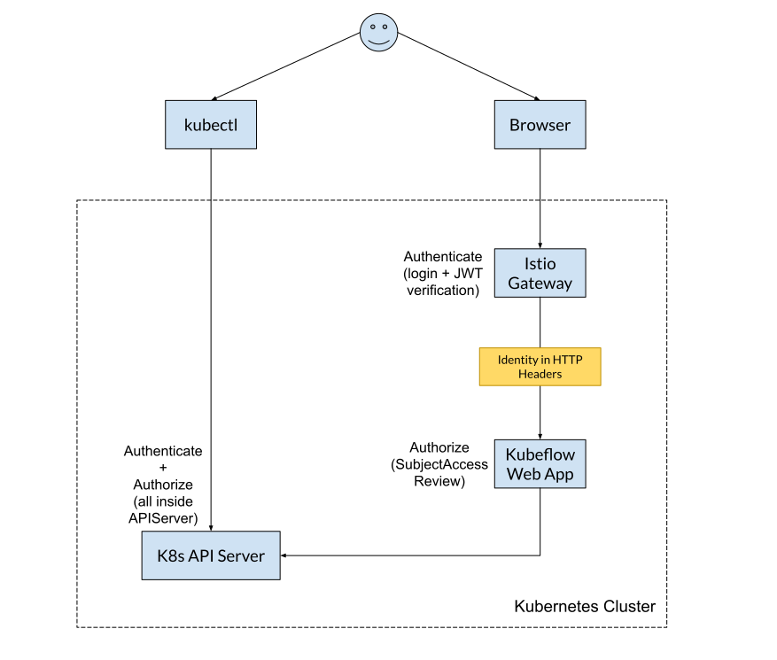

# Authentication and Authorization Guideline

This guideline documents the current best practices for authentication and
authorization in Kubeflow. Kubeflow Application Developers should use this guide
to effectively integrate their applications with Kubeflow. This document answers
the following questions:
* Authentication: How do application know the identity of the user making a
  request?
* Authorization: How do applications act on behalf of the user?

## Introduction

Kubeflow leverages Kubernetes to build its core APIs (CRDs), starting out with a
few operators. The multi-tenancy story at this level was straightforward: direct
interaction with the API via kubectl or other client, with the K8s API Server
taking care of authentication and authorization.

Soon after, Kubeflow introduced web apps to complement those core APIs and offer
a better UX. This pushes the authentication and authorization problem out of the
Kubernetes API Server and into the web apps.

## Kubeflow Core (CRDs)
Kubeflow started by introducing CRDs, providing an API on-top of Kubernetes.
Interaction directly with the K8s API-Server via kubectl and
authentication/authorization is a solved issue.

### Authentication

Whatever the [Kubernetes API-Server
supports](https://kubernetes.io/docs/reference/access-authn-authz/authentication/):
* ServiceAccount token
* OIDC token
* X509 Cert
* Webhook
* ...

### Authorization

K8s RBAC: Can `IDENTITY` perform `ACTION` on `RESOURCE` in `NAMESPACE`?

## Kubeflow Web Apps

Kubeflow wants to build on top of the functionality provided by its controllers.
To provide a better UX, Kubeflow started building Web Apps to ease the use of
its controllers. However, the story for authentication and authorization
changes:
* Authentication is performed by a proxy, not the K8s API Server.
* Authorization is performed by the Web App Backend, not the K8s API Server.

However, we still want to make sure that the user has the same identity and the
same RBAC permissions are consulted.

### Authentication

Authentication is done at a proxy (e.g., the Istio Gateway, Google IAP) in front
of the web app and the result is propagated to the web app in a header, in a way
similar to the [authenticating proxy](https://kubernetes.io/docs/reference/access-authn-authz/authentication/#authenticating-proxy)
method. The authenticated entity can be a user (OIDC, Google IAP) or a
ServiceAccount (TokenReview).

At the moment only userid is added as a header. However, there are other
identity elements we need to add as well (groups, extras) just like the
[authenticating proxy](https://kubernetes.io/docs/reference/access-authn-authz/authentication/#authenticating-proxy)
method. For reference, the
[UserInfo](https://github.com/kubernetes/kubernetes/blob/7f7378eddfe7a817c47fc75c220a729f4b78b913/pkg/apis/authentication/types.go#L90)
struct that Kubernetes uses to hold the user’s identity. 

#### Recommendation

Every web app should accept the following headers for user identity:
* A username header, configurable via the `KUBEFLOW_USERID_HEADER` setting 
    * Some IdPs (like Google) add a prefix to this header (e.g.,
      `accounts.google.com:`). If the Web App wants to support stripping that
      prefix, it should expose a `KUBEFLOW_USERID_PREFIX` setting).
* A groups header, configurable via the `KUBEFLOW_GROUPS_HEADER` setting. The
  value is a comma-separated list.
* A prefix for headers containing extra identity information (e.g., scopes),
  configurable via the `KUBEFLOW_EXTRAS_HEADER_PREFIX` setting. The prefix is
  removed, the remainder header name is percent decoded and becomes the key, the
  header value becomes the value. ([see also](https://kubernetes.io/docs/reference/access-authn-authz/authentication/#authenticating-proxy)).

#### Examples

* [Central Dashboard](https://github.com/kubeflow/kubeflow/blob/e0d7b2edd3df2ee4c06d59d2cf59bcaa2326fcfd/components/centraldashboard/app/server.ts#L29-L30)
* [Jupyter Web App](https://github.com/kubeflow/kubeflow/blob/0c496710150553784f7ebbbd3070cc9c26bfb39c/components/jupyter-web-app/backend/kubeflow_jupyter/common/utils.py#L21-L22)
* [Profile Controller](https://github.com/kubeflow/kubeflow/blob/960587ac9025b6a4ba7facaabc8aa1769fb01dc8/components/profile-controller/main.go#L33-L34)

### Authorization

For authorization, we want to still consult the K8s RBAC permissions. To do
that, there are two ways:
* [SubjectAccessReview API](https://kubernetes.io/docs/reference/access-authn-authz/authorization/#checking-api-access),
  allows the Web App to ask the Kubernetes RBAC authorizer if an action is
  allowed by a specific identity (user, group, etc.). After the check passes,
  the request is made with the Web App’s credentials.
    * Minimal addition of permissions to Web Apps (only permissions to perform
      SubjectAccessReview). 
    * API-Server logs show the web-app as the performer of the API calls.
      SubjectAccessReview calls and subsequent API calls could be correlated.
    * Requires 2 requests and doesn’t catch some cases ( RBAC privilege
      escalation checks, PSPs, Admission Controllers that rely on the user’s
      identity).
* [Impersonation](https://kubernetes.io/docs/reference/access-authn-authz/authentication/#user-impersonation)
  allows the Web App to perform the request to the K8s API Server as if it was
  made from a specified identity (user, group, etc.). Here, the check is made by
  the K8s API Server on the impersonated identity.
    * Requires only 1 request and passes through all authorization checks of
      K8s, some of which aren’t caught by SubjectAccessReview ( RBAC privilege
      escalation checks, PSPs, Admission Controllers that rely on the user’s
      identity).
    * The issue with impersonation is that it is too powerful and there is no
      way to scope it down. For example, if the Jupyter Notebooks Web App used
      impersonation, it would have the full permissions of every user it could
      impersonate. This presents too much of a surface for Web Apps that would
      normally need little permissions, like the Jupyter Notebook Web App. For
      Web Apps that would require elevated permissions anyway (e.g. an admin
      panel web app), impersonation could be a viable option.

#### Recommendation

Use **SubjectAccessReview** to authorize users, because it doesn't requires
giving excessive permissions to the Web App.

For special cases where the Web App is privileged anyway (e.g., an RBAC
dashboard that has to create Roles/RoleBindings), **Impersonation** can be used
if it makes more sense.

#### Examples

* [Jupyter Web App](https://github.com/kubeflow/kubeflow/blob/0c496710150553784f7ebbbd3070cc9c26bfb39c/components/jupyter-web-app/backend/kubeflow_jupyter/common/api.py#L80)
  uses decorators to transparently perform a SubjectAccessReview on every API
  access.