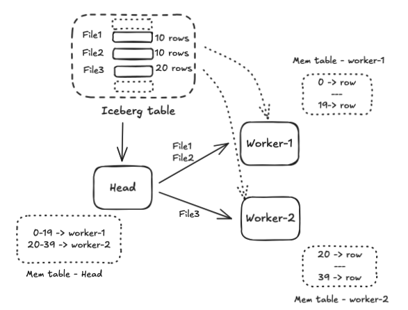
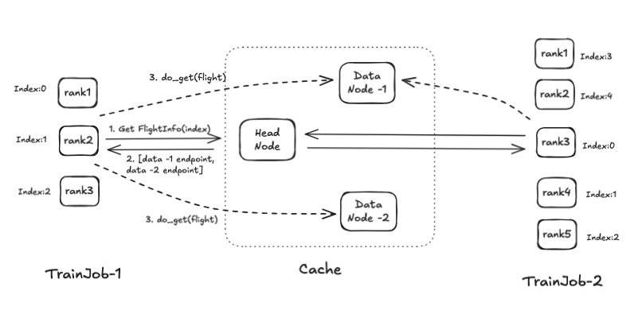
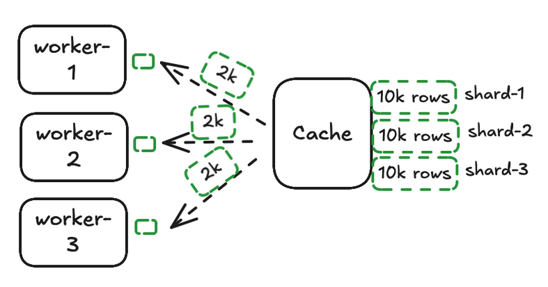
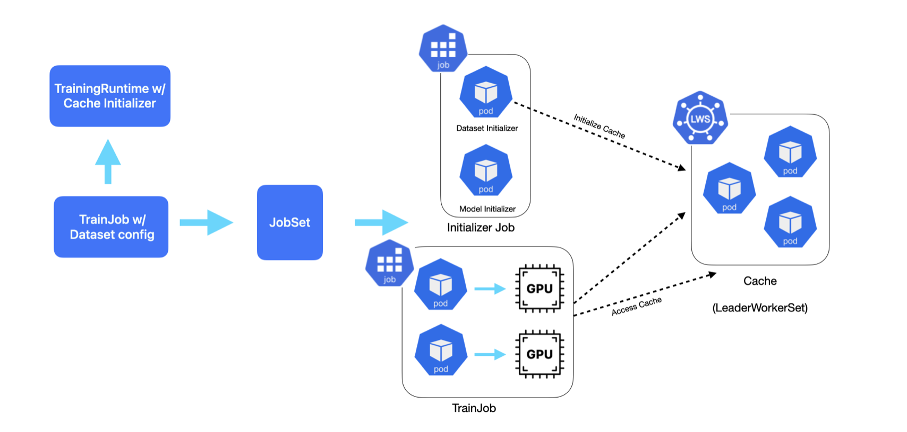
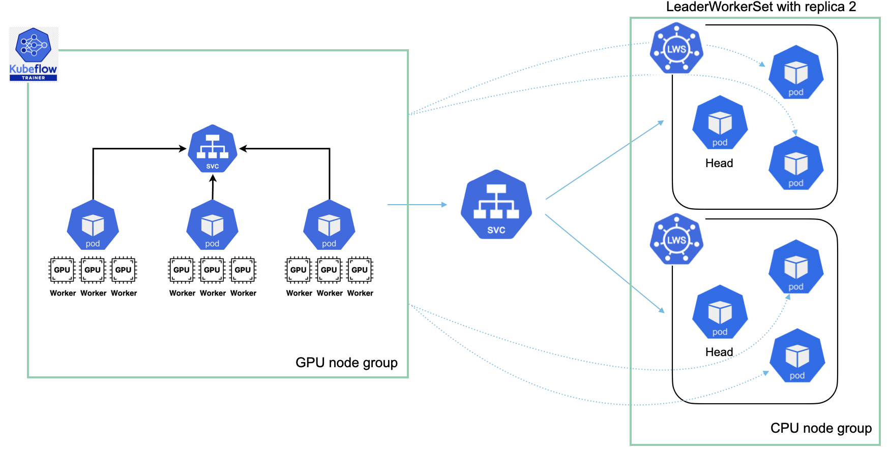

# KEP-2401: Kubeflow Data Cache

## Authors

- Akshay Chitneni - [@akshaychitneni](https://github.com/akshaychitneni)
- Rus Pandey

Creation date: 2025-04-18

Google doc: https://docs.google.com/document/d/1xj3K6bOT4f0EPiC4zwr2OsbRkROjIA8u_TBRZRVxrHI

## Overview

This document outlines the design of a distributed in-memory [Apache Arrow](https://arrow.apache.org/) data cache system 
for tabular datasets stored as [Apache Iceberg](https://iceberg.apache.org/) tables in remote object stores such as S3. 
It also details the deployment model on Kubernetes and its integration with Kubeflow Trainer to accelerate and optimize 
data loading in distributed training using data parallelism

## Motivation

In distributed training on Kubernetes using data parallelism, each worker typically loads the entire dataset into memory or streams it from storage (disk/object-store), even though it only needs a subset. For example, With PyTorch DDP, by default each DDP worker loads the entire dataset in memory and uses a distributed sampler to select indices to access based on rank. If using PyTorch IterableDataset for any large dataset, workers stream the entire dataset from source for every epoch and sharding of data must be implemented by users for their use cases. This approach not only introduces IO latency but also is not optimal, as it unnecessarily consumes memory and bandwidth. For tabular datasets stored in compressed formats like Parquet in cost-efficient object stores like S3, loading or streaming the entire dataset involves a CPU-intensive task of decoding to a memory format that is consumed by worker nodes, which can lead to GPU inefficiency

This proposal addresses these challenges by introducing distributed in-memory caching of tabular datasets in memory efficient Apache Arrow format and provides fast data access to GPU workers using [Arrow Flight protocol](https://arrow.apache.org/docs/format/Flight.html). It outlines design of caching solution that would
1. Auto shard the dataset based on number of gpu workers for optimal and parallel data access
2. Enable shuffling across training epochs by providing direct access to shard blocks
3. Integrate with Kubeflow Trainer simplifying and improving performance of distributed training on Kubernetes

### User Stories

* As ML engineer, I should be able to use kubeflow SDK to launch training or fine-tuning job with data cache passing dataset config
* As Platform engineer, I should be able to configure training runtimes with cache-initializer config

### User Value

**Caching Layer for Tabular Data**
* Users should readily access tabular data from cache without worrying about sharding the data across GPU worker nodes
* Users should see improved GPU utilization as GPU workers consume data via zero-copy Arrow streams, eliminating deserialization overhead. Supports direct conversion to pandas/NumPy

**Resource-Optimized Cache Bootstrap**
* Dataset initialization pods schedule on CPU nodes freeing GPU nodes for compute-intensive workloads
* Direct caching from Iceberg tables with column pruning (feature selection) and predicate pushdown (row filtering), reducing dataset load times for TB-scale datasets

**Memory-Efficient Training**
* Users can launch training workers with reduced memory and disk size as clients can stream batch of data from the cache
* Users could easily shuffle globally across partitions while maintaining per-batch in-memory shuffling

**Multi-Tenant Shared Datasets**
* Multiple users running training jobs in cluster can access the same dataset cache irrespective of the number of workers
* Users could leverage cache-aware scheduling of training jobs

**Seamless Kubeflow Integration**
* Users can configure and use Kubeflow trainer API to provision and accessing cache without any overhead


### Goals
* Provide in-memory dataset caching solution for training/fine-tuning using Kubeflow trainer
* Enhance kubeflow SDK to provision and manage cache using dataset initializer

### Non-Goals
* Right sizing of cache based on dataset size
* Support for hyperparameter tuning trials (should be addressed after implementing data cache with Kubeflow trainer)
* Cache lifecycle management independent of Kubeflow trainer

## Design Details

The proposed solution consists of loading and sharding of data in the Apache Iceberg table to memory efficient Arrow format. [Apache DataFusion](https://datafusion.apache.org/), which is an embedded query engine that uses Arrow and provides fast in-memory processing capabilities is used to shard the dataset and allow clients to query shards of arrow data. The solution leverages Apache Flight framework to stream dataset shards in parallel to GPU workers.

This section details the design of cache, deployment with [LeaderWorkerSet](https://github.com/kubernetes-sigs/lws) API and integration with Kubeflow trainer.

## Distributed Cache System

Cache is built using DataFusion which is a columnar query engine having integrations with various table formats like Iceberg to efficiently query data.





### Head Node:
**Initialization**
* Access table and fetch data files to scan applying predicates push down
* Partition the data files equally among data nodes based on row count
* Assign the partitions to workers and create an in-memory index table with partition info
* Distribute the file locations to data nodes

**Query to access a dataset shard**
* Access index table and fetch list of workers having the shard
* Responds with the data node endpoints for client to connect to and fetch shard data in parallel
* For shuffling, clients can pass a shard index that is unique for each epoch

### Data Node:
**Initialization**
* Stream data from list of files
* Add an index column and store data in in-memory table

**Query to stream data**
* Access the in-memory data table to fetch the partition data for the given range of indices
* Stream the response to client



Cache is built using Rust and uses datafusion interfaces like [TableProvider](https://docs.rs/datafusion/latest/datafusion/datasource/trait.TableProvider.html) to build custom table sources, introduces Executors using [ExecutionPlan](https://docs.rs/datafusion/latest/datafusion/physical_plan/trait.ExecutionPlan.html) api to adding index columns to the data, and streams data files to workers. It uses MemTable to build index and data tables and use in-built query execution capabilities to query for shard location and stream shards from data nodes

### Client flow


Clients interact with head and data nodes using Apache Arrow Flight framework. Apache Arrow Flight is an RPC framework designed for high-performance data services. It leverages gRPC and the Arrow IPC format to efficiently transfer Arrow format data over networks.

**Data flow:**
- Client connects to head node
    - Construct FlightDescriptor that specifies the shard info dataset.
    - Client sends FlightDescriptor to head node using GetFlightInfo RPC method
    - Head node responds with FlightInfo message containing
        - Endpoints - endpoints of location to fetch data
        - Tickets - tokens for each endpoint to identity the data
- Client connects to data node
  - Client connects to one or more data nodes specified in the FlightInfo response
  - For each endpoint client call DoGet with corresponding ticket
  - Data nodes stream Arrow record batches to client

***Example***
```python
import pyarrow as pa
import pyarrow.flight
from pyarrow._flight import FlightClient

index = 1 # shard index
total_workers = 10 # total workers in a training job

descriptor = pa.flight.FlightDescriptor.for_path(*[s for s in [str(index), str(total_workers)]])

client = pa.flight.connect(self.endpoint)
flight_info = client.get_flight_info(descriptor)

for endpoint in flight_info.endpoints:
   for location in endpoint.locations:
       _client = FlightClient(location.uri)
       reader = _client.do_get(endpoint.ticket)
       for chunk in reader:
         # Access record_batch

```

### Kubeflow Integration



**Initializer**
- Add Dataset initializer to bootstrap LeaderWorkerSet with provided config
    - Intializer uses serviceAccount having privileges to create LeaderWorkSet, Service, ServiceAccount and read TrainJob
    - Initializer adds trainJob ownerReference to all the created components
    - Initializer creates <trainjob>-cache-service to access head nodes
      - In the long term, we aim to manage lifecycle of the cache separately than with trainjob to enable reusing of cache across jobs

**Kubeflow SDK**
    - Support ArrowCacheDatasetInitializer to be passed as initializer in the train function
      - ArrowCacheDatasetInitializer accepts parameters that needs to be passed to LWS
    - Create a step to fetch logs from cache cluster

***Runtime with cache initializer***

```yaml
apiVersion: trainer.kubeflow.org/v1alpha1
kind: ClusterTrainingRuntime
metadata:
  name: torch-distributed-with-cache
spec:
  mlPolicy:
    numNodes: 1
    torch:
      numProcPerNode: auto
  template:
    spec:
      replicatedJobs:
      - name: dataset-initializer
        replicas: 1
        template:
          metadata:
            labels:
              trainer.kubeflow.org/trainjob-ancestor-step: dataset-initializer
          spec:
            template:
              spec:
                serviceAccountName: cache-initializer-sa # sa with required permissions to start cache
                containers:
                  - name: dataset-initializer
                    image: cache_initializer:latest # image to trigger cache creation
                    env:
                      - name: CACHE_IMAGE
                        value: "arrow_cache:latest"
                      - name: TRAIN_JOB_NAME
                        valueFrom:
                          fieldRef:
                            apiVersion: v1
                            fieldPath: metadata.labels['jobset.sigs.k8s.io/jobset-name']
      - name: node
        dependsOn:
          - name: dataset-initializer
            status: Complete
        template:
          metadata:
            labels:
              trainer.kubeflow.org/trainjob-ancestor-step: trainer
          spec:
            # trainer spec
```

***SDK to create trainJob accessing data from cache***

```python
from kubeflow.trainer.types.types import ArrowCacheDatasetInitializer

client = TrainerClient(namespace="cache-test")

for runtime in client.list_runtimes():
    ## access runtime with cache
    if runtime.name == "torch-distributed-with-cache":
        torch_runtime = runtime


job_name = client.train(

    trainer=CustomTrainer(
        func=train_func,
        num_nodes=8,
        resources_per_node={
            "cpu": 3,
            "memory": "8Gi",
            "nvidia.com/gpu": 1,
        },
        packages_to_install=["pyarrow==19.0.0"]
    ),
    # dataset config 
    initializer = Initializer(dataset=ArrowCacheDatasetInitializer(
        cluster_size="5",
        metadata_loc="s3a://testbucket/cache/data/amazon_polarity/metadata/12345.metadata.json",
        table_name="amazon_polarity_v2",
        schema_name="feature_demo",
        storage_uri=None,
    )),
    runtime=torch_runtime
)
```
The config can be passed by the users using the sdk or can be configured in the trainingRuntime by DevOps or ML engineers. Example: IAM_ROLE can be configured in the runtime.
Cache-initializer-sa needs to be precreated by the platform engineers so that initializer job can have access to create LWS and cluster specific resources like serviceAccount, Service and also access TrainJob to add as OwnerRef to these resources.

**LeaderWorkerSet**



LeaderWorkerSet API provides capabilities to deploy cache as a single unit enabling easy scaling of the cluster to multiple replicas. It provides support for dual-templates as with cache, data nodes might need more resources compared to head nodes. All-or-nothing restarts is useful for cache as it has in-memory tables avoiding partial failure.

- LeaderWorkerSet with head and data nodes
  - LWS should be ready on completion of loading data
  - Head node should stop accepting requests if any of the worker pod restarts
- Kubernetes clusterIp service to access head nodes
  - As the metadata table with shard information is same for any replica in leaderWorkerSet, clients can connect to any head node to retrieve shard location of a specific index and connect to data nodes

### Example
- BERT fine tuning example using PyTorch data loader that streams data from cache
- ArrowCacheDataset using PyTorch IterableDataset to stream record batches using Arrow Flight framework
```python
import time
from multiprocessing import current_process
import torch.distributed as dist
import pyarrow as pa
from pyarrow._flight import FlightClient
import torch
import os
from torch.utils.data import IterableDataset


# define arrow cache dataset to access arrow recorbatches (shards of dataset) from cache
class ArrowCacheDataset(IterableDataset):
    def __init__(self, seed = 0, batch_size = 128):
        train_job_name = os.getenv("TRAIN_JOB_NAME")
        self.endpoint = f'grpc://{train_job_name}-cache-service:50051'
        self.seed = seed
        self.batch_size = batch_size

    def set_epoch(self, epoch):
        self.seed = self.seed + epoch

    def from_arrow_rb_to_tensor(self, chunk):
        return

    # extract RecordBatches, split them into chunks of a specified siz
    def stream_recordbatch_chunks(self, recordbatch_stream, chunk_size):
        leftover = None  # To hold leftover rows from the previous batch
    
        for rb in recordbatch_stream:
            batch = rb.data
            # If there's leftover data, prepend it to the current batch
            if leftover is not None:
                arrays = [
                    pa.concat_arrays([leftover.column(i), batch.column(i)])
                    for i in range(len(batch.columns))
                ]
                batch = pa.RecordBatch.from_arrays(arrays, batch.schema.names)

            # Split the current batch into chunks
            for i in range(0, batch.num_rows, chunk_size):
                chunk = batch.slice(i, chunk_size)
    
                # If the chunk is smaller than `chunk_size`, save it as leftover for the next iteration
                if chunk.num_rows < chunk_size:
                    leftover = chunk
                    break  # Stop processing this batch and wait for more data
                else:
                    yield from self.from_arrow_rb_to_tensor(chunk)
    
            # If no leftover rows remain, reset `leftover`
            else:
                leftover = None
    
        # Yield any remaining rows after all batches are processed
        if leftover is not None and leftover.num_rows > 0:
            # pass recordbatch to upstream for specifc usecase
            yield from self.from_arrow_rb_to_tensor(leftover)


    def __iter__(self):
        worker_info = torch.utils.data.get_worker_info()
        if worker_info is None:  # Single-process data loading
            worker_id = 0
            num_workers = 1
        else:  # Multi-process data loading
            worker_id = worker_info.id
            num_workers = worker_info.num_workers

        # Distributed training info
        if dist.is_available() and dist.is_initialized():
            world_size = dist.get_world_size()
            rank = dist.get_rank()
        else:
            world_size = 1
            rank = 0
            
        # calculate shard index
        total_workers = num_workers * world_size
        global_worker_id = worker_id * world_size + rank
        index = (global_worker_id + self.seed ) % total_workers

        descriptor = pa.flight.FlightDescriptor.for_path(*[s for s in [str(index), str(total_workers)]])
        # Get flight information connecting to a head node
        client = pa.flight.connect(self.endpoint)
        flight_info = client.get_flight_info(descriptor)

        # Access flights from get_flight_info response and access data nodes
        for endpoint in flight_info.endpoints: 
            for location in endpoint.locations:
                _client = FlightClient(location.uri)
                ticket = endpoint.ticket
                reader = _client.do_get(ticket)
                
                # split recordbatch to chucks of batch_size
                yield from self.stream_recordbatch_chunks(reader, self.batch_size)

# Define dataset for tokenizing and converting rb with Amazon review data to tensors
# use ArrowCacheDataset and override from_arrow_rb_to_tensor function
class AmazonReviewDataset(ArrowCacheDataset):
    def __init__(self, tokenizer, seed = 0):
        super().__init__(seed)
        self.tokenizer = tokenizer

    # convert arrow recordbatch to tensor
    def from_arrow_rb_to_tensor(self, chunk):
        # convert arrow recordbatch to python data structure with zero copy
        deserialize_start_time = time.time()
        texts = chunk.column("content").to_pylist()
        labels = chunk.column("label").to_pylist()
        deserialize_end_time = time.time()
        print(f"{current_process().name}, Time to deserialize batch: {deserialize_end_time - deserialize_start_time:.6f} seconds")

        encode_start_time = time.time()
        encoding = self.tokenizer(
            texts,
            padding="max_length",
            truncation=True,
            max_length=128,
            return_tensors="pt"
        )
        encode_end_time = time.time()
        print(f"{current_process().name}, Time to encode batch: {encode_end_time - encode_start_time:.6f} seconds")
    
        yield {
            "input_ids": encoding["input_ids"].squeeze(0),
            "attention_mask": encoding["attention_mask"].squeeze(0),
            "labels": torch.tensor(labels)
        }
```

### Drawbacks
- Arrow data can consume significant memory compared with parquet format 
- Clients should handle retries on failures to access or streaming data from cache
- Client should handle resuming the streaming of data from cache

### Alternatives
**Ray**
* While a similar solution exists with Ray using Ray Cluster Object Store, It is integrated with Ray ecosystem such as Ray scheduler, Ray data. However, with the proposed caching solution, we aim to integrate with Kubernetes API by providing flexibility for the cluster operators or ML engineers to leverage any existing schedulers like volcano, preprocess data with Apache Spark or similar technologies

**MosaicML**
* MosaicML StreamingDataset is a pytorch iterableDataset which minimizes downloading entire dataset across training workers but stream relevant shards on demand and caches to disk. However, this requires users to convert the dataset to MDS format. With shuffling, the dataset is still downloaded multiple times for the training run across epochs but it is minimized as some data is already cached locally on disk.

**HuggingFace**
* Huggingface dataset allows streaming data from remote cloud storage for large datasets. This is achieved by streaming only relevant shards of dataset. However, to avoid streaming the entire dataset, the number of workers should be in sync with the number of shards or files in the dataset(git issue, git issue). Again with shuffling across epochs, training data can be restreamed from cloud storage.