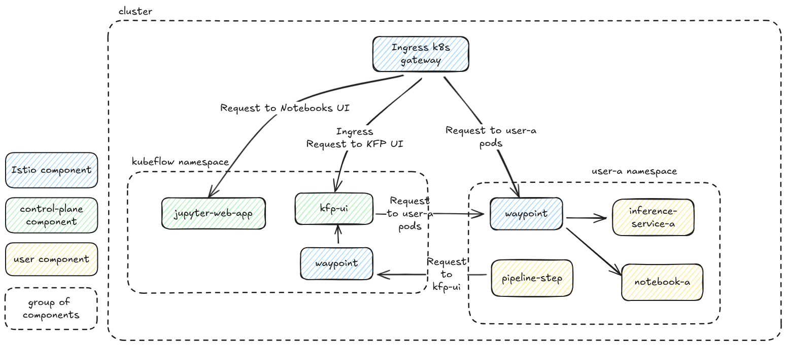

# KEP-2676: Support Istio ambient in Kubeflow

> [!NOTE]
> The KEP's number refer to issue https://github.com/kubeflow/manifests/issues/2676. The KEP is sent against `kubeflow/community` since the proposed changes involve multiple Kubeflow components, not just manifests.

## Authors
1. Orfeas Kourkakis (orfeas.kourkakis@canonical.com)
2. Kimonas Sotirchos (kimonas.sotirchos@canonical.com)

## Summary
Kubeflow components integrate with Istio as their service mesh, offering features that enable routing as well as authorization of authenticated users in control-plane components and user workloads.

Right now, all Kubeflow components are compatible with Istio's sidecar mode. In 2022, Istio launched a new operation mode, called ambient, which aims addressing the shortcomings present in the sidecar mode. In order for Kubeflow users to benefit from the reduced resource footprint and simplified operations in ambient mode, this proposal defines the changes needed to make Kubeflow component ambient-compatible. At the same time, it outlines a setup that uses Istio in ambient and enables the same Authorization and Authentication use cases.

## Motivation
Adopting Istio's ambient mode offers immediate operational benefits while strategically aligning Kubeflow with the future of Kubernetes networking. The primary motivations for this change are:
* **Reduced resource footprint**: Ambient mode significantly lowers the CPU and memory overhead for users across the cluster by replacing hundreds or thousands of sidecar proxies with a single ztunnel per node and, optionally, some envoy proxy deployments (waypoints).
* **Simplified Operations**: Developers no longer need to worry about sidecar injection, and rolling updates of applications don't require restarting pods to update the proxy.
* **Increased bandwidth**: With ambient mode, Istio is now the highest-bandwidth way to achieve a secure zero-trust network in Kubernetes.
- **Future-Proofing with the Gateway API**: This proposal transitions Kubeflow's networking from Istio-specific **routing** CRDs (`VirtualService`, `Gateway`) to the official Kubernetes **Gateway API** (`HTTPRoute`, `Gateway`). This is a critical strategic move that:
    - Ensures better compatibility with any service mesh that adopts the Gateway API standard.
    - Aligns Kubeflow more with the official, vendor-neutral direction of Kubernetes networking.

You can read more about Ambient's benefits at istio.io[^1] and in their performance analysis[^6].

### Goals
This KEP aims to define:
* A high-level architecture of Kubeflow that uses Istio ambient and showcases how to:
  * Use HTTPRoutes instead of VirtualServices
  * Enable the user login flow
  * Use waypoints to enforce namespace isolation (L7 and L4 traffic)
* An exhaustive list of changes in components that are needed to enable Istio ambient support.

### Non-Goals
- Modifying Kubeflow's Authorization model. All existing use cases are still supported.
- Supporting ambient in combination with Istio-specific **routing** CRDs (`VirtualService`, `Gateway`).
- Deprecating the existing sidecar mode. This proposal provides an alternative, not a replacement.
- Providing migration instructions from sidecar-based installation to ambient.

## Proposal
Enabling Kubeflow to support Istio's ambient mode means updating all components to provide ambient-compatible resources that also align with a working high-level design. Core goals of the proposed high-level design are to be simple, secure and easy to reason about while achieving the best network and resources efficiency possible. This section is split into:
1. High-level design overview
2. User stories and Proof Of Concept
3. Notes/Constraints/Caveats

More details on the high-level design are provided below in the [Design details](#design-details) section.

### High-level architecture overview

#### 1. Sidecar to Ambient overview
In order to understand the changes proposed, a quick overview of the differences between ambient and sidecar modes is needed, as well as of the resources that need to be migrated. Ambient mode has some key differences:
* All traffic is proxied through a Layer 4-only node proxy (ztunnel).  
* Applications can opt in to routing through an Envoy proxy (waypoint) to get Layer 7 features.  
* Gateways (ingress and waypoint) are managed with the new [Kubernetes Gateway API](https://gateway-api.sigs.k8s.io/).

You can read more at the relevant documentation of istio.io[^1]  or ambientmesh.io[^2].

##### Gateways
A key difference between a Kubernetes Gateway API custom resource (k8s gateway) and Istio gateway custom resources (Istio gateway) is that a k8s gateway also creates a gateway deployment while an Istio gateway is attached to an existing gateway deployment.

##### VirtualService to HTTPRoutes
Using k8s gateways with VirtualServices can lead to undefined behavior[^3]. Thus, all VirtualServices need to be migrated to HTTPRoutes. This includes VirtualServices created by the manifests during deployment (e.g. notebooks web app VirtualService) but also VirtualServices created dynamically from kubeflow control plane components (e.g. the VirtualService for each notebook).

##### AuthorizationPolicies
Migrating to ambient doesn't affect L4 AuthorizationPolicies since those are still applied to components with the use of a `selector`[^4]. On the other hand, L7 policies use a `targetRef` and they can target either a Gateway, a GatewayClass, a Service or a ServiceEntry.[^5]

##### Authorization enforcement points
In sidecar mode, there is only one place where AuthorizationPolicies are enforced, which is the pod's sidecar. In ambient, traffic is proxied either through ztunnel or an optional waypoint. AuthorizationPolicies with L4 attributes can be applied by both while L7 features are enabled only when services are enrolled to a waypoint. This creates two places where AuthorizationPolicies are enforced.

##### RequestAuthentication
The RequestAuthentications need to be migrated to use a `targetRef` since they make use of L7 features.

#### 2. Ingress traffic
In sidecar mode, Kubeflow deploys one Istio gateway deployment for serving ingress traffic but multiple Istio gateways that attach to it. In ambient, one k8s gateway will be created. It is configured to serve traffic for all namespaces and is of `gatewayClassName: istio`. The spawned deployment from that k8s gateway is the component that actually serves the traffic. 

For routing, the migrated HTTPRoutes are attached to the single ingress k8s gateway created.

#### 3. Securing the `kubeflow` namespace
To enable authorization for Kubeflow components, the whole `kubeflow` namespace is included in the mesh. 

##### Waypoints
To get the best performance out of ambient mode[^6][^7], services are enrolled to a waypoint only when the L7 features are required. For the Kubeflow control plane, only authorizationPolicies targeting `ml-pipeline` and `ml-pipeline-ui` make use of L7 attributes. Thus, a waypoint is deployed in the `kubeflow` namespace while only the services of those two components are enrolled to the waypoint.

#### 4. Securing the user namespaces
Similarly to the `kubeflow` namespace, all user namespaces are included in the mesh in order to enable authorization enforcement, while sidecars are disabled.

##### One waypoint per namespace
User namespaces are secured via an AuthorizationPolicy that is created dynamically by kubeflow's `profile-controller`. Most of the rules in this AuthorizationPolicy have L7 features[^8]. In sidecar mode, this AuthorizationPolicy is enforced to all traffic in the namespace by having no `selector`. This is due to the nature of those namespaces, where services are created dynamically. In Istio ambient mode, the only way to enforce a namespace-wide L7 AuthorizationPolicy is by proxying traffic to the whole namespace through the waypoint and then attaching the AuthorizationPolicy to the waypoint. This results in the authorization rules being enforced for all traffic proxied by the waypoint. This means that **a separate waypoint needs to be deployed in every user namespace**. For more information on this decision and the future of it, refer to the [corresponding section in the Notes/Constraints/Caveats part](#one-waypoint-per-namespace-1).

#### 5. Diagram
The following diagram outlines how requests will flow with the suggested setup. For more information how this design is achieved, refer to the design details section below.



### User Stories and Proof of Concept
This proposal supports all the same user stories already enabled by Kubeflow with Istio sidecar mode. For a detailed overview of the speced out use cases, refer to the https://github.com/orfeas-k/kubeflow-istio-ambient-demo repository and its subdirectories. It contains a Proof of Concept using Istio ambient in Kubeflow.

### Notes/Constraints/Caveats

#### One waypoint per namespace
##### Issue
Apparently, deploying one waypoint per namespace adds a resource overhead for every user namespace. As mentioned above, this architecture is required by Istio's ambient model to enforce namespace-wide L7 AuthorizationPolicies. Since the `profile-controller` creates a default policy with L7 rules  (e.g. path or headers based), one waypoint must correspond only to one namespace. The same Authorization model is not possible using a single cross-namespace waypoint. [Asking in Istio slack](https://istio.slack.com/archives/C041EQL1XMY/p1751905575407449?thread_ts=1751636618.350839&cid=C041EQL1XMY), they confirmed that:
>Typically, the authorization policy would be applied to a service so the destination would be "the thing my policy is attached to".
>...
>I don't think there is a shorthand expression for "all services in X namespace".

##### Future
This limitation was brought up and discussed in the Istio community meeting. It looks like they don't see any blockers to implementing such feature. It was not an intentional omission, just something that hasn't been implemented or decided on. There was nothing brought up that was a hard blocker, just challenges to overcome. Howver, implementing this would be a big effort, so before they actually action it they'd want to see more than a single person requesting the feature. This feature is requested via https://github.com/istio/istio.io/issues/16781. Next steps for this are:
1. Get more consensus/demand, which can only be done by getting more people to use the ambient overlay (at least from Kubeflow's side)
2. Bring it up again in a future community meeting once the demand is obvious

##### Cases affected
Note that the introduced resource overhead affects cases with a large number of **idle** namespaces. For namespaces that are being actively used, the resource footprint is still greatly reduced, given that there are no sidecar containers injected.

#### KServe compatibility with Ambient mesh
Integrating with Istio’s ambient mode requires all components to support the [k8s Gateway API](https://gateway-api.sigs.k8s.io/). At the time of writing (30th ofJuly 2025):
* Knative has a [net-gateway-api](https://github.com/knative-extensions/net-gateway-api) extension which, though, is still in [beta](https://github.com/knative-extensions/net-gateway-api?tab=readme-ov-file#knative-net-gateway-api).  
* KServe supports the Gateway API only in `rawDeployment` mode.

Thus, `serverless` mode can **NOT** be supported with the Gateway API. The provided installation will not install Knative and will configure Kserve to support and default to `rawDeployment`. Once support for Gateway API is implemented in both upstream projects, manifests for Knative will be included, migrating the Istio gateway deployment used for Knative too (`cluster-local-gateway`).

## Design Details
This section explains how the described setup can be achieved.

### Global `default-deny` Pattern
As recommended by Istio[^9], Kubeflow follows the default-deny pattern using a global "allow-nothing" AuthorizationPolicy. Since traffic is routed through two types of proxies now, there needs to be an additional "allow-nothing" AuthorizationPolicy that is attached to the waypoint GatewayClass[^10].
```yaml
  targetRefs:
  - kind: GatewayClass
    group: gateway.networking.k8s.io
    name: istio-waypoint
```

### Ingress Traffic
By default, even for services enrolled to a waypoint, ingress traffic is not proxied through the waypoint but rather goes directly to the service. This fits `ml-pipeline` and `ml-pipeline-ui` components, which allow ingress traffic without making any L7 checks. However, for user namespaces, L7 rules need to be applied to requests coming also from the ingress gateway:
```yaml
  - from:
    - source:
        principals:
        - cluster.local/ns/istio-system/sa/istio-ingressgateway-service-account
    when:
    - key: request.headers[kubeflow-userid]
      values:
      - user@example.com
```
This behavior is achieved with the use of the `istio.io/ingress-use-waypoint` label[^11]. The use of this label comes with the following downsides:
1. Less efficient networking for ingress traffic[^7]
2. Requires Istio to be configured with `ENABLE_INGRESS_WAYPOINT_ROUTING` flag[^12]. However, this is enabled by default when Istio is configured to use ambient[^13].

#### AuthorizationPolicies
In sidecar mode, AuthorizationPolicies for ingress traffic were attached to the ingress service using a selector. In ambient, those are attached directly to the ingress k8s gateway, using a `targetRef`.

#### Headers
Appending headers to ingress traffic takes place with the same RequestAuthentication custom resources. Similarly with AuthorizationPolicies, RequestAuthentications are attached to the ingress k8s gateway, using a `targetRef`.

### Enrolling namespaces to mesh and waypoints
Including namespaces in the mesh is possible with the use of the `istio.io/dataplane-mode: ambient` label. Enrolling namespaces (that of users) or services (ml-pipeline and ml-pipeline-ui) to waypoints is done with the use of the `istio.io/use-waypoint` label.

### Waypoint traffic type
Waypoints are configured to serve only the services of enrolled components, and not the pod IPs[^14], which is the default behavior. This is because:
1. All kubeflow components are expected to hit services rather than directly pod IPs.  
2. Prometheus is expected to hit pod IPs directly. Proxying traffic through a waypoint for pod IPs prevents attaching AuthorizationPolicies to specific pods[^15]. On the other hand, when traffic is proxied through ztunnel, it is possible to allow Prometheus by bounding L4 AuthorizationPolicy to specific pods.

### Allowing traffic from waypoint to service
In order for a waypoint to be able to forward requests to the services, traffic needs to be allowed on L4. This is achieved with an explicit L4 AuthorizationPolicy for each service that is subscribed to it. Using the `PILOT_AUTO_ALLOW_WAYPOINT_POLICY` flag[^16] is not recommended since this introduces a cluster-wide requirement to how Istio is configured.

### Kubeflow namespace

#### AuthorizationPolicies
L4 AuthorizationPolicies keep the same `selector` as in sidecar mode, while the L7 ones have a `targetRef` of the corresponding service. This results in the waypoint enforcing those L7 AuthorizationPolicies when traffic is sent to corresponding services.

#### Previously outside the mesh
In sidecar, multiple kubeflow components don't have a sidecar and operate outside the mesh. In ambient mode, the whole `kubeflow` is included in the mesh. Thus, traffic previously allowed will be rejected now. This can be solved with L4 AuthorizationPolicies. However, if the traffic comes from outside the mesh, it is not possible to define rules with specific attributes. Only an allow all rule is possible*. This affects, for example, webhook controllers like kserve, katib and admission-webhook which are expected to receive requests from the off-mesh Kubernetes API server.

\* For outside the mesh traffic, Istio knows only the source IP of a connection. [Asking in Istio slack](https://istio.slack.com/archives/C041EQL1XMY/p1752160919990969?thread_ts=1752144421.301679&cid=C041EQL1XMY), they mentioned that
> The issue is that all we really know is the src IP of this connection. IPs are not really fixed in kube and it's possible we have old information about what has that IP. This is why we only trust cryptographic verifiable workload information for auth.

Thus, attributes like `source.namespace`, `source.workload` for traffic coming from outside the mesh cannot be enforced. Note that Ztunnel logs append such attributes to traffic manually by matching IPs to facilitate debugging.

### User namespaces

#### Allowing traffic from waypoint to service
Since all services in a user namespace are enrolled to the waypoint, traffic from the waypoint to all services is allowed using an L4 AuthorizationPolicy without any `selector`. This AuthorizationPolicy needs to be created in every user namespace as well.

#### Programmatic access with k8s token
In sidecar mode, users need to create an AuthorizationPolicy in their namespace to allow their `ServiceAccount` to access to their namespace or specific resources in their namespace. In ambient mode, this AuthorizationPolicy needs to be attached either to the waypoint, as the one created by `profile-controller`, or to specific services in the namespace for more tailored access.

### Proposed Component Changes
Kubeflow components that create Istio specific resources need to be configurable to work either in sidecar (default) or ambient mode. In ambient mode:
* profile-controller needs to: 
  * create an L7 AuthorizationPolicy in every user namespace and attach it to the waypoint defined in deployment configuration (via environment variables or the command). Using a waypoint in a different namespace should be possible too to avoid the implementation enforcing any specific high-level architecture.  
  * create an L4 AuthorizationPolicy in every user namespace to allow requests from the aforementioned waypoint to all services in the namespace.
  * label user namespaces with appropriate labels.
  * create a waypoint in every user namespace, if configured to do so.
* kubeflow controllers that create virtualServices dynamically (notebook-controller, tensorboard-controller, pvcviewer-operator) need to create an HTTPRoute instead and attach it to the gateway defined in environment variables.
* Web application manifests need to provide an `ambient`/`gateway api` overlay that includes an HTTPRoute instead of a VirtualService for serving the web application itself.

### Test Plan
The E2E tests in `kubeflow/manifests` repository will be updated to have two flavours: Istio in sidecar mode and in ambient mode.

#### Integration tests
For every component that requires code changes, tests will need to cover the added functionality in `ambient` mode.

## Implementation History
* KEP creation: 30th July 2025

[^1]: https://istio.io/latest/docs/overview/dataplane-modes 
[^2]: https://ambientmesh.io/docs/setup/sidecar-migration/
[^3]: https://istio.io/latest/docs/ambient/usage/l7-features/
[^4]: https://istio.io/latest/docs/ambient/usage/l4-policy/\#targeting-policies
[^5]: https://istio.io/latest/docs/reference/config/security/authorization-policy/\#AuthorizationPolicy-targetRefs
[^6]: https://istio.io/latest/blog/2025/ambient-performance/
[^7]: https://ambientmesh.io/blog/sidecar-migration-part-1/\#to-waypoint-or-not-to-waypoint
[^8]: https://github.com/kubeflow/kubeflow/blob/41ee8e7cb7cf57fa73b45362e67915c6a438c4aa/components/profile-controller/controllers/profile_controller.go#L432-L504
[^9]: https://istio.io/latest/docs/ops/best-practices/security/\#safer-authorization-policy-patterns
[^10]:  https://istio.io/latest/docs/ops/best-practices/security/\#default-deny-pattern-with-waypoints
[^11]: https://ambientmesh.io/docs/traffic/gateways/\#:\~:text=You%20can%20enable%20ingress%20waypoint%20routing%20on%20a%20service%2C%20such%20that%20traffic%20will%20be%20sent%20from%20the%20gateway%20to%20the%20configured%20waypoint%2C%20not%20to%20the%20destination%20service.%20To%20do%20this%2C%20set%20the%20label%20istio.io/ingress%2Duse%2Dwaypoint%3Dtrue%20on%20a%20service
[^12]: https://istio.io/latest/docs/reference/commands/pilot-discovery/\#:\~:text=ENABLE\_INGRESS\_WAYPOINT\_ROUTING
[^13]: https://github.com/istio/istio.io/issues/16649
[^14]: https://istio.io/latest/docs/ambient/usage/waypoint/\#waypoint-traffic-types
[^15]: https://github.com/canonical/istio-beacon-k8s-operator/issues/76\#issuecomment-2971331539
[^16]: https://istio.io/latest/docs/reference/commands/pilot-discovery/\#:\~:text=PILOT\_AUTO\_ALLOW\_WAYPOINT\_POLICY
