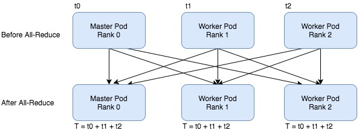

<!-- START doctoc generated TOC please keep comment here to allow auto update -->
<!-- DON'T EDIT THIS SECTION, INSTEAD RE-RUN doctoc TO UPDATE -->

**Table of Contents** _generated with [DocToc](https://github.com/thlorenz/doctoc)_

- [Motivation](#motivation)
- [Goals](#goals)
- [Non-Goals](#non-goals)
- [API (CRD and resulting objects)](#api-crd-and-resulting-objects)
  - [Custom Resource Definition](#custom-resource-definition)
  - [Resulting Master](#resulting-master)
  - [Resulting Worker](#resulting-worker)
- [Design](#design)
- [Alternatives Considered](#alternatives-considered)

<!-- END doctoc generated TOC please keep comment here to allow auto update -->

_Status_

- 2018-03-20 - Accepted
- 2018-03-15 - Implementation Started
- 2018-07-02 - v1alpha1 is released in 0.2

# KEP-33: PyTorch Operator

## Motivation

PyTorch is a popular machine learning framework which currently does not have an operator/controller for Kubernetes. This proposal is aimed at defining what that operator should look like, and adding it to Kubeflow.

## Goals

A Kubeflow user should be able to run training using PyTorch as easily as then can using Tensorflow. This proposal is centered around a Kubernetes operator for PyTorch. A user should be able to run both single node and distributed training jobs with PyTorch.

This proposal defines the following:

- A PyTorch operator
- A way to deploy the operator with ksonnet
- A single pod PyTorch example
- A distributed PyTorch example

## Non-Goals

For the scope of this proposal, we won't be addressing the method for serving the model.

## API (CRD and resulting objects)

### Custom Resource Definition

The custom resource submitted to the Kubernetes API would look something like this:

```yaml
apiVersion: "kubeflow.org/v1alpha1"
kind: "PyTorchJob"
metadata:
  name: "example-job"
spec:
  backend: "gloo"
  masterPort: "23456"
  replicaSpecs:
    - replicas: 1
      ReplicaType: MASTER
      template:
        spec:
          containers:
            - image: pytorch/pytorch:latest
              name: master
              imagePullPolicy: IfNotPresent
          restartPolicy: OnFailure
    - replicas: 2
      ReplicaType: WORKER
      template:
        spec:
          containers:
            - image: pytorch/pytorch:latest
              name: worker
          restartPolicy: OnFailure
```

This PyTorchJob resembles the existing TFJob for the tf-operator. The main differences being the omission of the parameter server replica type, and the addition of `masterPort` and `backend` options.

`backend` Defines the protocol the PyTorch workers will use to communicate when initializing the worker group. Information on the different backends (and the functions they support) can be found [here](http://pytorch.org/docs/master/distributed.html).

`masterPort` Defines the port the group will use to communicate with the master's Kubernetes service.

### Resulting Master

```yaml
kind: Service
apiVersion: v1
metadata:
  name: pytorch-master-${job_id}
spec:
  selector:
    app: pytorch-master-${job_id}
  ports:
    - port: 23456
      targetPort: 23456
```

```yaml
apiVersion: v1
kind: Pod
metadata:
  name: pytorch-master-${job_id}
  labels:
    app: pytorchmaster-${job_id}
spec:
  containers:
    - image: pytorch/pytorch:latest
      imagePullPolicy: IfNotPresent
      name: master
      env:
        - name: MASTER_PORT
          value: "23456"
        - name: MASTER_ADDR
          value: "localhost"
        - name: WORLD_SIZE
          value: "3"
          # Rank 0 is the master
        - name: RANK
          value: "0"
      ports:
        - name: masterPort
          containerPort: 23456
  restartPolicy: OnFailure
```

The master spec will create a service and a pod. The environment variables provided are used when initializing a distributed process group with PyTorch. `WORLD_SIZE` is determined by adding the number of replicas in both 'MASTER' and 'WORKER' replicaSpecs. `RANK` is 0 for the master.

### Resulting Worker

```yaml
apiVersion: v1
kind: Pod
metadata:
  name: py-torchjob-worker-${job_id}
spec:
  containers:
    - image: pytorch/pytorch:latest
      imagePullPolicy: IfNotPresent
      name: worker
      env:
        - name: MASTER_PORT
          value: "23456"
        - name: MASTER_ADDR
          value: pytorch-master-${job_id}
        - name: WORLD_SIZE
          value: "3"
        - name: RANK
          value: "1"
  restartPolicy: OnFailure
```

The worker spec generates a pod. They will communicate to the master through the master's service name.

## Design

This is an implementaion of the PyTorch distributed design patterns, found [here](http://pytorch.org/tutorials/intermediate/dist_tuto.html), via the lense of TFJob found [here](https://github.com/kubeflow/tf-operator). In the case of Kubernetes, because the operator is able to easily apply configurations to each process, we will use the environment variable initialization method found [here](http://pytorch.org/tutorials/intermediate/dist_tuto.html#initialization-methods).

In most training examples, the pods will communicate via the all-reduce function in order to average the gradients.


## Alternatives Considered

One alternative considered for the CRD spec is shown below:

```yaml
apiVersion: "kubeflow.org/v1alpha1"
kind: "PyTorchJob"
metadata:
  name: "example-job"
spec:
  backend: "gloo"
  masterPort: "23456"
  worldSize: 3
  container:
    - image: pytorch/pytorch:latest
```

The idea was the number of replicas for worker and masters could be derived from the `worldSize` given there would only be one master. It was decided against based on the fact that it deviates from a regular replicaSpec and provides less customization.
