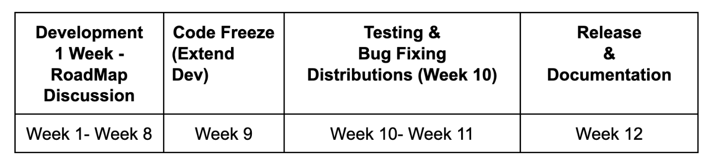

# KEP-841: Proposal to update the Release Process for Kubeflow

<!--
This is the title of your KEP. Keep it short, simple, and descriptive. A good
title can help communicate what the KEP is and should be considered as part of
any review.
-->

## Summary

This proposal aims to share insights on topics discussed with the release team and others about diverse challenges and improvement opportunities in the release process based on Kubeflow release 1.10.

## Motivation

Current challenges based on Kubeflow release 1.10:
* Challenge to get component’s release progress during release meetings.
    - Blockers or challenges on the Release are identified later.
    -  Incomplete/Inaccurate or null information on some components about progress/blockers.
* The Release Manager role challenges:
- Only one person is responsible for the Release and decisions.
- Time dedication and commitment are high and for an extended period (6 months), which makes it hard to find candidates for Release.
- The diverse skills required for the role make it even harder for candidates to join.
* Release Documentation
- Working groups need help on building Technical Documentation for Releases.
- Working on technical documentation during the Release, before the feature freeze, can expedite the release process.
* Feature Freeze vs Building Release Candidate
- Teams required more time to finish the Release and later cherry-pick and work on building the Release.
* Release timeframe 
- The Release is now 27 weeks. There are 10 weeks between feature freeze and Release. 
- Release dates and phases are hard to predict in the current process.

### Goals

* Cut down the release handbook by 70 %
* Replace the the manual bureaucratic process and overhead and human hours needed by an an automation first approach
* Move away from the Waterfall model to an agile model that relies on automated tests instead of human labor.
* Reduce time to market of Kubeflow Release, by being able to release at any time
* Reduce meeting time and structure to give back time to the Release Team.
* Focus on contributions from technical documents and source code by reducing meetings and promoting asynchronous communication.
* Promote clarity on dates and phases so distributions, working groups, and the whole community can plan accordingly.
* Improve release cycle by moving technical decisions affecting the release to the Release Management team including Kubeflow platform

### Non-Goals

<!--
What is out of scope for this KEP? Listing non-goals helps to focus discussion
and make progress.
-->

## Proposal

### Release Timelines
KubeFlow Release x.x is moved to Quarterly Release = 12 weeks

* Notes: Release dates will not be changed unless critical changes are needed.

* KubeFlow Release minor versions x.x.xx
** Release can be 60-90 days.

### Release Meetings and Communication
* Create a new Release Management team on Slack for asynchronous communication within the team
* Bi-weekly meetings during Software Development (Week 1-Week 8). Weekly meetings between week 9-12 as needed.
* Meetings will focus on roadmap status, including blockers, feature discussions, the overall status of the release, and the help needed.

### Release Documentation

* Build a team of technical writers to be embedded in each working group for the release time frame. 
* Provide roles within the community to boost participation and bring new members into this group.
* Technical Documentation Lead will lead this team; technical documentation can include a blog and slides to announce the Release.

### Release Management Team: 
The Release Management Team is composed by: Release Manager, WG Leads ( in some cases Liasons), Technical Doc Lead.
Responsabilities:

- Release team liaisons will be responsible not for the communication but for contributing to the release with documentation, source code, PRs review, etc, according to their skills and motivation.

### Release Manager Responsibilities: 
- Responsible for the overall Kubeflow Release Process 
- Promote best practices for the release and software development process.
- Manage the communication between the teams to understand current release status and potential blockers
- Manage the communication with the community about the status of the Release or any help/blockers needed.
- Approve & review the blog and slides announcing the Release.

### Implementation -todo update release team
* Week 0 -  (Release and Roadmap discussions) WG Leads and Release Manager meet to discuss the roadmap planned for the Release
* Week 2 - (Software development Phase) WG Leads/Liaisons meet to discuss any release challenges, release changes, and help needed from the community (to communicate on Kubeflow Community Meeting)
* Week 4 - (Software development Phase) WG Leads/Liaisons meet to discuss any release challenges, release changes, and help needed from the community (to communicate on Kubeflow Community Meeting)
* Week 6 - (Software development Phase) WG Leads/Liaisons meet to discuss any release challenges, release changes, and help needed from the community (to communicate on Kubeflow Community Meeting)
* Week 8 - (Last week of Software development Phase) WG Leads/Liaisons meet to discuss any release challenges, release changes, and help needed from the community (to communicate on Kubeflow Community Meeting)
* Week 9 - (Feature Freeze and Prep for Release) WG Leads/Liaisons meet to discuss any release challenges, release changes, and help needed from the community (to communicate on Kubeflow Community Meeting). Discuss items required to prepare for Release (including documentation).
* Week 10 - (Community and Distribution testing starts) Users and distributions run their automated test suites and try to stay away from manual labor-intensive tests.
* Week 11 - (Bug Fixing) - Discuss any potential blockers for the Release.
* Week 12 - (Release) - Items to discuss: bug fixes required, release cut, documentation needed.
- Manifests WG leads synchronizes and cut the release on Kubeflow Platform/Manifests.
- The Release Manager is responsible for approving/reviewing the blog and slides announcing the release.

### Notes/Constraints/Caveats (Optional)

* At this time, there is no plan to update support. No changes to support.
* This proposal does not cover any changes on Kubeflow manifests vs Kubeflow Platform. This should be addressed in other KEP
<!--
What are the caveats to the proposal?
What are some important details that didn't come across above?
Go in to as much detail as necessary here.
This might be a good place to talk about core concepts and how they relate.
-->

