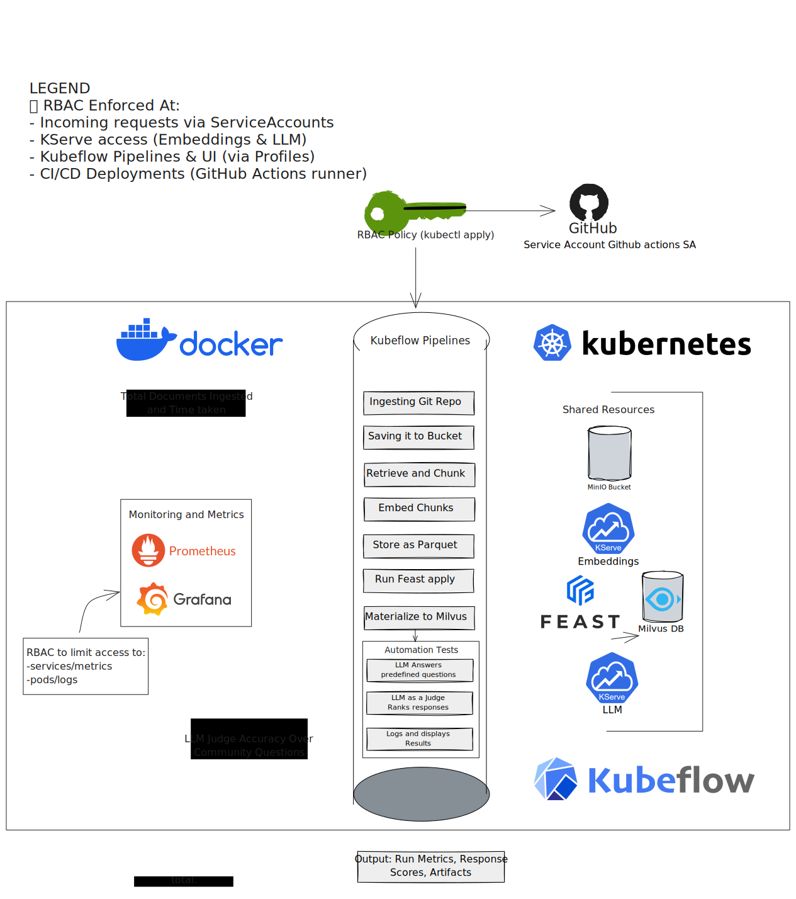

# KEP-867: Kubeflow Documentation AI Assistant with Retrieval-Augmented Generation

## Summary

This KEP proposes the development of an AI-powered documentation assistant for the Kubeflow ecosystem that leverages Retrieval-Augmented Generation (RAG) to provide accurate, contextual, and cited responses to user queries.

The assistant will be deployed as a cloud-native solution on Kubernetes, utilizing KServe for model serving, Kubeflow Pipelines for automated indexing, and an agentic approach to intelligently route queries between foundational LLM knowledge and documentation-specific retrieval.

## Motivation

Kubeflow users currently face significant challenges in finding accurate information across fragmented sources:
- **Fragmented Knowledge Base**: Critical information is scattered across multiple repositories, GitHub issues, pull requests, documentation pages, and community discussions.
- **Manual Search Inefficiency**: Users must manually search through multiple sources, causing frustration and inefficiency.
- **Limited Search Capabilities**: The current website relies on basic Google Custom Search, limited to static content.
- **Knowledge Gap**: Many issues stem from underlying Kubernetes concepts that users expect to find in Kubeflow documentation.

The Kubeflow community's knowledge represents a valuable treasure trove of information that is currently underutilized due to accessibility challenges. By making this knowledge easily searchable and accessible through natural language queries, we can:
- Reduce time-to-value for new users.
- Decrease repetitive support requests.
- Improve overall user experience.
- Leverage the community's collective knowledge more effectively.

This proposal is related to the following issues:
- **KEP-867**: [Kubeflow Documentation AI Assistant with Retrieval-Augmented Generation · Issue #867 · kubeflow/community](https://github.com/kubeflow/community/issues/867)
- **website**: [Empowering Kubeflow Documentation with LLMs · Issue #4025 · kubeflow/website](https://github.com/kubeflow/website/issues/4025)

### Goals

- **Primary Goal**: Create an intelligent documentation assistant that can answer user queries using both foundational LLM knowledge and Kubeflow-specific documentation.
- **Accessibility**: Provide a single chat interface on thw website for accessing information across all Kubeflow repositories and documentation.
- **Accuracy**: Ensure responses are accurate, contextual, and properly cited.
- **Scalability**: Build a system that can scale with the growing Kubeflow ecosystem.
- **Maintainability**: Implement automated indexing to keep information current.
- **Community Integration**: Provide feedback mechanisms to continuously improve the system.

### Non-Goals

- Replace current documentation: This system complements existing documentation rather than replacing it.
- Implement a general-purpose chatbot: We intend to focus on Kubeflow-specific queries.
- Operational debugging: We won't provide real-time debugging of user deployments.
- Training new LLMs: We will use existing pre-trained models.
- Multi-language support: Initial implementation will be English-only.
- Outdated Examples: Many code examples and tutorials become outdated as the project evolves.

## Proposal

The solution consists of two main workflows:
1.  **Document Indexing Pipeline**: An automated system for ingesting, processing, and indexing documentation from various sources like GitHub repositories, pull requests, and the official website.
2.  **Query-Answering Service**: A real-time service for handling user queries with intelligent routing between a foundational LLM and the indexed Kubeflow-specific knowledge.

## Design Details

### Architecture Overview
The solution consists of two main workflows:

**Document Indexing Pipeline** - Automated system for ingesting, processing, and indexing documentation


**Query-Answering Service** - Real-time service for handling user queries with intelligent routing


The RAG-powered chatbot implementation consists of three core components that work together to provide intelligent, context-aware responses based on Kubeflow documentation:
- **LLM Deployment**: Model serving infrastructure using KServe.
- **Vector Database**: Document indexing and retrieval using Milvus.
- **Backend Service**: RAG orchestration and WebSocket API.

### 1. LLM Deployment with KServe

We use KServe to deploy and serve large language models in our Kubernetes cluster. KServe provides a standardized serving layer with automatic scaling, model versioning, and high availability.

**Model Serving Setup**

Create a secret with your Hugging Face token:
```yaml
apiVersion: v1
kind: Secret
metadata:
    name: hf-secret
type: Opaque    
stringData:
    HF_TOKEN: <your-huggingface-token>
```

Deploy the LLM using KServe InferenceService:
```yaml
apiVersion: serving.kserve.io/v1beta1
kind: InferenceService
metadata:
  name: huggingface-llama3
spec:
  predictor:
    model:
      modelFormat:
        name: huggingface
      args:
        - --model_name=llama3
        - --model_id=meta-llama/meta-llama-3-8b-instruct
      env:
        - name: HF_TOKEN
          valueFrom:
            secretKeyRef:
              name: hf-secret
              key: HF_TOKEN
      resources:
        limits:
          cpu: "6"
          memory: 24Gi
          nvidia.com/gpu: "1"
```

### 2. Vector Database with Feast + Milvus

Deploy Milvus using Helm:
```bash
helm repo add milvus https://milvus-io.github.io/milvus-helm/
helm install my-release milvus/milvus
```

**Document Indexing Pipeline (Kubeflow Pipelines Integration)**
```python
@component(
    base_image="python:3.9",
    packages_to_install=[
        "pymilvus==2.3.0",
        "sentence-transformers==2.2.2", 
        "gitpython==3.1.32"
    ]
)
def repo_indexing_component(
    repo_urls: list,
    milvus_host: str = "my-release-milvus",
    milvus_port: str = "19530",
    rebuild: bool = False
) -> dict:
    """Kubeflow component for repository indexing"""
    
    # Implementation includes:
    # - Repository cloning and file scanning
    # - Text chunking with 512 token chunks and 50% overlap
    # - Embedding generation using all-mpnet-base-v2
    # - Milvus collection creation and data insertion
    
    return {
        "status": "success",
        "total_chunks": total_chunks,
        "processed_repos": processed_repos
    }

@pipeline(name="kubeflow-docs-indexing-pipeline")
def indexing_pipeline(
    repo_urls: list = [
        "https://github.com/kubeflow/website",
        "https://github.com/kubeflow/kubeflow"
    ],
    rebuild: bool = False
):
    indexing_task = repo_indexing_component(
        repo_urls=repo_urls,
        rebuild=rebuild
    )
    return indexing_task.outputs
```

### 3. Backend Service

The backend service orchestrates the RAG workflow with WebSocket API for real-time responses.

**Key Features**:
- WebSocket API for real-time streaming responses.
- RAG Integration with automatic context retrieval from Milvus.
- Fallback Handling for queries without relevant context.
- Source Attribution showing which documents informed the response.

**Service Implementation (Simplified)**
```python
from fastapi import FastAPI, WebSocket
from pymilvus import MilvusClient
from sentence_transformers import SentenceTransformer

class RAGSearcher:
    def __init__(self, milvus_host="milvus-service", milvus_port="19530"):
        self.client = MilvusClient(uri=f"http://{milvus_host}:{milvus_port}")
        self.encoder = SentenceTransformer("all-mpnet-base-v2")
    
    def search(self, query: str, limit: int = 5) -> List[Dict]:
        query_vector = self.encoder.encode(query).tolist()
        # Search across collections and return formatted results
        return results

app = FastAPI()
rag_searcher = RAGSearcher()

@app.websocket("/ws")
async def ws(ws: WebSocket):
    await ws.accept()
    # Handle WebSocket communication and RAG processing
```

**Deployment Configuration**
```yaml
apiVersion: apps/v1
kind: Deployment
metadata:
  name: rag-chatbot-backend
spec:
  replicas: 2
  template:
    spec:
      containers:
      - name: backend
        image: your-registry/rag-chatbot-backend:latest
        ports:
        - containerPort: 8000
        env:
        - name: MILVUS_HOST
          value: "my-release-milvus"
---
apiVersion: v1
kind: Service
metadata:
  name: rag-chatbot-service
spec:
  selector:
    app: rag-chatbot-backend
  ports:
  - port: 8000
    targetPort: 8000
```

### 4. Main Branch Change Detection and Re-indexing

To keep the knowledge base current with the latest changes, we implement a GitHub Actions workflow that triggers re-indexing when PRs are merged to the main branch.

**GitHub Actions Workflow**
```yaml
# .github/workflows/docs-reindex.yml
name: Documentation Re-indexing on Main Branch Changes

on:
  push:
    branches: [ main, master ]
    paths:
      - 'docs/**'
      - '*.md'
      - 'examples/**'
      - 'manifests/**'

jobs:
  detect-changes:
    runs-on: ubuntu-latest
    outputs:
      changed-files: ${{ steps.changes.outputs.files }}
    steps:
      - name: Checkout
        uses: actions/checkout@v4
        with:
          fetch-depth: 2
      
      - name: Get changed files
        id: changes
        run: |
          echo "files=$(git diff --name-only HEAD~1 HEAD | grep -E '\.(md|py|yaml|yml|ipynb)$' | jq -R -s -c 'split("\n")[:-1]')" >> $GITHUB_OUTPUT

  reindex-docs:
    needs: detect-changes
    if: ${{ needs.detect-changes.outputs.changed-files != '[]' }}
    runs-on: ubuntu-latest
    steps:
      - name: Trigger KFP Re-indexing Pipeline
        run: |
          curl -X POST \
            -H "Authorization: Bearer ${{ secrets.KFP_TOKEN }}" \
            -H "Content-Type: application/json" \
            -d '{
              "pipeline_id": "docs-reindex-pipeline",
              "parameters": {
                "repository": "${{ github.repository }}",
                "changed_files": ${{ needs.detect-changes.outputs.changed-files }},
                "commit_sha": "${{ github.sha }}"
              }
            }' \
            "${{ secrets.KFP_ENDPOINT }}/api/v1/runs"
```

**Incremental Re-indexing Pipeline Component**
```python
@component(
    base_image="python:3.9",
    packages_to_install=[
        "pymilvus==2.3.0",
        "sentence-transformers==2.2.2", 
        "gitpython==3.1.32"
    ]
)
def incremental_reindex_component(
    repository: str,
    changed_files: list,
    commit_sha: str,
    milvus_host: str = "my-release-milvus",
    milvus_port: str = "19530"
) -> dict:
    """Re-index only changed files from main branch"""
    
    import git
    import os
    from pymilvus import MilvusClient
    from sentence_transformers import SentenceTransformer
    
    # Initialize clients
    client = MilvusClient(uri=f"http://{milvus_host}:{milvus_port}")
    encoder = SentenceTransformer("all-mpnet-base-v2")
    
    # Clone repository
    repo_url = f"https://github.com/{repository}.git"
    repo_dir = f"/tmp/{repository.split('/')[-1]}"
    
    if os.path.exists(repo_dir):
        repo = git.Repo(repo_dir)
        repo.remotes.origin.pull()
    else:
        repo = git.Repo.clone_from(repo_url, repo_dir)
    
    # Checkout specific commit
    repo.git.checkout(commit_sha)
    
    processed_files = []
    collection_name = f"docs_{repository.split('/')[-1].replace('-', '_').lower()}"
    
    # Ensure collection exists
    if not client.has_collection(collection_name):
        client.create_collection(
            collection_name=collection_name,
            dimension=768,
            metric_type="COSINE"
        )
    
    for file_path in changed_files:
        full_path = os.path.join(repo_dir, file_path)
        
        if not os.path.exists(full_path):
            # File was deleted, remove from index
            file_id = hash(f"{repository}:{file_path}")
            try:
                client.delete(
                    collection_name=collection_name,
                    filter=f"file_path == '{file_path}'"
                )
                processed_files.append({
                    "file": file_path,
                    "action": "deleted"
                })
            except Exception as e:
                print(f"Error deleting {file_path}: {e}")
            continue
        
        # Read and process file content
        try:
            with open(full_path, 'r', encoding='utf-8') as f:
                content = f.read()
            
            # Remove existing chunks for this file
            client.delete(
                collection_name=collection_name,
                filter=f"file_path == '{file_path}'"
            )
            
            # Chunk content (512 tokens with 50% overlap)
            chunks = chunk_text(content, chunk_size=512, overlap=0.5)
            
            # Process each chunk
            for i, chunk in enumerate(chunks):
                if len(chunk.strip()) < 50:  # Skip very short chunks
                    continue
                
                embedding = encoder.encode(chunk).tolist()
                
                chunk_data = {
                    "id": int(f"{hash(f'{repository}:{file_path}:{i}') % 1000000000}"),
                    "vector": embedding,
                    "repo_name": repository.split('/')[-1],
                    "file_path": file_path,
                    "chunk_index": i,
                    "content": chunk[:2000],  # Truncate if too long
                    "commit_sha": commit_sha,
                    "last_updated": datetime.now().isoformat()
                }
                
                client.insert(collection_name=collection_name, data=[chunk_data])
            
            processed_files.append({
                "file": file_path,
                "action": "updated",
                "chunks": len(chunks)
            })
            
        except Exception as e:
            print(f"Error processing {file_path}: {e}")
            processed_files.append({
                "file": file_path,
                "action": "error",
                "error": str(e)
            })
    
    # Flush collection
    if processed_files:
        client.flush(collection_name)
    
    return {
        "status": "success",
        "repository": repository,
        "commit_sha": commit_sha,
        "processed_files": processed_files,
        "total_files": len(processed_files)
    }

def chunk_text(text: str, chunk_size: int = 512, overlap: float = 0.5) -> list:
    """Split text into overlapping chunks"""
    words = text.split()
    chunks = []
    
    if len(words) <= chunk_size:
        return [text]
    
    step = int(chunk_size * (1 - overlap))
    
    for i in range(0, len(words), step):
        chunk_words = words[i:i + chunk_size]
        if len(chunk_words) >= chunk_size * 0.3:  # Minimum chunk size
            chunks.append(' '.join(chunk_words))
    
    return chunks

@pipeline(name="incremental-docs-reindex-pipeline")
def incremental_reindex_pipeline(
    repository: str,
    changed_files: list,
    commit_sha: str
):
    """Pipeline to re-index only changed files"""
    
    reindex_task = incremental_reindex_component(
        repository=repository,
        changed_files=changed_files,
        commit_sha=commit_sha
    )
    
    return reindex_task.outputs
```

**Repository Setup for Auto-indexing**

Each monitored repository needs to add the workflow file and configure secrets:

```yaml
# Required secrets in each repository:
# KFP_TOKEN - Authentication token for Kubeflow Pipelines
# KFP_ENDPOINT - Kubeflow Pipelines API endpoint
```

**Supported File Types for Re-indexing**
- **Markdown files** (`.md`) - Documentation, READMEs, guides
- **Python files** (`.py`) - Code examples, scripts
- **YAML files** (`.yaml`, `.yml`) - Configuration examples, manifests
- **Jupyter notebooks** (`.ipynb`) - Tutorials, examples

### Implementation Plan

#### Phase 1: Repository Setup and Infrastructure Planning
- Create a new repository under the Kubeflow organization: `kubeflow/docs-bot`
- Define cloud resource requirements for:
  - LLM inference (GPU/CPU requirements for Llama 3.1 8B or Mistral 7B)
  - Milvus vector database deployment
  - Backend service hosting
- Establish project structure with clear separation of concerns:
  - `/milvus` - yaml files for deploying milvus
  - `/config` - Cluster configuration
  - `/backend` - API and WebSocket services
  - `/LLM` - LLM deployment and loading scripts.
  - `/tests` - Testing infrastructure.

#### Phase 2: Development and Testing

**2.1 LLM Deployment and Benchmarking with KServe**
- **Model Selection and Evaluation**: Deploy and benchmark multiple LLM options locally:
  - Llama 3.1 8B Instruct (primary candidate)
  - Mistral 7B Instruct (fallback option)
  - Evaluate response quality, inference speed, and resource requirements
- **KServe Integration**: 
  - Configure KServe InferenceService with appropriate resource limits (GPU/CPU)
  - Implement model versioning and A/B testing capabilities
  - Set up autoscaling policies based on query volume
  - Configure health checks and monitoring for model endpoints

**2.2 Vector Database Setup with Milvus and Feast Integration**
- **Milvus Deployment**:
  - Deploy Milvus cluster with persistent storage for vector embeddings
  - Configure collection schemas for different data types (docs, PRs, issues)
  - Set up indexing strategies (IVF_FLAT, HNSW) for optimal search performance
  - Implement backup and disaster recovery procedures
- **Feast Integration** (Optional Enhancement):
  - Configure Feast for feature store capabilities to manage document metadata
  - Set up feature pipelines for document freshness tracking
  - Implement feature serving for real-time document ranking
  - Create feature views for user interaction patterns and query analytics

**2.3 Data Source Ingestion and ETL Pipeline Development**

**Primary Data Sources**:
- **Core Repositories**:
  - `kubeflow/website` - Official documentation, tutorials, guides
  - `kubeflow/kubeflow` - Main repository with manifests and core documentation
  - `kubeflow/pipelines` - KFP-specific documentation and examples
  - `kubeflow/training-operator` - Training workload documentation
  - `kubeflow/serving` - Model serving documentation
  - `kubeflow/katib` - Hyperparameter tuning documentation
  - `kubeflow/notebooks` - Notebook server documentation

**Secondary Data Sources**:
- **Community Resources**:
  - `kubeflow/community` - Governance, proposals, meeting notes
  - Release notes and changelogs
  - Community meeting transcripts and recordings (future enhancement)

**ETL Pipeline Implementation with Kubeflow Pipelines**:
- **Document Processing Pipeline**:
  - File type handlers (Markdown, Python, YAML, Jupyter notebooks)
  - Text chunking with semantic boundaries (512 tokens, 50% overlap)
  - Metadata extraction (repository, file path, last modified, commit SHA)
  - Embedding generation using sentence-transformers (all-mpnet-base-v2)
- **Main Branch Change Detection**:
  - GitHub Actions workflow triggers on main branch pushes
  - Incremental re-indexing of only changed files
  - Automatic cleanup of deleted files from index
  - Commit-based versioning for change tracking
- **KFP Pipeline Components**:
  - `repo_clone_component` - Git repository cloning and file scanning
  - `document_processor_component` - Text extraction and chunking
  - `embedding_generator_component` - Vector embedding creation
  - `milvus_indexer_component` - Vector database insertion
  - `incremental_reindex_component` - Re-index only changed files
  - `quality_validator_component` - Data quality checks and validation

**2.4 Backend Services Development**
- **WebSocket API Service**:
  - Real-time bidirectional communication for streaming responses
  - Connection management and session handling
  - Rate limiting per user/session
  - Error handling and graceful degradation
- **RAG Pipeline Orchestration**:
  - Query preprocessing and intent classification
  - Vector similarity search with hybrid scoring
  - Context ranking and relevance filtering
  - Response generation with source attribution
  - Fallback mechanisms for out-of-scope queries
- **GitHub API Integration Service**:
  - Authenticated API calls with token rotation
  - Pull request and issue data synchronization
  - Comment and discussion thread processing
  - Webhook integration for real-time updates (future enhancement)

**2.5 Security Implementation**
- **Authentication and Authorization**:
  - RBAC integration with Kubernetes service accounts
  - User session management and token validation
  - API key management for external services
- **Rate Limiting and Abuse Prevention**:
  - Per-user query limits (e.g., 50 queries/hour)
  - IP-based rate limiting for anonymous users
  - Query complexity analysis and throttling
- **Prompt Injection Protection**:
  - Input sanitization and validation
  - Prompt template hardening
  - Response filtering for sensitive information
  - Audit logging for security monitoring

**2.6 Monitoring and Observability**
- **Performance Metrics**:
  - Query response time tracking (target: <5 seconds)
  - Vector search latency and accuracy metrics
  - LLM inference time and token usage
  - System resource utilization (CPU, GPU, memory)
- **Quality Metrics**:
  - User feedback collection (thumbs up/down)
  - Response relevance scoring
  - Source attribution accuracy
  - Error rate tracking and alerting
- **Operational Metrics**:
  - ETL pipeline success rates and data freshness
  - API endpoint availability and health checks
  - Database connection pooling and query performance

#### Phase 3: Deployment and Integration
- Deploy complete stack to Kubernetes cluster with monitoring
- Integrate WebSocket with Kubeflow website and add UI/UX components
- Conduct community testing and launch docs bot

## Test Plan

The goal is to ensure that we don't accept enhancements with inadequate testing.
All code is expected to have adequate tests (eventually with coverage
expectations). Please adhere to the Kubeflow testing guidelines when drafting this test plan.

- **Automated LLM Response Testing**: Create predefined question set drafted by community. Run automated evaluation on every merge to validate response accuracy and consistency.
- **Performance Testing**: Target: < 5 seconds average response time. Monitor end-to-end pipeline and optimize bottlenecks. Load testing for concurrent users.
- **Security Testing**: RBAC enforcement validation. Prompt injection testing with guardrails. GitHub issue creation spam prevention with rate limiting.
- **User Feedback Validation**: Test thumbs up/down logging and GitHub issue creation. Community beta testing with selected members.

[ ] I/we understand the owners of the involved components may require updates to
existing tests to make this code solid enough prior to committing the changes necessary
to implement this enhancement.

#### Prerequisite testing updates

Since this is a new component for the Kubeflow ecosystem, testing infrastructure will be built from scratch, including unit tests for ETL pipeline, integration tests for backend services, and security validation.

#### Unit Tests
- `<package>`: `<date>` - `<test coverage>`

#### E2E tests
- E2E tests will be added to verify the complete RAG pipeline, from user query to response generation, including the UI interaction.

#### Integration tests
- Integration tests will be created to validate the interaction between the backend service, Milvus, KServe, and the GitHub API.

## Graduation Criteria

- **Alpha**: ETL pipeline processes website docs, basic RAG functionality working, local deployment completed.
- **Beta**: Multi-repository support, cloud deployment operational, community testing completed, performance targets met (< 5s response time).
- **Stable**: Full documentation coverage, production deployment, comprehensive testing, community adoption.

## Implementation History

- To be updated as development progresses

## Drawbacks

Potential Drawbacks Include:
- LLM may provide incorrect or outdated responses despite RAG implementation.
- Nightly ETL updates mean recent changes won't be immediately reflected.
- Responses confined to ingested sources; may miss broader context.
- Success depends on effective system prompts and guardrails to prevent misuse.
- Significant computational resources required for LLM inference.

## Alternatives

- **KubeGPT**: Existing Kubernetes-focused AI assistant for cluster analysis, but focused on operations rather than documentation assistance.
- **ChatGPT/Claude Integration**: Commercial LLM APIs could reduce infrastructure overhead but raise data privacy concerns and external service dependencies.
- **Kubernetes-Native GPT Solutions**: Solutions like K8sGPT and Robusta focus on operational aspects rather than comprehensive documentation assistance, making them complementary rather than competitive.
