# KEP-872: Adoption of Spark History Server MCP in Kubeflow

## Authors

- Manabu McCloskey, DeepDiagnostix AI ([@manabu-mccloskey](https://github.com/manabu-mccloskey))
- Vara Bonthu, DeepDiagnostix AI ([@vara-bonthu](https://github.com/vara-bonthu))

## Summary

This proposal requests adoption of the Spark History Server MCP project into the Kubeflow ecosystem. The [Spark History Server](https://spark.apache.org/docs/latest/monitoring.html#web-uis) is [Apache Spark](https://spark.apache.org/docs/latest/index.html)'s built-in web UI service that provides access to information about completed Spark applications, including job execution details, stage performance, and task-level metrics. Our project provides a Model Context Protocol (MCP) server that enables AI agents to analyze this Spark application data through natural language queries, complementing the existing Kubeflow Spark Operator with intelligent observability capabilities.

## What is Spark History Server?

The Spark History Server is a web application that serves as the central repository for monitoring completed Apache Spark applications. It provides:

- **Application Monitoring**: Web UI for viewing completed Spark application details
- **Event Log Storage**: Persistent storage of Spark application event logs (typically in HDFS, S3, or local filesystem)
- **Performance Metrics**: Job, stage, and task-level execution statistics
- **Resource Usage**: Executor memory, CPU utilization, and storage metrics
- **Historical Analysis**: Timeline view of application execution and performance trends

The Spark History Server is essential for post-mortem analysis and performance optimization of Spark workloads, but currently requires manual navigation through complex web interfaces to extract insights.

## Motivation

Kubeflow users running Spark workloads currently lack AI-powered troubleshooting capabilities. While the Spark Operator handles job lifecycle management, users must manually analyze Spark UI logs, metrics, and performance data when jobs fail or perform poorly.

### Problem Statement
- Manual analysis of Spark performance issues is time-consuming
- Lack of intelligent troubleshooting capabilities  
- No natural language interface for Spark observability
- Disconnected monitoring tools that don't integrate with AI workflows
- Complex Spark History Server web UI requires expertise to navigate effectively

**Related GitHub Issue**: https://github.com/kubeflow/community/issues/872

## Architecture Overview

```mermaid
graph TB
    subgraph "User Interface"
        USER[Users via Web UI<br/>Amazon Q CLI, Claude, LangGraph, Strands]
    end

    subgraph "AI Analysis Layer"
        MCP[Spark History Server MCP<br/>AI-Powered Analysis<br/>📋 THIS PROPOSAL]
    end

    subgraph "Spark Infrastructure"
        SHS[Spark History Server<br/>Event Logs & Metrics]
        SO[Spark Operator<br/>Running Spark Jobs]
    end

    USER -->|Natural Language Queries| MCP
    MCP -->|Fetch Data via REST API| SHS
    SO -->|Writes Event Logs| SHS
    MCP -->|AI Analysis & Recommendations| USER

    classDef user fill:#e1f5fe
    classDef proposal fill:#ffeb3b,stroke:#f57f17,stroke-width:3px
    classDef spark fill:#fff3e0

    class USER user
    class MCP proposal
    class SHS,SO spark
```

##  How It Works

- Users interact with AI tools to ask questions about Spark performance
- Spark History Server MCP (this proposal) processes queries and fetches data from Spark History Server
- Spark Operator continuously writes event logs to Spark History Server
- MCP Server returns AI-powered analysis and recommendations to users

## Benefits

### First AI Tool for Data Processing
- **Pioneer AI Integration**: First AI-powered observability tool in Kubeflow ecosystem for data processing frameworks
- **Natural Language Interface**: Enables data engineers to troubleshoot Spark using conversational AI instead of manual UI navigation
- **MCP Standard Adoption**: Leverages emerging Model Context Protocol for standardized AI agent integration

### Enhanced Spark Operations
- **Intelligent Diagnosis**: AI-powered root cause analysis for failed or slow Spark jobs
- **Performance Optimization**: Natural language recommendations for resource allocation and configuration tuning
- **Simplified Troubleshooting**: Transforms complex Spark analysis into simple conversational queries

### Community Value
- **Data Working Group Expansion**: Adds first AI-powered tool to complement existing data processing operators
- **Knowledge Sharing**: AI-generated insights help spread Spark optimization expertise across the community
- **Foundation for Future Tools**: Creates template for AI-powered tools across other Kubeflow data processing frameworks

## Maintainers

**Initial Maintainers:**
- Vara Bonthu, DeepDiagnostix AI ([@vara-bonthu](https://github.com/vara-bonthu))
- Manabu McCloskey, DeepDiagnostix AI ([@manabu-mccloskey](https://github.com/manabu-mccloskey))
- Amazon EMR/Glue team

**Committed Community Contributors:**
- [Open for community nominations]

## Migration Plan

### GitHub Repository

1. **Repository Transfer**: Transfer from `DeepDiagnostix-AI/spark-history-server-mcp` to `kubeflow/spark-history-server-mcp`
2. **API Alignment**: Update Kubernetes resources to use `kubeflow.org` API group
3. **Documentation**: Migrate docs to Kubeflow website and create integration tutorials
4. **Standards Adoption**: Align with Kubeflow branching, versioning, and configuration patterns

## Existing Solutions

While several Spark monitoring solutions exist, none provide the AI-powered natural language interface specifically designed for Kubeflow environments:

### Current Spark Observability Tools
- **Spark UI**: Basic web interface for Spark monitoring
- **Spark History Server**: Historical job analysis (what our MCP enhances)
- **Prometheus + Grafana**: Metrics-based monitoring dashboards
- **Custom Solutions**: Organization-specific monitoring tools

### Unique Value of Spark History Server MCP
- **AI-Powered Analysis**: Only solution providing natural language interface for Spark troubleshooting
- **MCP Standard**: Leverages emerging Model Context Protocol for AI agent integration
- **Kubeflow Native**: Specifically designed for ML/AI workflow optimization
- **Multi-Framework Support**: Works with 5+ AI frameworks (LangChain, Claude, Strands, Amazon Q, LangGraph)

## Technical Implementation

### Current Project Status
- **Repository**: https://github.com/DeepDiagnostix-AI/spark-history-server-mcp
- **License**: Apache License 2.0
- **Contributors**: 4+ active developers

### Integration Requirements Met
- ✅ **Open Source License**: Apache 2.0 (CNCF compatible)
- ✅ **Governance**: OWNERS file with clear maintainer structure
- ✅ **Contributing Guidelines**: Comprehensive documentation
- ✅ **Adopters List**: Public adopters tracking
- ✅ **Kubernetes Native**: Helm charts, production-ready deployment
- ✅ **CI/CD**: Automated testing and release pipeline
- ✅ **Security**: Security scanning and vulnerability management

## Implementation Timeline

### Phase 1: Repository Migration (Target Date: End of July 2025)
- Transfer repository to Kubeflow organization
- Update documentation for Kubeflow integration
- Establish Kubeflow-compatible governance structure

## Community Validation

This proposal seeks validation from the Kubeflow community on:

1. **Technical Approach**: Alignment of MCP integration with Kubeflow architecture
2. **User Demand**: Community interest in AI-powered Spark observability
3. **Integration Strategy**: Feedback on planned Kubeflow component integrations
4. **Governance Alignment**: Confirmation of governance and contribution standards

## Contact Information

- **Kubeflow Community Issue**: https://github.com/kubeflow/community/issues/872
- **Project Repository**: https://github.com/DeepDiagnostix-AI/spark-history-server-mcp
- **GitHub Issues**: https://github.com/DeepDiagnostix-AI/spark-history-server-mcp/issues

---

**Status**: Proposal Stage  
**Submission Date**: 14 Jul 2025