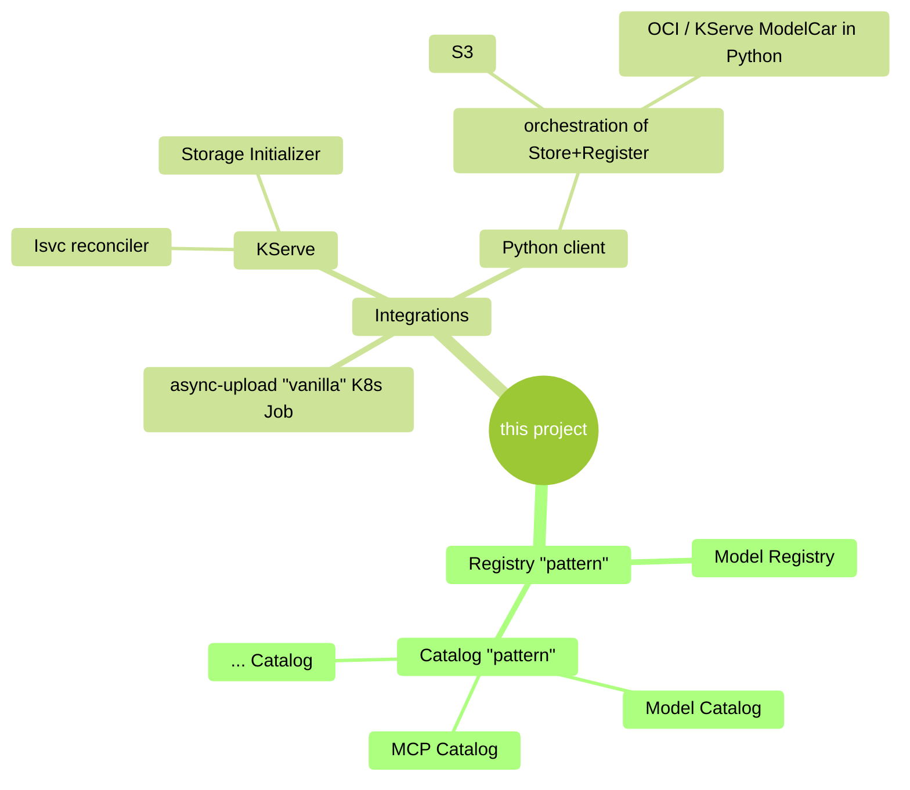

# KEP-907: Renaming "Model Registry" to reflect Registry and Catalog use-cases

Status: `review by KSC requested`.

## Summary

This KEP proposes renaming the current "Kubeflow Model Registry" project to "Kubeflow Hub", to better reflect its evolution that encompasses both _model registry_ capabilities (for tracking model evolution during development) and _model catalog_ capabilities (for showcasing organization-approved models). The current naming might under-evaluate the project's capabilities and goals, as the "Kubeflow Model Registry" project has well grown beyond its original scope to include GenAI/LLM showcasing, enterprise-wide model sharing, and more than a singular use-case pattern (i.e.: multi-tenant Registries and a cluster-wide Catalog).

## Motivation

The Kubeflow Model Registry project, originally proposed in [this Model Registry Platform proposal](../model-registry-proposal.md), has evolved significantly since its original onboarding. The project now serves two distinct but complementary use cases that are not clearly reflected in its current naming ("Model Registry"):

1. **Model Registry**: Tenant-scoped model tracking during development lifecycle
2. **Model Catalog**: Cluster-scoped showcase of organization-approved models, including GenAI/LLM models

According to the [Kubeflow 2023 survey](https://blog.kubeflow.org/kubeflow-user-survey-2023/), 44% of users identified Model Registry as a critical gap in the ML lifecycle. Meanwhile, the current implementation addresses a broader model management need, that extends beyond the traditional registry concepts, especially into newer GenAI and LLM use-cases.

This proposal captures a [community discussion](https://github.com/kubeflow/community/pull/892#discussion_r2263804358) as a proper KEP form.

### Goals

<!-- these are the Goals of the KEP -->

- Clarify the project's ability to cover the 2 use-cases through improved naming
- Better reflect the project's evolution to support GenAI/LLM model showcasing
- Align terminology with Industry standards and User expectations
- Facilitate better understanding for new Users and Enterprise adoption

### Non-Goals

<!-- these are the non-Goals of this KEP -->

- Change the underlying technical architecture or functionality, API, integrations patterns, etc.
- Impact current deployment or operational procedures
- Modify, replace, deprecate existing WG

## Proposal

We propose renaming the "Model Registry" Kubeflow project to better reflect its current, more comprehensive model management capabilities. This KEP presents the analysis and considerations for potential naming options (below) while keeping the discussion open for community inputs!

### Current Project Analysis

The existing "Model Registry" project actually encompasses 2 distinct use-case and patterns:

#### Model Registry (Tenant-Scoped)
- Purpose: track model evolution during development lifecycle
- Scope: per-tenant/per-namespace deployment
- Use Cases:
    - Training experiments and iterations
    - Model fine-tuning and alignment tracking
    - Version management during development
    - Metadata for training runs, parameters, metrics
    - Model lineage from data --> training --> checkpoints
- Users: Data Scientists, ML engineers within specific teams/projects
- Deployment: 0..N instances per cluster (1 per Tenant)

#### Model Catalog (Cluster-Scoped, Company-scoped)
- Purpose: showcase "blessed" models for organization-wide consumption
- Scope: single instance per cluster/Kubeflow installation
- Use Cases:
    - GenAI/LLM model showcase
    - Organization-approved models (might be internal models, + external models)
    - Model discovery and sharing across teams
    - Corporate model governance and compliance
    - Integration with external model sources (HuggingFace, etc.)
- Users: all organization members, model consumers
- Deployment: (1) singleton per cluster

#### Summarizing the 2 use-cases

The following table summarizes the key differences between Registry and Catalog concepts.

> ![NOTE]
> These distinctions represent common usage patterns and blueprints. Organizations may _still_ choose to adopt a single Model Registry approach if it better fits their needs! This table is provided only for illustrative purposes and to highlight the different use cases the current Kubeflow project supports.

| Aspect | Model Registry pattern | Model Catalog pattern |
|--------|------------------------|------------------------|
| **Lifecycle Stage** | Development & Training | Production & Sharing |
| **Audience** | Team/Project members | Company-/Organization-wide |
| **Model Types** | Work-in-progress models | Blessed/approved models for the whole Company |
| **Versioning** | More fine-grained iterations | Major releases |
| **Governance** | Team-level (MLOps) | Enterprise-level (Admin + Stakeholders) |
| **Source** | Typically only internal training/tuning models | Internal + External models |
| **Deployment** | Multiple-tenants (1 per Tenant) | Single instance (cluster-wide) |
| **Discovery** | Project-scoped search | Organization-wide catalog |
| **Compliance** | Development standards | Enterprise policies enforced by Stakeholders |

#### Naming Patterns in AI/ML Ecosystem

Existing and common terminology patterns in other projects/products:

- **"Registry"**: current name, MlFlow, Azure, AWS
- **"Hub"**: Docker Hub, HuggingFace Hub
- **"Model Garden"**: Vertex AI

### User Stories

#### Story 1: Data Scientist workflow
As a Data Scientist, I want to track my model experiments and iterations within my team's workspace (_Model Registry_ pattern) while also being able to discover and use approved models from our organization's catalog (_Model Catalog_ pattern).

#### Story 2: Organization model's Governance
As a Stakeholder, I want to distinguish between development model tracking (per-team registries) and organization-wide model sharing (centralized catalog) to implement appropriate governance policies.

#### Story 3: the Admin
As a platform Administrator, I need to showcase _the_ approved GenAI/LLM models Organization-wide through a centralized catalog, while maintaining separate registries for individual team development needs.

### Naming Considerations

#### Evaluation Criteria

As we ask for Community inputs, the following criteria could be used later to evaluate the final selected name.

- **Scope Clarity**: does the name clearly indicate the 2 model management (registry, catalog) capabilities?
- **Industry Alignment**: is the name consistent with established ML/AI terminology? Do we actually need to be aligned, or can we introduce a "creative" name?
- **Future Compatibility**: can it accommodate GenAI/LLM evolution and Organization needs?
- **Kubeflow Integration**: does it fit within the Kubeflow ecosystem naming?

#### Candidate Names for Discussion

Captured each one from the previous [community discussion](https://github.com/kubeflow/community/pull/892#discussion_r2263804358), and the Community can provide inputs directly in markdown below:

- "Kubeflow AI Asset Registry"
- "Kubeflow AI Assets"
- "Kubeflow Registry" (simplified by dropping "Model")
- "Kubeflow Tracker"
- "Kubeflow Tracking"
- "Kubeflow AI Hub"
- "Kubeflow AI Registry"
- "Kubeflow Metadata"
- "Kubeflow AI Atlas"
- "Kubeflow Atlas"
- "Kubeflow Hub"
- `<add your proposal name in this list>`

### Risks and Mitigations

- **Risk**: Community confusion for those familiar with "Kubeflow Model Registry"
- **Mitigation**: phased communication plan, clear documentation updates

### 2025-11-04 Kubeflow Community meeting

Members of KSC and of the KF Community suggests is best to proceed as follows:
1. run a Poll on this PR to come up with the name selected (or an ordered list)
2. based on the results of the above step, the KSC will check if any CNCF enquiry is needed

A suggestion was also made that the KSC as a "backoffice activity" can rename the repo.

### 2025-11-24 Kubeflow Working Group biweekly meeting

The community has discussed in the dedicated github page.

We [have highlighted](https://github.com/kubeflow/community/pull/907#issuecomment-3509842213) the need for the rename based on the _current_ and short-term evolution of the project:

We have [proposed a simple](https://github.com/kubeflow/community/pull/907#issuecomment-3543346336), less-is-more name: "Kubeflow Hub".

In the [community meeting, we have reached an unanymous consensus](https://youtu.be/lKB0coftNPY?si=XIVnI749ES9BdVME&t=111) to proceed with "Kubeflow Hub" as the preferred name.

As indicated by the KSC, we are therefore asking confirmation to proceed with "Kubeflow Hub" as the name, by merging this PR to finally proceed with phase 2, 3 accordingly.

## Design Details

### Migration Strategy

1. **Phase 1**: Community discussion and name selection
2. **Phase 2**: Implement any needed Repository renaming and documentation updates
3. **Phase 3**: Update naming across Kubeflow and external communications

## Implementation History

- **KEP Creation**: 2025-09-29
- **Community Discussion**: 2025-11-04
- **Name Selection**: 2025-11-24
- **Implementation Start**: WIP

## Drawbacks

- **Transition Overhead**: Requires some coordination and documentation updates
- **Community Learning Curve**: Kubeflow Users must adapt to new terminology
- **External Impact**: Existing external references and materials might need update

## Alternatives

### Alternative 0: Maintain Current Naming (the "do nothing" alternative)
- **Pros**: no transition overhead, existing naming
- **Cons**: continued confusion and under-evaluation about project scope, misalignment with evolved capabilities

### Alternative 1: Add Descriptive Suffixes (eg "Kubeflow Model Registry and Catalog")
- **Pros**: maintain base naming while adding clarity only in documentation updates
- **Cons**: verbose naming, inconsistent with Kubeflow patterns

## References
- https://github.com/kubeflow/community/pull/892#discussion_r2263804358
