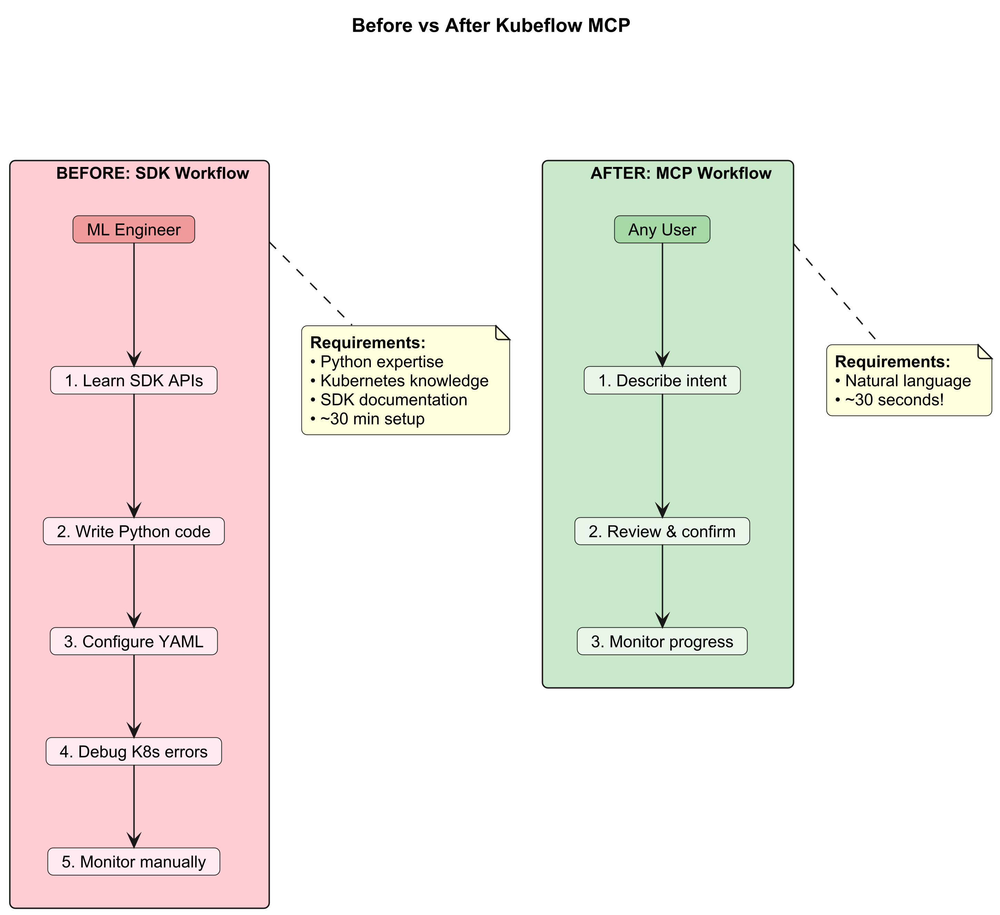
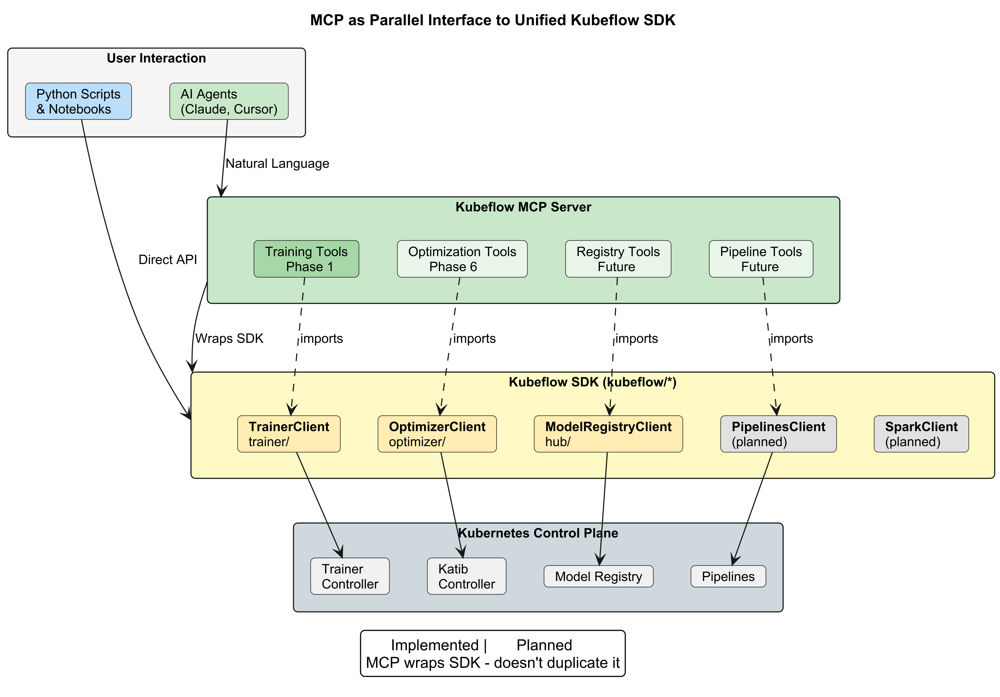
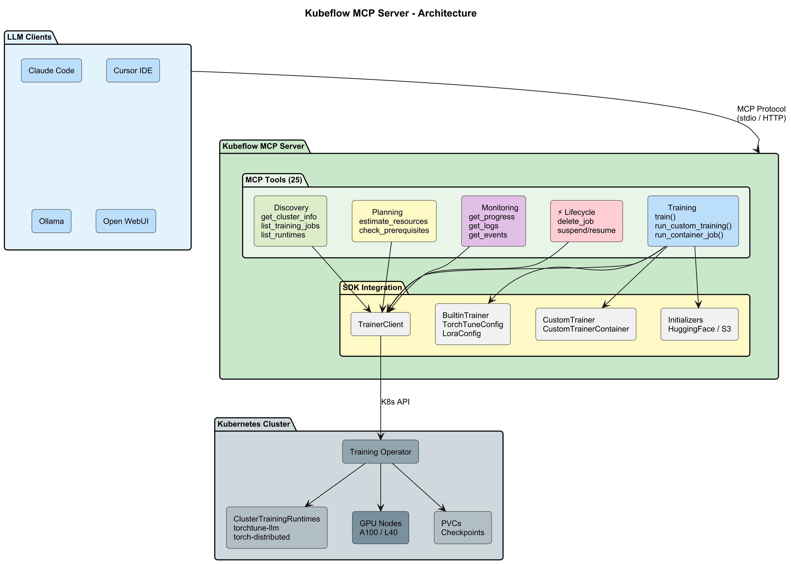
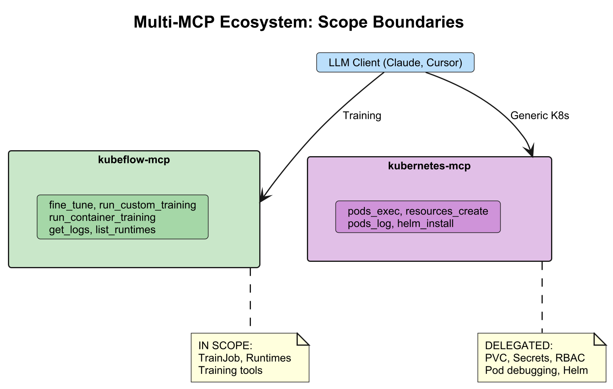
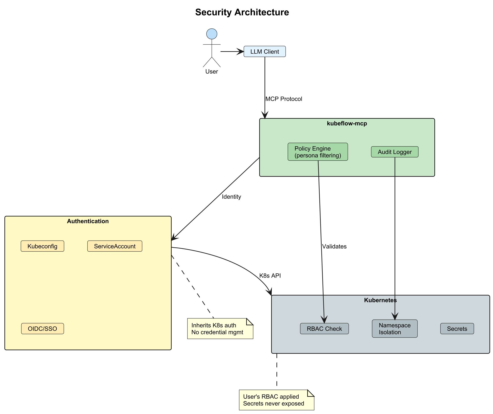
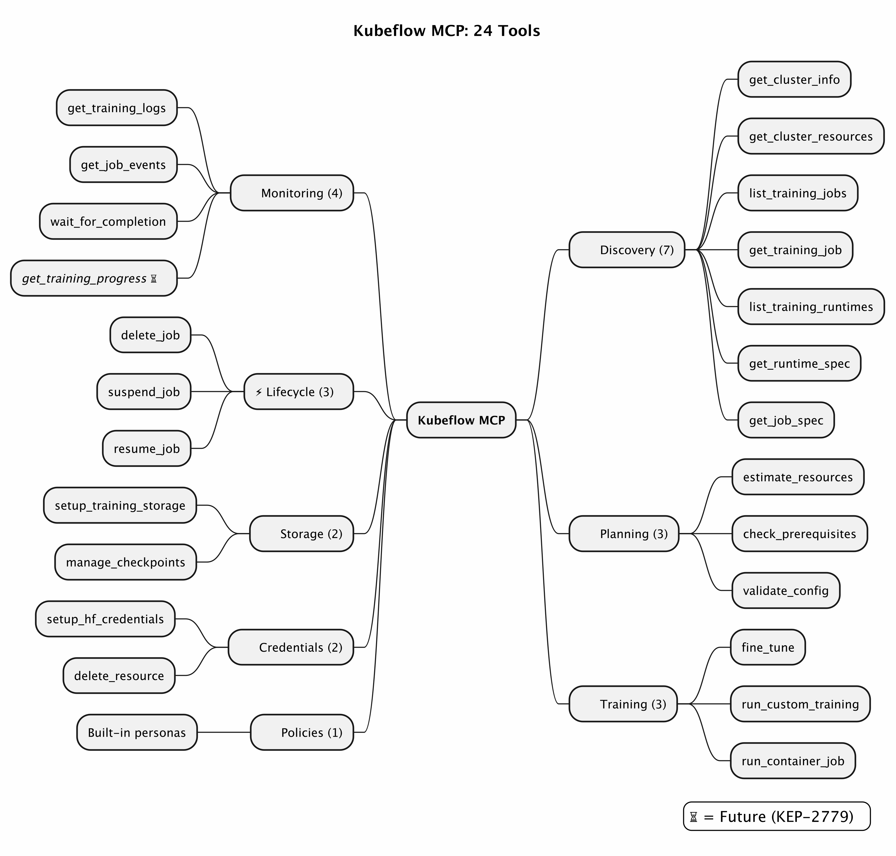
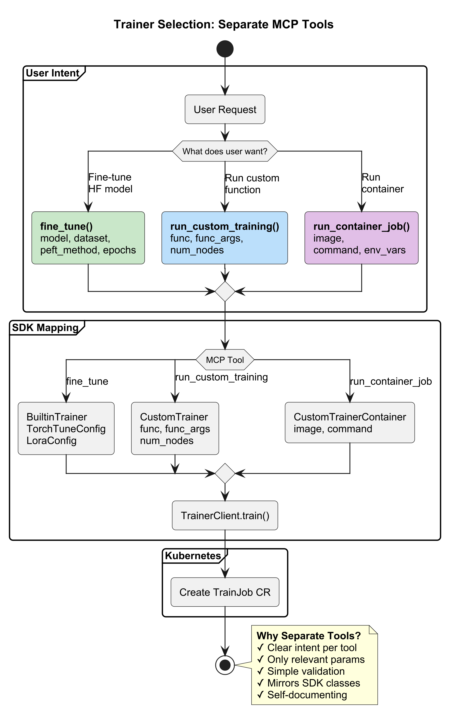
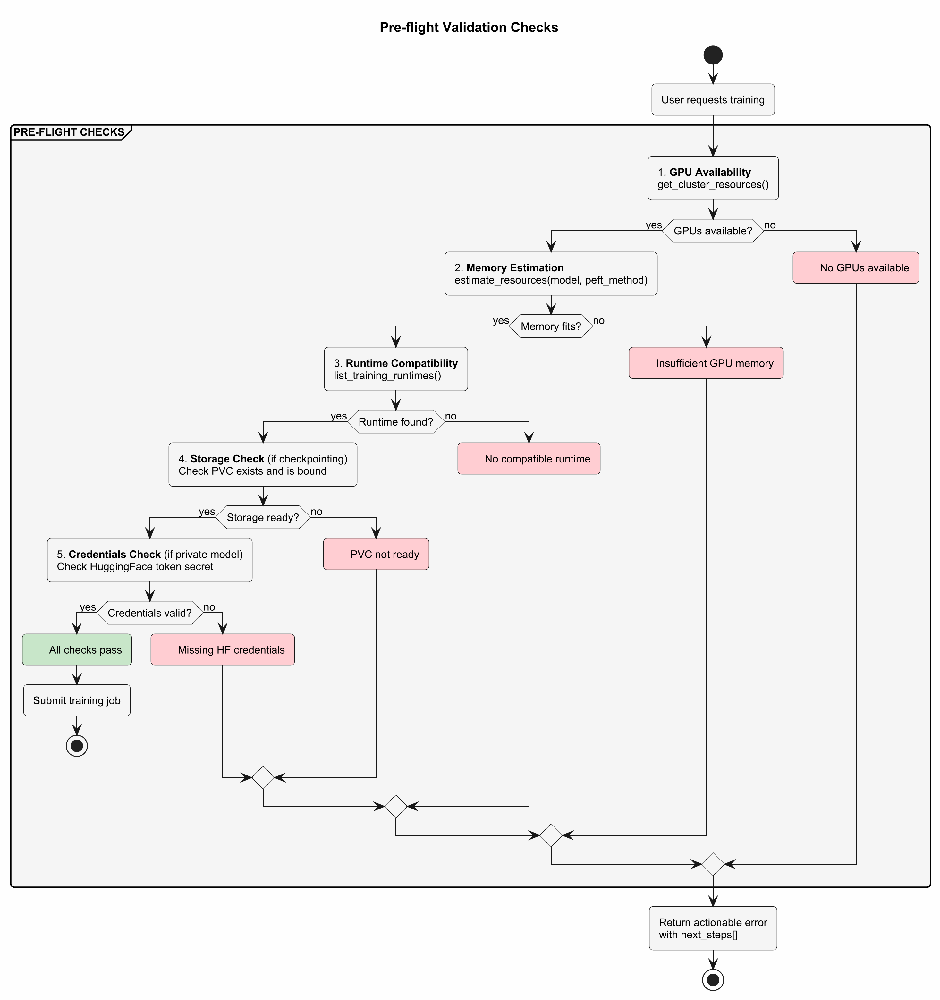
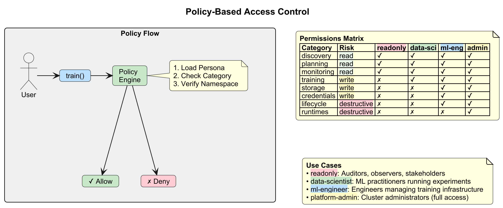
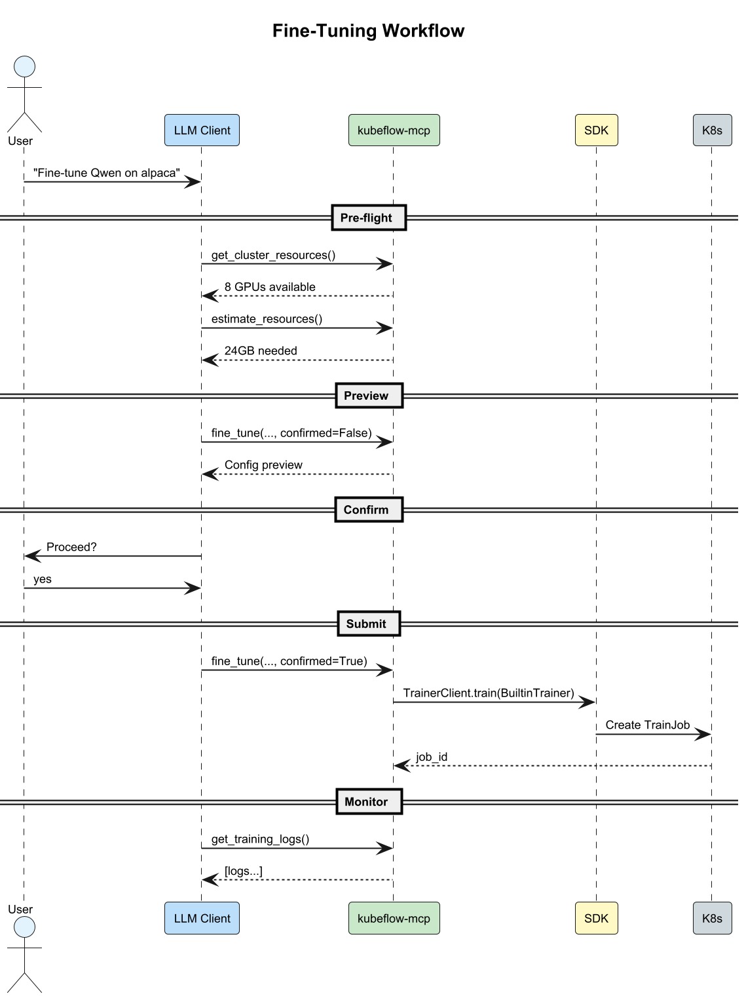

# KEP-936: Kubeflow MCP Server - AI-Powered Training Interface

**Authors:**
- Abhijeet Dhumal (Red Hat) - [@abhijeet-dhumal](https://github.com/abhijeet-dhumal)

**Tracking Issue:** [kubeflow/community#936](https://github.com/kubeflow/community/issues/936)

**Related:** [kubeflow/sdk#238](https://github.com/kubeflow/sdk/issues/238)

---

## Summary

This KEP proposes a **Model Context Protocol (MCP) Server** for the Kubeflow SDK that should enable AI agents to interact with Kubeflow Training resources through natural language. The MCP server should wrap the existing Kubeflow SDK (`TrainerClient`, `BuiltinTrainer`, `CustomTrainer`) without duplicating code, providing a conversational interface for training operations.

**Core Principle:** The MCP server should be a *complementary interface*, not a replacement. It should wrap the SDK, enabling natural language workflows while preserving full programmatic access for power users.

### Before vs After



## Motivation

Kubeflow Training provides powerful distributed training capabilities, but requires:

1. **Python SDK Knowledge**: Understanding `TrainerClient`, `BuiltinTrainer`, `CustomTrainer`, `TorchTuneConfig`, etc.
2. **Kubernetes Expertise**: PVCs, Secrets, RBAC, namespaces, ClusterTrainingRuntimes
3. **Multiple Tools**: kubectl, Python REPL, monitoring dashboards
4. **Manual Validation**: Pre-flight checks are user responsibility

The [Model Context Protocol (MCP)](https://modelcontextprotocol.io/) provides a standard way for AI agents to interact with external systems. Modern AI-powered IDEs (Claude Code, Cursor, VS Code with Copilot) support MCP, enabling natural language interfaces for complex operations.

### Goals

1. **Natural Language Training Interface**: Enable users to fine-tune models, run custom training, and monitor jobs through conversational commands
2. **SDK Integration Without Duplication**: Import and wrap existing SDK types (`BuiltinTrainer`, `CustomTrainer`, `TrainerClient`) directly
3. **Pre-flight Validation**: Automatic checks for GPU availability, memory estimation, and storage before training
4. **Multi-Client Support**: Work with Claude, Cursor IDE, Ollama, Open WebUI, and any MCP-compatible client
5. **Support Both Trainer Types**: 
   - `BuiltinTrainer` for zero-code fine-tuning with TorchTune recipes
   - `CustomTrainer` for user-provided training functions
6. **Multi-MCP Ecosystem**: Work alongside `kubernetes-mcp-server` for clear scope separation
7. **Policy-Based Access Control**: Support personas (readonly, data-scientist, ml-engineer, platform-admin) for enterprise environments

### Non-Goals

1. **Replace Kubeflow SDK**: MCP wraps the SDK, it doesn't replace it
2. **Duplicate SDK Code**: Import SDK types directly, no re-implementation
3. **Real-time Training Streaming**: Focus on polling-based monitoring
4. **Hyperparameter Optimization**: Katib integration planned for future
5. **Replace kubectl/K8s tools**: Use `kubernetes-mcp-server` for generic K8s operations (PVCs, ConfigMaps, Secrets management)

## Proposal

### Alignment with Unified Kubeflow SDK

This MCP server proposal is designed to **evolve alongside the unified Kubeflow SDK** (`kubeflow/sdk`), which consolidates multiple Kubeflow ecosystem components under a single Python package.

#### Current SDK Structure

```
kubeflow/
├── trainer/       # TrainerClient - distributed training & fine-tuning
├── optimizer/     # OptimizerClient - Katib AutoML & hyperparameter tuning  
├── hub/           # ModelRegistryClient - model artifact management
└── common/        # Shared utilities across clients
```

#### MCP as Parallel Interface to SDK



| SDK Client | Component | Control Plane ConfigMap | MCP Integration |
|------------|-----------|-------------------------|-----------------|
| `TrainerClient` | Kubeflow Trainer | `kubeflow-trainer-public` | ✅ Phase 1 (this proposal) |
| `OptimizerClient` | Kubeflow Katib | `kubeflow-optimizer-public` | 🔜 Phase 6 |
| `ModelRegistryClient` | Model Registry | `kubeflow-hub-public` | 🔜 Future |
| `PipelinesClient` | Kubeflow Pipelines | `kubeflow-pipelines-public` | 🔜 Future |
| `SparkClient` | Spark Operator | `kubeflow-spark-public` | 🔜 Future |

### Architecture Overview



### Design Principle: SDK Integration Without Duplication

The MCP server imports Kubeflow SDK types directly—no code duplication:


```python
# kubeflow_mcp/server.py
from kubeflow.trainer import (
    TrainerClient,
    BuiltinTrainer,
    CustomTrainer,
    CustomTrainerContainer,
    TorchTuneConfig,
    LoraConfig,
    HuggingFaceModelInitializer,
    HuggingFaceDatasetInitializer,
    S3ModelInitializer,
    S3DatasetInitializer,
)
from kubeflow.trainer.options import Labels, Name

@mcp.tool()
def fine_tune(
    model: str,
    dataset: str,
    peft_method: str = "lora",
    epochs: int = 3,
    batch_size: int = 4,
    num_nodes: int = 1,
    gpus_per_node: int = 1,
    namespace: str = "default",
) -> dict:
    """Fine-tune a model using BuiltinTrainer with TorchTune."""
    
    client = TrainerClient()
    
    # Build trainer using SDK types directly
    trainer = BuiltinTrainer(
        config=TorchTuneConfig(
            epochs=epochs,
            batch_size=batch_size,
            num_nodes=num_nodes,
            resources_per_node={"nvidia.com/gpu": gpus_per_node},
            peft_config=LoraConfig(lora_rank=16, lora_alpha=32) if peft_method == "lora" else None,
        )
    )
    
    # Build initializers using SDK types
    initializer = Initializer(
        model=HuggingFaceModelInitializer(storage_uri=f"hf://{model}"),
        dataset=HuggingFaceDatasetInitializer(storage_uri=f"hf://{dataset}"),
    )
    
    # Submit via SDK
    job_name = client.train(trainer=trainer, initializer=initializer)
    
    return {"success": True, "job_id": job_name}
```

### User Stories

#### Story 1: Data Scientist Fine-Tuning with BuiltinTrainer

As a data scientist, I want to fine-tune Qwen on a custom dataset without learning Kubernetes.

```
User: "Fine-tune Qwen/Qwen2.5-7B-Instruct on tatsu-lab/alpaca using LoRA"

AI Agent (using MCP tools):
1. get_cluster_resources() → "4x A100 80GB available"
2. estimate_resources("Qwen/Qwen2.5-7B-Instruct", "lora") → "24GB needed"
3. fine_tune(model="Qwen/Qwen2.5-7B-Instruct", dataset="tatsu-lab/alpaca", peft_method="lora")

Response: "Started training job 'ft-qwen-abc123'. The model needs ~24GB GPU memory,
which fits on your available A100 GPUs. Training will take approximately 2 hours
for 3 epochs. Use 'get_training_progress' to monitor."
```

**SDK Equivalent:**
```python
from kubeflow.trainer import TrainerClient, BuiltinTrainer, TorchTuneConfig, LoraConfig
from kubeflow.trainer import HuggingFaceModelInitializer, HuggingFaceDatasetInitializer, Initializer

client = TrainerClient()
job = client.train(
    trainer=BuiltinTrainer(
        config=TorchTuneConfig(
            epochs=3,
            batch_size=4,
            peft_config=LoraConfig(lora_rank=16, lora_alpha=32),
        )
    ),
    initializer=Initializer(
        model=HuggingFaceModelInitializer(storage_uri="hf://Qwen/Qwen2.5-7B-Instruct"),
        dataset=HuggingFaceDatasetInitializer(storage_uri="hf://tatsu-lab/alpaca"),
    ),
)
```

#### Story 2: ML Engineer Running Custom Training with CustomTrainer

As an ML engineer, I want to run my distributed training function on 2 nodes with 4 GPUs each.

```
User: "Run my distributed training function on 2 nodes with 4 GPUs each"

AI Agent (using MCP tools):
1. get_cluster_resources() → "8 GPUs available across 2 nodes"
2. run_custom_training(
     func=user_training_func,
     func_args={"learning_rate": "0.01"},
     num_nodes=2,
     resources_per_node={"nvidia.com/gpu": 4}
   )

Response: "Started custom training job 'custom-train-xyz789' on 2 nodes.
Your function will run with PyTorch DDP across 8 GPUs total."
```

**SDK Equivalent:**
```python
from kubeflow.trainer import TrainerClient, CustomTrainer

def train_func(learning_rate: str):
    import torch.distributed as dist
    dist.init_process_group(backend="nccl")
    # Training logic...

client = TrainerClient()
job = client.train(
    trainer=CustomTrainer(
        func=train_func,
        func_args={"learning_rate": "0.01"},
        num_nodes=2,
        resources_per_node={"nvidia.com/gpu": 4},
    )
)
```

#### Story 3: DevOps Running Container-Based Training

As a DevOps engineer, I want to run a pre-built training container.

```
User: "Run my custom trainer image ghcr.io/myorg/trainer:v1 with 4 GPUs"

AI Agent (using MCP tools):
1. get_cluster_resources() → "4 GPUs available"
2. run_container_job(image="ghcr.io/myorg/trainer:v1", gpus_per_node=4)

Response: "Started container training job 'container-train-def456'.
Your image will run with 4 GPUs."
```

**SDK Equivalent:**
```python
from kubeflow.trainer import TrainerClient, CustomTrainerContainer

client = TrainerClient()
job = client.train(
    trainer=CustomTrainerContainer(
        image="ghcr.io/myorg/trainer:v1",
        num_nodes=1,
        resources_per_node={"nvidia.com/gpu": 4},
    )
)
```

### Notes/Constraints/Caveats

#### Multi-MCP Ecosystem

Kubeflow MCP should be designed to work alongside other MCP servers, with clear scope boundaries:



**Design Principle:** No overlap. `kubeflow-mcp` should handle training; `kubernetes-mcp-server` should handle generic K8s operations.

| Domain | kubeflow-mcp | kubernetes-mcp-server |
|--------|--------------|----------------------|
| **TrainJob CRDs** | ✅ Owns | ❌ Delegates |
| **ClusterTrainingRuntimes** | ✅ Owns | ❌ Delegates |
| **Training-specific storage** | ✅ Owns | ❌ Delegates |
| **Generic PVC management** | ❌ Delegates | ✅ Owns |
| **ConfigMaps / Secrets** | ❌ Delegates | ✅ Owns |
| **Pod debugging (exec, logs)** | ❌ Delegates | ✅ Owns |
| **RBAC / Roles** | ❌ Delegates | ✅ Owns |
| **Helm charts** | ❌ Delegates | ✅ Owns |

#### Progress Tracking

Real-time progress tracking with metrics (loss, epoch, ETA) depends on [KEP-2779: TrainJob Progress Tracking](https://github.com/kubeflow/trainer/tree/master/docs/proposals/2779-trainjob-progress). Until implemented, monitoring relies on job status and container logs.

### Risks and Mitigations

| Risk | Mitigation |
|------|------------|
| **SDK Breaking Changes** | Pin SDK version, adapter pattern should isolate changes |
| **LLM Hallucination** | Pre-flight checks should validate all inputs before execution |
| **Resource Exhaustion** | Automatic resource estimation and user confirmation required |
| **Multi-tenancy** | Namespace isolation, should use user's kubeconfig RBAC |
| **Unauthorized Access** | Policy layer should enforce RBAC at tool level |
| **Scope Creep** | Clear delegation to `kubernetes-mcp-server` for generic K8s ops |

## Security Considerations



### Authentication

The MCP server should inherit authentication from the underlying Kubernetes context:

| Method | Description | Use Case |
|--------|-------------|----------|
| **Kubeconfig** | Uses `~/.kube/config` or `KUBECONFIG` env var | Local development, CI/CD |
| **ServiceAccount Token** | Mounted at `/var/run/secrets/kubernetes.io/serviceaccount/token` | In-cluster deployment |
| **OIDC** | OpenID Connect via kubeconfig auth provider | Enterprise SSO integration |

**Design Principle:** The MCP server should NOT manage credentials. It should use the same authentication as `kubectl` and the Kubeflow SDK.

### Authorization

MCP tools should operate under the user's Kubernetes RBAC permissions:

```
User Request → MCP Server → Kubeflow SDK → K8s API Server → RBAC Check
```

| Resource | Required RBAC Verbs |
|----------|---------------------|
| TrainJob | `get`, `list`, `create`, `delete`, `patch` |
| ClusterTrainingRuntime | `get`, `list` |
| PersistentVolumeClaim | `get`, `list` (via `kubernetes-mcp-server`) |
| Secrets | `get` (for HF tokens, via `kubernetes-mcp-server`) |

**Namespace Isolation:** Policies should be able to restrict MCP tools to specific namespaces:

```yaml
# ~/.kf-mcp-policy.yaml
policy:
  namespaces:
    - ml-team-dev    # Only allow operations in these namespaces
    - ml-team-prod
```

### Secret Management

The MCP server should handle sensitive data carefully:

| Secret Type | Storage | Access Pattern |
|-------------|---------|----------------|
| HuggingFace Token | K8s Secret (`hf-token`) | Mounted to training pods, never logged |
| S3 Credentials | K8s Secret | Mounted to initializer pods |
| Model Weights | PVC | Downloaded by initializers, not MCP |

**Best Practices:**
- `setup_hf_credentials()` should create secrets with `stringData` (base64 handled by K8s)
- Secrets should **never** be returned in tool responses
- Container logs should be filtered to redact tokens

### Multi-Tenancy

The MCP server should support multi-tenant deployments through:

1. **Namespace Isolation**: Users should only be able to access training jobs in namespaces where they have RBAC permissions
2. **Policy Enforcement**: Persona-based policies should restrict tool access per user/group
3. **Resource Quotas**: MCP should validate against K8s ResourceQuotas before training


### Audit Logging

The MCP server should log all tool invocations for audit:

```json
{
  "timestamp": "2026-01-29T10:30:00Z",
  "tool": "fine_tune",
  "user": "user@example.com",
  "namespace": "ml-team-dev",
  "parameters": {"model": "Qwen/Qwen2.5-7B", "dataset": "alpaca"},
  "result": "success",
  "job_id": "ft-qwen-abc123"
}
```

**Note:** Sensitive parameters (tokens, credentials) should be **redacted** from logs.

## Design Details

### MCP Tool Inventory



Tools organized by category, mapping to SDK functionality:

#### Discovery Tools (Read-only)

| Tool | SDK Mapping | Description |
|------|-------------|-------------|
| `get_cluster_info()` | K8s API | Cluster connection status |
| `get_cluster_resources()` | K8s API | Available GPUs, nodes, memory |
| `list_training_jobs()` | `TrainerClient.list_jobs()` | Jobs in namespace |
| `get_training_job(job_id)` | `TrainerClient.get_job()` | Job details |
| `list_training_runtimes()` | `TrainerClient.list_runtimes()` | Available ClusterTrainingRuntimes |
| `get_runtime_spec(name)` | K8s API | Full runtime YAML |
| `get_job_spec(job_id)` | K8s API | Full TrainJob YAML |

#### Planning Tools (Validation)

| Tool | Purpose | Returns |
|------|---------|---------|
| `estimate_resources(model, peft_method)` | GPU/memory requirements | `{gpu_memory, recommended_gpus, feasible}` |
| `check_prerequisites(model, dataset)` | Pre-flight validation | `{ready, issues[], actions_needed[]}` |
| `validate_config(model, dataset, runtime)` | Config validation | `{valid, errors[]}` |

**Note on Resource Estimation:** The `estimate_resources()` tool uses trainer-specific logic:

| Trainer Type | Estimation Method |
|--------------|-------------------|
| `BuiltinTrainer` (TorchTune) | Model registry lookup + recipe-based calculation |
| `BuiltinTrainer` (TRL) | *Future:* TRL-specific memory profiling |
| `BuiltinTrainer` (Unsloth) | *Future:* Unsloth optimization factors (~2x efficiency) |
| `CustomTrainer` | User-provided hints or conservative defaults |
| `CustomTrainerContainer` | Container metadata or user-provided hints |

As new backends are added via [KEP-2839](https://github.com/kubeflow/trainer/issues/2839), the estimation logic should extend to support their memory characteristics.

#### Training Tools (Execute)

| Tool | SDK Mapping | Description |
|------|-------------|-------------|
| `fine_tune(model, dataset, ...)` | `BuiltinTrainer` | Zero-code fine-tuning with TorchTune |
| `run_custom_training(script_code, ...)` | `CustomTrainer` | User-provided training function |
| `run_container_job(image, ...)` | `CustomTrainerContainer` | Pre-built training container |

#### Design Decision: Separate Tools vs Unified `train()`

We considered a unified `train()` tool with auto-detection based on parameters, but chose **separate tools** for the following reasons:

| Criteria | Unified Tool | Separate Tools (Chosen) |
|----------|--------------|-------------------------|
| **Parameter Clarity** | Many optional params, confusing combinations | Only relevant params per tool |
| **Validation** | Complex ("if model provided, script_code must be None") | Simple - all params are relevant |
| **LLM Tool Selection** | Single tool, LLM must understand param combinations | Clear intent from tool name |
| **SDK Alignment** | Hides SDK's class separation | Mirrors `BuiltinTrainer`, `CustomTrainer`, `CustomTrainerContainer` |
| **Error Messages** | "Invalid combination of parameters" | "Missing required argument: dataset" |
| **Discoverability** | One generic tool | Self-documenting tool names |
| **Maintainability** | Monolithic function with many code paths | Single responsibility per tool |

**Example:**

```
User: "Fine-tune Llama on alpaca"     → LLM selects fine_tune()
User: "Run my custom DDP script"      → LLM selects run_custom_training()
User: "Deploy my trainer container"   → LLM selects run_container_job()
```

Each tool has a clear purpose, making it easier for both LLMs and humans to understand and use.

#### Monitoring Tools (Observe)

| Tool | SDK Mapping | Description |
|------|-------------|-------------|
| `get_training_logs(job_id)` | `TrainerClient.get_job_logs()` | Container logs |
| `get_job_events(job_id)` | K8s API | Kubernetes events |
| `wait_for_completion(job_id)` | `TrainerClient.wait_for_job_status()` | Block until done |
| `get_training_progress(job_id)` | *Future: KEP-2779* | Progress bar, metrics ⏳ |

#### Lifecycle Tools (Manage)

| Tool | SDK Mapping | Description |
|------|-------------|-------------|
| `delete_job(job_id)` | `TrainerClient.delete_job()` | Delete training job |
| `suspend_job(job_id)` | K8s API patch | Pause job, free GPUs |
| `resume_job(job_id)` | K8s API patch | Resume suspended job |

### Trainer Selection Logic



#### Extensibility: Dynamic LLM Trainer Framework

This MCP server is designed to support the upcoming **Dynamic LLM Trainer Framework** ([KEP-2839](https://github.com/kubeflow/trainer/issues/2839)), which introduces a pluggable backend architecture for LLM fine-tuning:

| Backend | Status | MCP Support |
|---------|--------|-------------|
| **TorchTune** | Current default | ✅ Supported |
| **TRL** | Planned | 🔜 When available |
| **Unsloth** | Planned | 🔜 When available |
| **LlamaFactory** | Planned | 🔜 When available |

**Design Principle:** MCP tools use the SDK's `LLMBackend` abstraction. When new backends are registered (e.g., `TRLBackend`, `UnslothBackend`), MCP automatically supports them through:

```python
# Future SDK API with Dynamic Trainer Framework
client.train(
    trainer=BuiltinTrainer(config=TRLBackend(trainer_type="dpo"))  # TRL backend
)

client.train(
    trainer=BuiltinTrainer(config=UnslothBackend(model="llama3"))  # Unsloth backend
)
```

The MCP server should wrap this SDK API directly—no MCP changes should be needed when new backends are added.

### SDK Types Used

The MCP server should import these types directly from `kubeflow.trainer`:

```python
# Trainers
from kubeflow.trainer import BuiltinTrainer, CustomTrainer, CustomTrainerContainer

# Configurations
from kubeflow.trainer import TorchTuneConfig, LoraConfig, TorchTuneInstructDataset

# Initializers
from kubeflow.trainer import (
    Initializer,
    HuggingFaceModelInitializer,
    HuggingFaceDatasetInitializer,
    S3ModelInitializer,
    S3DatasetInitializer,
)

# Client
from kubeflow.trainer import TrainerClient

# Options
from kubeflow.trainer.options import Labels, Name

# Types
from kubeflow.trainer import TrainerType
```

### Pre-flight Validation

Before training, MCP tools should automatically validate:



### Policy-Based Access Control

Kubeflow MCP should support persona-based policies for enterprise environments:



| Persona | Discovery | Planning | Training | Lifecycle | Storage | Runtimes |
|---------|-----------|----------|----------|-----------|---------|----------|
| `readonly` | ✅ | ✅ | ❌ | ❌ | ❌ | ❌ |
| `data-scientist` | ✅ | ✅ | ✅ | ✅ (own jobs) | ❌ | ❌ |
| `ml-engineer` | ✅ | ✅ | ✅ | ✅ | ✅ | ✅ (use) |
| `platform-admin` | ✅ | ✅ | ✅ | ✅ | ✅ | ✅ (create) |

**Policy Configuration (YAML):**

```yaml
# ~/.kf-mcp-policy.yaml
policy:
  # Allow patterns (supports categories, risks, and globs)
  allow:
    - category:discovery     # All discovery tools
    - category:monitoring    # Logs, metrics, events
    - category:planning      # Prerequisites, validation
    - category:training      # fine_tune(), run_custom_training(), run_container_job()

  # Deny patterns (overrides allow)
  deny:
    - risk:destructive       # Block delete operations
    - delete_*               # Block deletions (glob)

  # Namespace restrictions
  namespaces:
    - ml-team-dev
    - ml-team-prod

  # Read-only mode (blocks all write/destructive)
  read_only: false
```

### MCP Protocol Implementation

Using [FastMCP](https://github.com/jlowin/fastmcp) for protocol handling:

```python
from mcp.server.fastmcp import FastMCP

mcp = FastMCP(
    "kubeflow-mcp",
    instructions="""
    Kubeflow MCP Server - AI Model Training on Kubernetes
    
    WORKFLOW: Fine-Tuning (BuiltinTrainer)
    1. get_cluster_resources() → Check GPU availability
    2. estimate_resources(model, peft_method) → Memory requirements
    3. fine_tune(model, dataset, ...) → Submit training job
    4. get_training_progress(job_id) → Monitor progress
    
    WORKFLOW: Custom Training (CustomTrainer)
    1. get_cluster_resources() → Check GPU availability
    2. run_custom_training(func, func_args, ...) → Submit job
    3. get_training_logs(job_id) → View output
    """
)
```

### Workflow



### Package Structure

```
kubeflow-mcp/
├── pyproject.toml                    # Dependencies: kubeflow>=0.3.0, mcp
├── src/kubeflow_mcp/
│   ├── __init__.py
│   ├── server.py                     # FastMCP server with tools
│   ├── tools/
│   │   ├── discovery.py              # Discovery tools
│   │   ├── planning.py               # Pre-flight validation
│   │   ├── training.py               # Training tools
│   │   ├── monitoring.py             # Progress/logs tools
│   │   └── lifecycle.py              # Delete/suspend/resume
│   ├── adapters/
│   │   └── trainer.py                # SDK wrapper (imports kubeflow.trainer)
│   ├── policies/                     # Policy enforcement
│   │   ├── policy.py                 # ToolPolicy class (category/risk/glob patterns)
│   │   ├── readonly.yaml             # Read-only persona
│   │   ├── data-scientist.yaml       # Data scientist persona
│   │   ├── ml-engineer.yaml          # ML engineer persona
│   │   └── platform-admin.yaml       # Platform admin persona
│   ├── registry.py                   # Model + tool registry
│   └── cli.py                        # CLI commands
└── tests/
```

### Dependencies

```toml
[project]
dependencies = [
    "kubeflow>=0.3.0",                # Kubeflow SDK
    "mcp>=1.0.0",                     # MCP protocol
    "kubernetes>=28.0.0",             # K8s client
]
```

### Test Plan

- [x] I/we understand the owners of the involved components may require updates to
existing tests to make this code solid enough prior to committing the changes necessary
to implement this enhancement.

#### Unit Tests
- Tool logic with mocked SDK
- Pre-flight validation
- Model registry lookups
- Policy enforcement (allow/deny patterns)
- Namespace restrictions

#### Integration Tests
- Real TrainerClient with mock K8s
- Runtime selection
- Job submission
- Policy filtering with personas

#### E2E Tests
- Claude Desktop integration
- Cursor IDE integration
- Real Kubeflow cluster
- Multi-MCP with kubernetes-mcp-server

### Graduation Criteria

#### Alpha
- Core MCP server with `fine_tune()`, `run_custom_training()`, `run_container_job()` tools
- Basic monitoring tools
- Unit tests passing

#### Beta
- Pre-flight validation
- Policy support
- Integration tests with mock K8s

#### Stable
- E2E tests on real cluster
- Multi-client validation (Claude, Cursor)
- Documentation complete


## Drawbacks

1. **Additional Dependency**: Users must install both SDK and MCP server
2. **Maintenance Overhead**: MCP layer must track SDK changes
3. **Abstraction Layer**: Natural language may hide complexity users need to understand

## Alternatives

### Alternative 1: Embed MCP in SDK

**Rejected:** MCP is an integration concern, not core SDK functionality. Keeping them separate allows independent versioning.

### Alternative 2: Build Reasoning into Tools

**Rejected:** Tools like `diagnose_failure()` or `recommend_config()` duplicate LLM capabilities. MCP tools should provide DATA + ACTIONS; LLMs provide REASONING.

### Alternative 3: Custom Protocol

**Rejected:** MCP is an open standard supported by multiple vendors (Anthropic, Cursor, etc.). Custom protocols limit adoption.

### Alternative 4: Hugging Face Skills

[HF Skills](https://github.com/huggingface/skills) provide an alternative approach for AI-powered training workflows:

| Aspect | MCP (This Proposal) | HF Skills |
|--------|---------------------|-----------|
| **Architecture** | Tool-based JSON-RPC protocol | Instruction files (`SKILL.md`) |
| **Runtime** | Kubernetes cluster (on-prem/cloud) | HF Jobs (cloud) or local |
| **Server Required** | Yes (MCP server) | No (files only) |
| **Agent Format** | JSON-RPC tool definitions | YAML frontmatter + markdown |
| **Supported Agents** | Claude, Cursor, any MCP client | Claude Code, Codex, Gemini CLI |
| **Training Backend** | Kubeflow Trainer (TorchTune, custom) | TRL on HF Jobs |
| **Execution Model** | Tools execute actions directly | Skills provide guidance, agent executes |

**Why MCP over Skills for Kubeflow:**

1. **Executable Tools**: MCP should provide actual tool execution, not just guidance. Skills tell agents *how* to train; MCP should *do* the training.
2. **Direct Integration**: MCP tools call SDK methods directly, ensuring consistent behavior. Skills rely on agent interpretation of instructions.
3. **Enterprise Requirements**: MCP should support namespace isolation, RBAC, and policy enforcement required for enterprise deployments.
4. **Real-time Feedback**: MCP tools should return actual job status, logs, and metrics with structured responses.

**Complementary Approach**: Skills and MCP can coexist. A `kubeflow-trainer` skill could provide *guidance* on using Kubeflow MCP tools, combining the best of both approaches:


## Implementation Plan

### Phase 1: Core MCP Server (TrainerClient)
- [ ] FastMCP server with discovery tools
- [ ] `fine_tune()` tool wrapping `BuiltinTrainer` (zero-code fine-tuning)
- [ ] `run_custom_training()` tool wrapping `CustomTrainer` (user-provided function)
- [ ] `run_container_job()` tool wrapping `CustomTrainerContainer` (pre-built container)
- [ ] Basic monitoring tools (logs, job status, events)
- **SDK Dependency:** `kubeflow.trainer.TrainerClient`

### Phase 2: Pre-flight Validation
- [ ] `estimate_resources()` with model registry
- [ ] `check_prerequisites()` for GPU/storage validation
- [ ] Automatic runtime selection
- [ ] Leverage SDK control plane checks ([#221](https://github.com/kubeflow/sdk/issues/221))

### Phase 3: Policy & Multi-MCP
- [ ] Policy enforcement layer (category/risk/glob patterns)
- [ ] Built-in persona policies (readonly, data-scientist, ml-engineer, platform-admin)
- [ ] Namespace restrictions
- [ ] Clear scope boundaries with `kubernetes-mcp-server`

### Phase 4: Advanced Features
- [ ] Suspend/resume for GPU management
- [ ] GPU visibility integration ([#165](https://github.com/kubeflow/sdk/issues/165))
- [ ] Checkpoint management tools

### Phase 5: Progress Tracking
- [ ] `get_training_progress()` with visual progress bar
- [ ] Real-time metrics (loss, epoch, throughput, ETA)
- [ ] Requires [KEP-2779: TrainJob Progress](https://github.com/kubeflow/trainer/tree/master/docs/proposals/2779-trainjob-progress)

### Phase 6: OptimizerClient Integration (Katib)
- [ ] `create_experiment()` wrapping `OptimizerClient`
- [ ] `get_experiment_status()` for HPO monitoring
- [ ] `suggest_hyperparameters()` for AutoML
- **SDK Dependency:** `kubeflow.optimizer.OptimizerClient`

### Phase 7: Future SDK Integrations

| SDK Client | MCP Tools | Depends On |
|------------|-----------|------------|
| `ModelRegistryClient` | `register_model()`, `list_models()` | SDK adds `kubeflow.hub` |
| `PipelinesClient` | `create_pipeline()`, `run_pipeline()` | SDK adds `kubeflow.pipelines` |
| `SparkClient` | `submit_spark_job()` | SDK adds `kubeflow.spark` |
| `FeastClient` | `get_features()` | [#239](https://github.com/kubeflow/sdk/issues/239) |

**Note on Model Registry Integration:** The [Model Registry MCP Catalog](https://github.com/kubeflow/model-registry/pull/2029) is developing its own MCP functionality with gallery UI and database-backed sources. When integrating `ModelRegistryClient`:
- Coordinate tool naming to avoid conflicts with Model Registry MCP Catalog
- Consider unified discovery of MCP servers in the Kubeflow ecosystem
- Leverage Model Registry's `McpServer`, `McpTool`, and `McpSource` entities for interoperability

## References

### Core References
- [Model Context Protocol Specification](https://modelcontextprotocol.io/)
- [Kubeflow SDK Repository](https://github.com/kubeflow/sdk)
- [Kubeflow Training Operator](https://github.com/kubeflow/trainer)
- [KEP-2170: Kubeflow Trainer V2 API](https://github.com/kubeflow/trainer/blob/master/docs/proposals/2170-kubeflow-trainer-v2/README.md)

### Related Issues
- [#936: KEP Tracking Issue](https://github.com/kubeflow/community/issues/936) - This proposal
- [#238: MCP Server for Kubeflow SDK](https://github.com/kubeflow/sdk/issues/238) - Original SDK discussion
- [#221: Control Plane Availability Checks](https://github.com/kubeflow/sdk/issues/221) - Pre-flight validation
- [#239: Feast Integration](https://github.com/kubeflow/sdk/issues/239) - Future feature store tools
- [#164: OpenTelemetry Integration](https://github.com/kubeflow/sdk/issues/164) - Observability
- [#165: GPU Visibility](https://github.com/kubeflow/sdk/issues/165) - Resource monitoring

### Related Kubeflow Initiatives
- [KEP-2839: Dynamic LLM Trainer Framework](https://github.com/kubeflow/trainer/issues/2839) - Pluggable backend architecture for LLM fine-tuning (TRL, Unsloth, LlamaFactory)
- [KEP-2779: TrainJob Progress Tracking](https://github.com/kubeflow/trainer/tree/master/docs/proposals/2779-trainjob-progress) - Real-time training metrics
- [model-registry#2029: MCP Catalog API](https://github.com/kubeflow/model-registry/pull/2029) - MCP server catalog with gallery UI for Model Registry

### Kubeflow Architecture
- [Kubeflow Ecosystem Architecture](https://www.kubeflow.org/docs/started/architecture/)
- [Kubeflow Projects](https://www.kubeflow.org/docs/components/)

