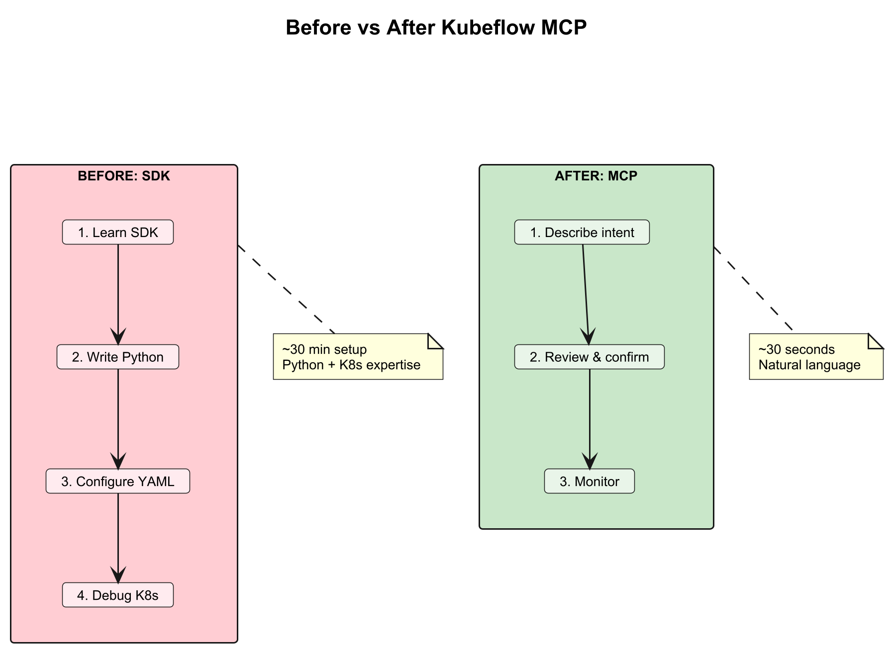
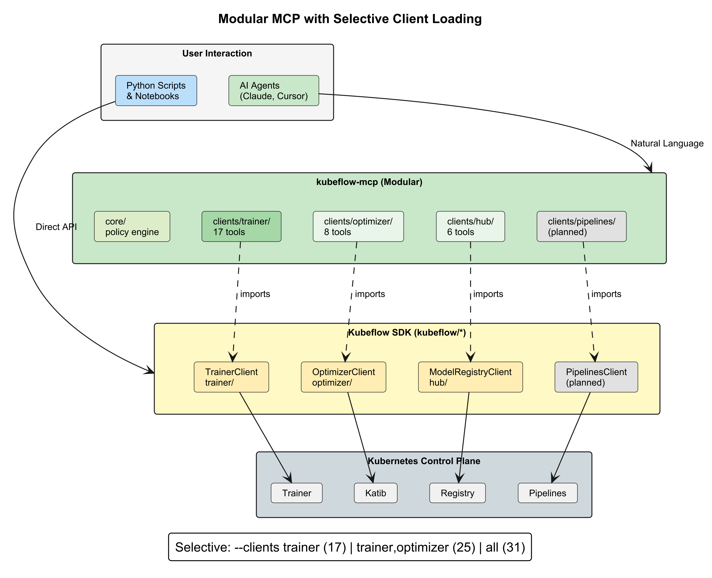
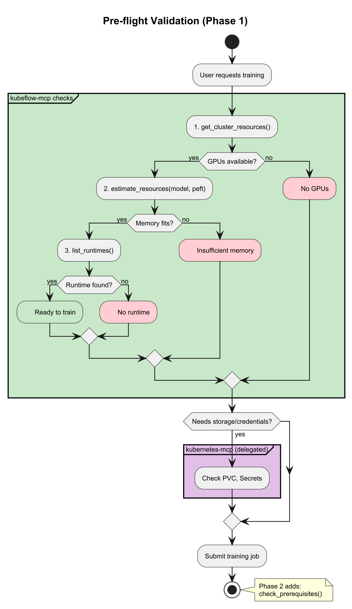
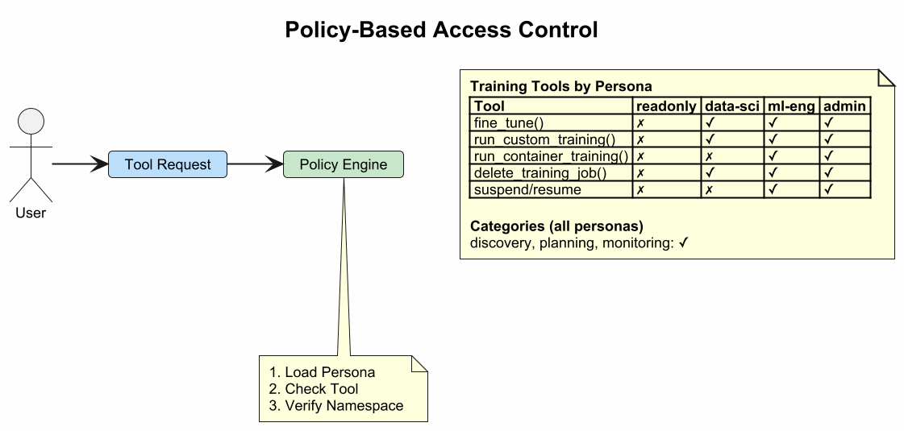
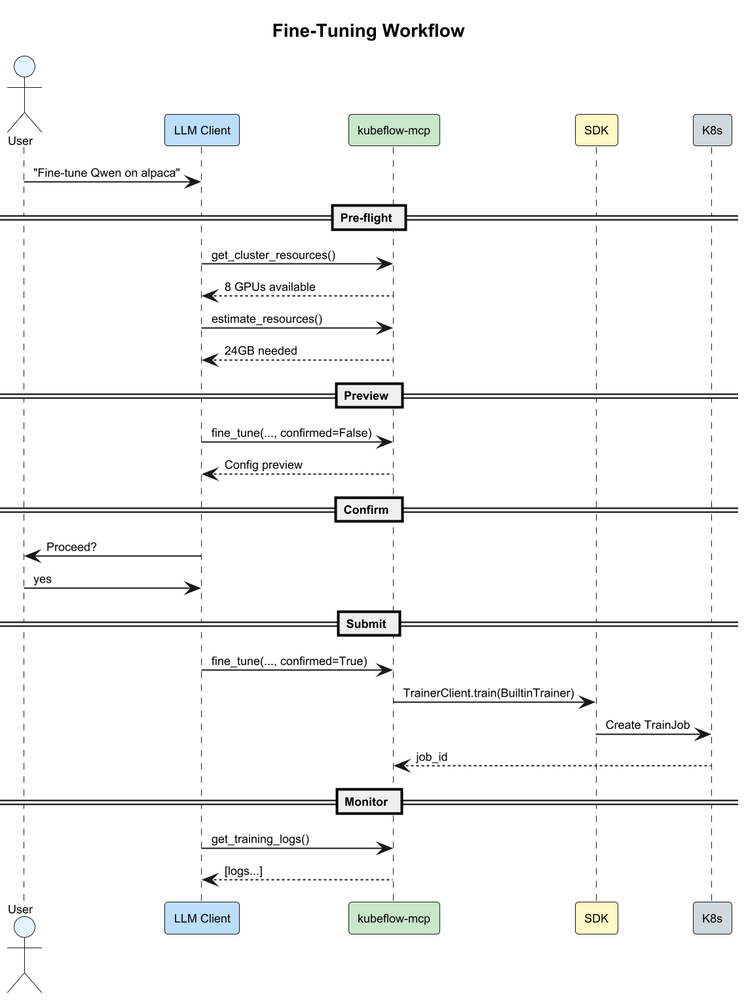
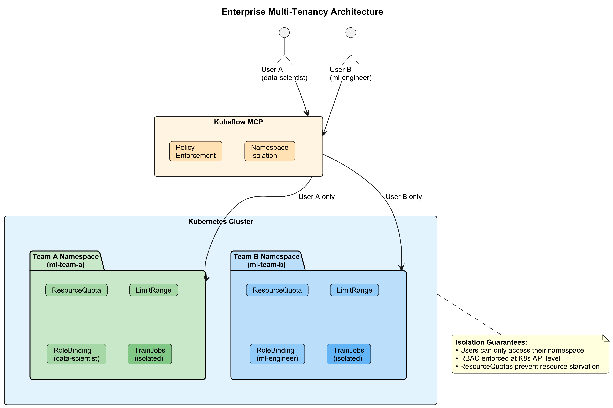

# KEP-936: Kubeflow MCP Server - AI-Powered Training Interface

**Authors:**
- Abhijeet Dhumal (Red Hat) - [@abhijeet-dhumal](https://github.com/abhijeet-dhumal)

**Tracking Issue:** [kubeflow/community#936](https://github.com/kubeflow/community/issues/936), [kubeflow/sdk#238](https://github.com/kubeflow/sdk/issues/238)

---

## Summary

This KEP proposes a **Model Context Protocol (MCP) Server** for the Kubeflow SDK that should enable AI agents to interact with Kubeflow Training resources through natural language. The MCP server should wrap the existing Kubeflow SDK (`TrainerClient`, `BuiltinTrainer`, `CustomTrainer`) without duplicating code, providing a conversational interface for training operations.

**Core Principle:** The MCP server should be a *complementary interface*, not a replacement. It should wrap the SDK, enabling natural language workflows while preserving full programmatic access for power users.

### Before vs After



## Motivation

Kubeflow Training provides powerful distributed training capabilities, but requires:

1. **Python SDK Knowledge**: Understanding `TrainerClient`, `BuiltinTrainer`, `CustomTrainer`, `TorchTuneConfig`, etc.
2. **Kubernetes Expertise**: PVCs, Secrets, RBAC, namespaces, ClusterTrainingRuntimes
3. **Multiple Tools**: kubectl, Python REPL, monitoring dashboards
4. **Manual Validation**: Pre-flight checks are user responsibility

The [Model Context Protocol (MCP)](https://modelcontextprotocol.io/) provides a standard way for AI agents to interact with external systems. Modern AI-powered IDEs (Claude Code, Cursor, VS Code with Copilot) support MCP, enabling natural language interfaces for complex operations.

### Goals

1. **Natural Language Training Interface**: Enable users to fine-tune models, run custom training, and monitor jobs through conversational commands
2. **SDK Integration Without Duplication**: Import and wrap existing SDK types (`BuiltinTrainer`, `CustomTrainer`, `TrainerClient`) directly
3. **Pre-flight Validation**: Automatic checks for GPU availability, memory estimation, and storage before training
4. **Multi-Client Support**: Work with Claude, Cursor IDE, Ollama, Open WebUI, and any MCP-compatible client
5. **Support Both Trainer Types**: 
   - `BuiltinTrainer` for zero-code fine-tuning with TorchTune recipes
   - `CustomTrainer` for user-provided training functions
6. **Multi-MCP Ecosystem**: Work alongside `kubernetes-mcp-server` for clear scope separation
7. **Policy-Based Access Control**: Support personas (readonly, data-scientist, ml-engineer, platform-admin) for enterprise environments

### Non-Goals

1. **Replace Kubeflow SDK**: MCP wraps the SDK, it doesn't replace it
2. **Duplicate SDK Code**: Import SDK types directly, no re-implementation
3. **Real-time Training Streaming**: Focus on polling-based monitoring
4. **Hyperparameter Optimization**: Katib integration planned for future
5. **Replace kubectl/K8s tools**: Use `kubernetes-mcp-server` for generic K8s operations (PVCs, ConfigMaps, Secrets management)

## Proposal

### Alignment with Unified Kubeflow SDK

This MCP server proposal is designed to **evolve alongside the unified Kubeflow SDK** (`kubeflow/sdk`), which consolidates multiple Kubeflow ecosystem components under a single Python package.

#### Current SDK Structure

```
kubeflow/
├── trainer/       # TrainerClient - distributed training & fine-tuning
├── optimizer/     # OptimizerClient - Katib AutoML & hyperparameter tuning  
├── hub/           # ModelRegistryClient - model artifact management
└── common/        # Shared utilities across clients
```

#### MCP as Parallel Interface to SDK



| SDK Client | Component | Control Plane ConfigMap | MCP Integration |
|------------|-----------|-------------------------|-----------------|
| `TrainerClient` | Kubeflow Trainer | `kubeflow-trainer-public` | ✅ Phase 1 (this proposal) |
| `OptimizerClient` | Kubeflow Katib | `kubeflow-optimizer-public` | 🔜 Phase 5 |
| `ModelRegistryClient` | Model Registry | `kubeflow-hub-public` | 🔜 Phase 5 |
| `PipelinesClient` | Kubeflow Pipelines | `kubeflow-pipelines-public` | 🔜 Future |
| `SparkClient` | Spark Operator | `kubeflow-spark-public` | 🔜 Future |

### Architecture Overview


### Design Principle: SDK Integration Without Duplication

The MCP server imports Kubeflow SDK types directly—no code duplication:


```python
# kubeflow_mcp/server.py
from kubeflow.trainer import (
    TrainerClient,
    BuiltinTrainer,
    CustomTrainer,
    CustomTrainerContainer,
    TorchTuneConfig,
    LoraConfig,
    Initializer,
    HuggingFaceModelInitializer,
    HuggingFaceDatasetInitializer,
)

@mcp.tool()
def fine_tune(
    model: str,
    dataset: str,
    peft_method: str = "lora",
    epochs: int = 3,
    batch_size: int = 4,
    num_nodes: int = 1,
    resources_per_node: dict | None = None,
    runtime: str | None = None,
    confirmed: bool = False,
) -> dict:
    """Fine-tune an LLM using BuiltinTrainer with TorchTune.
    
    Use this for zero-code fine-tuning of HuggingFace models.
    Internally calls: TrainerClient.train(trainer=BuiltinTrainer(...))
    """
    if not confirmed:
        return {"error": "Set confirmed=True to submit training job"}
    
    client = TrainerClient()
    trainer = BuiltinTrainer(
        config=TorchTuneConfig(
            epochs=epochs, batch_size=batch_size, num_nodes=num_nodes,
            resources_per_node=resources_per_node,
            peft_config=LoraConfig(lora_rank=16, lora_alpha=32) if peft_method == "lora" else None,
        )
    )
    initializer = Initializer(
        model=HuggingFaceModelInitializer(storage_uri=f"hf://{model}"),
        dataset=HuggingFaceDatasetInitializer(storage_uri=f"hf://{dataset}"),
    )
    job_name = client.train(runtime=runtime, trainer=trainer, initializer=initializer)
    return {"success": True, "job_id": job_name, "trainer_type": "BuiltinTrainer"}

@mcp.tool()
def run_custom_training(
    func: str,
    func_args: dict | None = None,
    packages_to_install: list[str] | None = None,
    num_nodes: int = 1,
    resources_per_node: dict | None = None,
    runtime: str | None = None,
    confirmed: bool = False,
) -> dict:
    """Run distributed training with a user-provided function.
    
    Use this when you have custom training code.
    Internally calls: TrainerClient.train(trainer=CustomTrainer(...))
    """
    if not confirmed:
        return {"error": "Set confirmed=True to submit training job"}
    
    client = TrainerClient()
    trainer = CustomTrainer(
        func=func, func_args=func_args, packages_to_install=packages_to_install,
        num_nodes=num_nodes, resources_per_node=resources_per_node,
    )
    job_name = client.train(runtime=runtime, trainer=trainer)
    return {"success": True, "job_id": job_name, "trainer_type": "CustomTrainer"}

@mcp.tool()
def run_container_training(
    image: str,
    num_nodes: int = 1,
    resources_per_node: dict | None = None,
    env: dict | None = None,
    runtime: str | None = None,
    confirmed: bool = False,
) -> dict:
    """Run training with a pre-built container image.
    
    Use this when you have a custom Docker/OCI image with training code.
    Internally calls: TrainerClient.train(trainer=CustomTrainerContainer(...))
    """
    if not confirmed:
        return {"error": "Set confirmed=True to submit training job"}
    
    client = TrainerClient()
    trainer = CustomTrainerContainer(
        image=image, num_nodes=num_nodes, resources_per_node=resources_per_node, env=env,
    )
    job_name = client.train(runtime=runtime, trainer=trainer)
    return {"success": True, "job_id": job_name, "trainer_type": "CustomTrainerContainer"}
```

### User Stories

#### Story 1: Data Scientist Fine-Tuning with BuiltinTrainer

As a data scientist, I want to fine-tune Qwen on a custom dataset without learning Kubernetes.

```
User: "Fine-tune Qwen/Qwen2.5-7B-Instruct on tatsu-lab/alpaca using LoRA"

AI Agent (using MCP tools):
1. get_cluster_resources() → "4x A100 80GB available"
2. estimate_resources("Qwen/Qwen2.5-7B-Instruct", "lora") → "24GB needed"
3. fine_tune(model="Qwen/Qwen2.5-7B-Instruct", dataset="tatsu-lab/alpaca", peft_method="lora", confirmed=True)

Response: "Started training job 'ft-qwen-abc123'. The model needs ~24GB GPU memory,
which fits on your available A100 GPUs. Training will take approximately 2 hours
for 3 epochs. Use 'get_training_job' or 'get_training_logs' to monitor."
```

#### Story 2: ML Engineer Running Custom Training with CustomTrainer

As an ML engineer, I want to run my distributed training function on 2 nodes with 4 GPUs each.

```
User: "Run my distributed training function on 2 nodes with 4 GPUs each"

AI Agent (using MCP tools):
1. get_cluster_resources() → "8 GPUs available across 2 nodes"
2. run_custom_training(
     func=user_training_func,
     func_args={"learning_rate": "0.01"},
     num_nodes=2,
     resources_per_node={"nvidia.com/gpu": 4},
     confirmed=True
   )

Response: "Started custom training job 'custom-train-xyz789' on 2 nodes.
Your function will run with PyTorch DDP across 8 GPUs total."
```

#### Story 3: DevOps Running Container-Based Training

As a DevOps engineer, I want to run a pre-built training container.

```
User: "Run my custom trainer image ghcr.io/myorg/trainer:v1 with 4 GPUs"

AI Agent (using MCP tools):
1. get_cluster_resources() → "4 GPUs available"
2. run_container_training(image="ghcr.io/myorg/trainer:v1", resources_per_node={"nvidia.com/gpu": 4}, confirmed=True)

Response: "Started container training job 'container-train-def456'.
Your image will run with 4 GPUs."
```

## Design Details

### MCP Tool Inventory


Tools are organized in layers aligned with SDK structure for maintainability. When SDK adds new methods, MCP adds corresponding tools without refactoring existing ones.

#### Layer 1: Core Tools (Always Loaded)

| Tool | Source | Description |
|------|--------|-------------|
| `get_cluster_resources()` | K8s API | Available GPUs, nodes, memory, quotas |

#### Layer 2: SDK-Aligned Tools (1:1 SDK Mapping)

These tools map directly to SDK methods for easy maintenance when SDK evolves.

##### Planning Tools

| Tool | Source | Description |
|------|--------|-------------|
| `estimate_resources(model, peft_method, num_nodes?)` | Custom logic | GPU/memory estimation for models |

**Note on Resource Estimation:** Uses trainer-specific logic:

| Trainer Type | Estimation Method |
|--------------|-------------------|
| `BuiltinTrainer` (TorchTune) | Model registry lookup + recipe-based calculation |
| `BuiltinTrainer` (TRL) | *Future:* TRL-specific memory profiling |
| `BuiltinTrainer` (Unsloth) | *Future:* Unsloth optimization factors (~2x efficiency) |
| `CustomTrainer` | User-provided hints or conservative defaults |
| `CustomTrainerContainer` | Container metadata or user-provided hints |

As new backends are added via [KEP-2839](https://github.com/kubeflow/trainer/issues/2839), the estimation logic should extend to support their memory characteristics.

##### Training Tools

| Tool | SDK Type | Description |
|------|----------|-------------|
| `fine_tune(model, dataset, peft_method, ...)` | `BuiltinTrainer` | Zero-code LLM fine-tuning with TorchTune |
| `run_custom_training(func, func_args, ...)` | `CustomTrainer` | User-provided training function |
| `run_container_training(image, ...)` | `CustomTrainerContainer` | Pre-built training container |

All three tools internally call `TrainerClient.train()` with the appropriate trainer type. Dedicated tools provide:
- **Clear intent** - LLM selects based on user goal, not parameter detection
- **Focused parameters** - each tool only exposes relevant options
- **Granular permissions** - personas can allow `fine_tune` but block `run_custom_training`

##### Discovery Tools

| Tool | SDK Method | Description |
|------|------------|-------------|
| `list_training_jobs(namespace?, status?)` | `TrainerClient.list_jobs()` | List jobs with filtering |
| `get_training_job(job_id)` | `TrainerClient.get_job()` | Job details and status |
| `list_runtimes()` | `TrainerClient.list_runtimes()` | Available ClusterTrainingRuntimes |
| `get_runtime(name)` | `TrainerClient.get_runtime()` | Runtime details |
| `get_runtime_packages(runtime)` | `TrainerClient.get_runtime_packages()` | Debug environment packages |

##### Monitoring Tools

| Tool | SDK Method | Description |
|------|------------|-------------|
| `get_training_logs(job_id, step?, follow?)` | `TrainerClient.get_job_logs()` | Container logs |
| `get_training_events(job_id)` | `TrainerClient.get_job_events()` | Kubernetes events |
| `wait_for_training(job_id, timeout?)` | `TrainerClient.wait_for_job_status()` | Block until done |
| `get_training_progress(job_id)` | *Future: KEP-2779* | Progress bar, metrics ⏳ |

##### Lifecycle Tools

| Tool | SDK Method | Description |
|------|------------|-------------|
| `delete_training_job(job_id)` | `TrainerClient.delete_job()` | Delete training job |
| `suspend_training_job(job_id)` | K8s API patch | Pause job, free GPUs |
| `resume_training_job(job_id)` | K8s API patch | Resume suspended job |

#### Tool Count Summary (Phase 1)

| Layer | Tools | Token Est. |
|-------|-------|------------|
| Core | 1 | ~400 |
| Trainer (Planning) | 1 | ~400 |
| Trainer (Training) | 3 | ~1.2K |
| Trainer (Discovery) | 5 | ~1.5K |
| Trainer (Monitoring) | 3 | ~1K |
| Trainer (Lifecycle) | 3 | ~1K |
| **Total** | **16** | **~5.5K** |

*Note: `get_training_progress()` will be added when [KEP-2779](https://github.com/kubeflow/trainer/tree/master/docs/proposals/2779-trainjob-progress) is available.*

### Multi-MCP Ecosystem

Kubeflow MCP should be designed to work alongside other MCP servers, with clear scope boundaries:


**Design Principle:** No overlap. `kubeflow-mcp` should handle Kubeflow-specific resources; `kubernetes-mcp-server` should handle generic K8s operations.

| Domain | kubeflow-mcp | kubernetes-mcp-server |
|--------|--------------|----------------------|
| **Kubeflow CRDs** (TrainJob, Experiment, etc.) | ✅ Owns | ❌ Delegates |
| **Kubeflow Runtimes** (ClusterTrainingRuntime, etc.) | ✅ Owns | ❌ Delegates |
| **Kubeflow-specific storage** | ✅ Owns | ❌ Delegates |
| **Generic PVC management** | ❌ Delegates | ✅ Owns |
| **ConfigMaps / Secrets** | ❌ Delegates | ✅ Owns |
| **Pod debugging (exec, logs)** | ❌ Delegates | ✅ Owns |
| **RBAC / Roles** | ❌ Delegates | ✅ Owns |
| **Helm charts** | ❌ Delegates | ✅ Owns |

**Design Decision:** A unified `kubeflow-mcp` (mirroring the unified SDK) was chosen over per-component servers for single installation, cross-component workflows, and consistent policies. Component teams developing specialized MCP functionality (e.g., Model Registry's MCP Catalog) should coordinate on tool naming and discovery.

### Tool Scalability

Research shows LLM tool selection accuracy degrades beyond 20-25 tools ([ToolScope](https://arxiv.org/abs/2510.20036)). The modular architecture addresses this through **selective client loading** and **persona filtering**:

| Configuration | Tools | Tokens | Use Case |
|---------------|-------|--------|----------|
| `--clients trainer` | 16 | ~5.5K | Fine-tuning workflows (Phase 1) |
| `--clients optimizer` | 8 | ~3K | HPO-only workflows |
| `--clients trainer,optimizer` | 24 | ~8.5K | Training + HPO |
| `--clients trainer,optimizer,hub` | 30 | ~11K | Full ML lifecycle |

**Scalability Strategies:**

| Strategy | Token Reduction | Mechanism |
|----------|-----------------|-----------|
| **Modular Client Loading** | 40-70% | `--clients trainer` loads only trainer tools |
| **Persona Filtering** | 50-70% | `--persona data-scientist` hides admin tools |
| **Combined** | 70-85% | `--clients trainer --persona readonly` = 7 tools |

**Effective Tool Counts:**

| Clients | Persona | Tools | Tokens |
|---------|---------|-------|--------|
| `trainer` | `readonly` | 7 | ~2.5K |
| `trainer` | `data-scientist` | 12 | ~4.2K |
| `trainer,optimizer` | `data-scientist` | 16 | ~6K |
| `trainer,optimizer,hub` | `ml-engineer` | 30 | ~11K |

Dedicated training tools enable granular control—e.g., `data-scientist` can access `fine_tune()` and `run_custom_training()` but not `run_container_training()`.

**Future:** Track MCP protocol proposals for deferred schema loading ([modelcontextprotocol#1978](https://github.com/modelcontextprotocol/modelcontextprotocol/issues/1978)) which could reduce token overhead by 90%+ via lazy hydration.

#### Persona-Based Tool Visibility

To optimize LLM accuracy, tools are filtered by persona. Dedicated training tools enable granular permissions:

| Persona | Visible Tools | Token Est. | Use Case |
|---------|---------------|------------|----------|
| `readonly` | 7 | ~2.5K | Monitoring dashboards, auditing |
| `data-scientist` | 12 | ~4.2K | Fine-tuning, custom training, monitoring |
| `ml-engineer` | 16 | ~5.5K | Full training access, debugging |
| `platform-admin` | 16 | ~5.5K | Full access, all namespaces |

```yaml
# Persona tool visibility
personas:
  readonly:
    tools:
      - get_cluster_resources
      - list_training_jobs
      - get_training_job
      - get_training_logs
      - get_training_events
      - list_runtimes
      - get_runtime
      
  data-scientist:
    inherit: readonly
    tools:
      - estimate_resources
      - fine_tune                # ✅ Zero-code fine-tuning
      - run_custom_training      # ✅ Custom training functions
      # run_container_training   # ❌ Blocked - requires DevOps
      - wait_for_training
      - delete_training_job      # Own jobs only
      
  ml-engineer:
    inherit: data-scientist
    tools:
      - run_container_training   # ✅ Container-based training
      - get_runtime_packages
      - suspend_training_job
      - resume_training_job
      
  platform-admin:
    tools: "*"                   # All 16 tools
```

**Note:** These are suggested defaults. Organizations can customize persona policies based on their team structure and security requirements. For example, some teams may restrict `run_container_training` to DevOps only, while others may grant all training tools to data scientists.

### Trainer Selection Logic


#### Extensibility: Dynamic LLM Trainer Framework

This MCP server is designed to support the upcoming **Dynamic LLM Trainer Framework** ([KEP-2839](https://github.com/kubeflow/trainer/issues/2839)), which introduces a pluggable backend architecture for LLM fine-tuning:

| Backend | Status | MCP Support |
|---------|--------|-------------|
| **TorchTune** | Current default | ✅ Supported |
| **TRL** | Planned | 🔜 When available |
| **Unsloth** | Planned | 🔜 When available |
| **LlamaFactory** | Planned | 🔜 When available |

**Design Principle:** MCP tools use the SDK's `LLMBackend` abstraction. When new backends are registered (e.g., `TRLBackend`, `UnslothBackend`), MCP automatically supports them through:

```python
# Future SDK API with Dynamic Trainer Framework
client.train(
    trainer=BuiltinTrainer(config=TRLBackend(trainer_type="dpo"))  # TRL backend
)

client.train(
    trainer=BuiltinTrainer(config=UnslothBackend(model="llama3"))  # Unsloth backend
)
```

The MCP server should wrap this SDK API directly—no MCP changes should be needed when new backends are added.

### SDK Types Used

The MCP server should import these types directly from `kubeflow.trainer`:

```python
# Trainers
from kubeflow.trainer import BuiltinTrainer, CustomTrainer, CustomTrainerContainer

# Configurations
from kubeflow.trainer import TorchTuneConfig, LoraConfig, TorchTuneInstructDataset

# Initializers
from kubeflow.trainer import (
    Initializer,
    HuggingFaceModelInitializer,
    HuggingFaceDatasetInitializer,
    S3ModelInitializer,
    S3DatasetInitializer,
)

# Client
from kubeflow.trainer import TrainerClient

# Options
from kubeflow.trainer.options import Labels, Name

# Types
from kubeflow.trainer import TrainerType
```

### Pre-flight Validation

Before training, MCP tools should automatically validate:



**Argument Validation:** Invalid arguments (malformed model IDs, unsupported PEFT methods, resource requests exceeding capacity) return structured errors with suggestions rather than failing at the Kubernetes level.

### Policy-Based Access Control

Kubeflow MCP should support persona-based policies for enterprise environments:



| Persona | Discovery | Planning | Training | Lifecycle | Storage | Runtimes |
|---------|-----------|----------|----------|-----------|---------|----------|
| `readonly` | ✅ | ✅ | ❌ | ❌ | ❌ | ❌ |
| `data-scientist` | ✅ | ✅ | ✅ | ✅ (own jobs) | ❌ | ❌ |
| `ml-engineer` | ✅ | ✅ | ✅ | ✅ | ✅ | ✅ (use) |
| `platform-admin` | ✅ | ✅ | ✅ | ✅ | ✅ | ✅ (create) |

**Policy Configuration (YAML):**

```yaml
# ~/.kf-mcp-policy.yaml
policy:
  # Allow patterns (supports categories, risks, and globs)
  allow:
    - category:discovery     # list_training_jobs, get_training_job, list_runtimes, etc.
    - category:monitoring    # get_training_logs, get_training_events, wait_for_training
    - category:planning      # get_cluster_resources, estimate_resources
    - fine_tune              # Allow zero-code fine-tuning
    # run_custom_training    # Block custom training (requires coding)
    # run_container_training # Block container training (requires DevOps)

  # Deny patterns (overrides allow)
  deny:
    - risk:destructive       # Block delete/suspend/resume operations
    - delete_*               # Block deletions (glob)

  # Namespace restrictions
  namespaces:
    - ml-team-dev
    - ml-team-prod

  # Read-only mode (blocks all write/destructive)
  read_only: false
```

### MCP Protocol Implementation

Using [FastMCP](https://gofastmcp.com) for protocol handling:

```python
from mcp.server.fastmcp import FastMCP

mcp = FastMCP(
    "kubeflow-mcp",
    instructions="""
    Kubeflow MCP Server - AI Model Training on Kubernetes
    
    WORKFLOW: Fine-Tuning LLMs
    1. get_cluster_resources() → Check GPU availability
    2. estimate_resources(model, peft_method) → Memory requirements
    3. fine_tune(model, dataset, ..., confirmed=True) → Submit job
    4. get_training_job(job_id) / get_training_logs(job_id) → Monitor
    
    WORKFLOW: Custom Training Code
    1. get_cluster_resources() → Check GPU availability
    2. run_custom_training(func, func_args, ..., confirmed=True) → Submit job
    3. get_training_logs(job_id) → View output
    
    WORKFLOW: Container-Based Training
    1. get_cluster_resources() → Check GPU availability
    2. run_container_training(image, ..., confirmed=True) → Submit job
    3. get_training_logs(job_id) → View output
    
    TOOL SELECTION:
    - Fine-tune HuggingFace models → fine_tune()
    - Run custom training function → run_custom_training()
    - Run pre-built container → run_container_training()
    - Check job status → get_training_job()
    - View logs → get_training_logs()
    - List jobs → list_training_jobs()
    """
)
```

### Workflow



### Package Structure (Modular Architecture)

The package uses a **modular architecture** where each SDK client is a separate submodule. This enables selective tool loading—users can mount only the clients they need, reducing token consumption and improving LLM accuracy.

```
kubeflow-mcp/
├── pyproject.toml
├── src/kubeflow_mcp/
│   ├── __init__.py                    # Package version, exports
│   ├── server.py                      # FastMCP server with dynamic tool loading
│   │
│   ├── core/                          # Shared utilities (always loaded)
│   │   ├── __init__.py
│   │   ├── auth.py                    # K8s authentication handling
│   │   ├── policy.py                  # Persona-based policy enforcement
│   │   ├── resources.py               # get_cluster_resources()
│   │   └── config.py                  # Configuration loading
│   │
│   ├── clients/                       # SDK client modules (selectively loaded)
│   │   ├── __init__.py
│   │   │
│   │   ├── trainer/                   # TrainerClient tools (16 tools)
│   │   │   ├── __init__.py            # Exports: TOOLS, INSTRUCTIONS, MODULE_INFO
│   │   │   ├── training.py            # fine_tune, run_custom_training, run_container_training
│   │   │   ├── discovery.py           # list_training_jobs, get_training_job, list_runtimes, etc.
│   │   │   ├── monitoring.py          # get_training_logs, get_training_events, wait_for_training
│   │   │   ├── lifecycle.py           # delete, suspend, resume
│   │   │   └── planning.py            # estimate_resources
│   │   │
│   │   ├── optimizer/                 # OptimizerClient tools (8 tools)
│   │   │   ├── __init__.py
│   │   │   ├── optimization.py        # optimize, get_best_results
│   │   │   ├── discovery.py           # list_optimization_jobs, get_optimization_job
│   │   │   └── monitoring.py          # get_optimization_logs, get_optimization_events
│   │   │
│   │   ├── hub/                       # ModelRegistryClient tools (6 tools)
│   │   │   ├── __init__.py
│   │   │   ├── registry.py            # register_model
│   │   │   └── discovery.py           # list_models, get_model, list_model_versions
│   │   │
│   │   ├── pipelines/                 # Future: PipelinesClient
│   │   │   └── __init__.py
│   │   │
│   │   └── spark/                     # Future: SparkClient
│   │       └── __init__.py
│   │
│   ├── policies/                      # Persona policy definitions
│   │   ├── readonly.yaml
│   │   ├── data-scientist.yaml
│   │   ├── ml-engineer.yaml
│   │   └── platform-admin.yaml
│   │
│   └── cli.py                         # CLI with --clients flag
│
└── tests/
    ├── test_trainer/
    ├── test_optimizer/
    └── test_hub/
```

#### Client Module Interface

Each client module exports a standard interface for dynamic loading:

```python
# kubeflow_mcp/clients/trainer/__init__.py

MODULE_INFO = {
    "name": "trainer",
    "sdk_client": "TrainerClient",
    "sdk_import": "kubeflow.trainer",
    "description": "Distributed training and LLM fine-tuning",
}

TOOLS = [
    fine_tune, run_custom_training, run_container_training,
    list_training_jobs, get_training_job, list_runtimes, get_runtime, get_runtime_packages,
    get_training_logs, get_training_events, wait_for_training,
    delete_training_job, suspend_training_job, resume_training_job,
    estimate_resources,
]
# Future: get_training_progress (when KEP-2779 is available)

INSTRUCTIONS = """
TRAINER MODULE - Distributed Training & LLM Fine-Tuning

WORKFLOW: Fine-Tuning → fine_tune(model, dataset, confirmed=True)
WORKFLOW: Custom Training → run_custom_training(func, func_args, confirmed=True)
WORKFLOW: Container Training → run_container_training(image, confirmed=True)
"""
```

#### Dynamic Tool Loading

```python
# kubeflow_mcp/server.py
def create_server(clients: list[str] | None = None, persona: str = "ml-engineer") -> FastMCP:
    """Create MCP server with selected client modules."""
    if clients is None:
        clients = detect_available_clients()  # Auto-detect from cluster
    
    all_tools = [get_cluster_resources]  # Core tool always included
    all_instructions = []
    
    for client_name in clients:
        module = importlib.import_module(f"kubeflow_mcp.clients.{client_name}")
        all_tools.extend(module.TOOLS)
        all_instructions.append(module.INSTRUCTIONS)
    
    filtered_tools = filter_tools_by_persona(all_tools, persona)
    
    mcp = FastMCP("kubeflow-mcp", instructions="\n".join(all_instructions))
    for tool in filtered_tools:
        mcp.tool()(tool)
    return mcp
```

### Dependencies

```toml
[project]
name = "kubeflow-mcp"
dependencies = [
    "mcp>=1.0.0",                     # MCP protocol
    "kubernetes>=28.0.0",             # K8s client
    "pyyaml>=6.0",                    # Config loading
]

[project.optional-dependencies]
trainer = ["kubeflow>=0.3.0"]
optimizer = ["kubeflow>=0.3.0"]
hub = ["kubeflow[hub]>=0.3.0"]
all = ["kubeflow[hub]>=0.3.0"]        # All SDK clients
```

**Installation:**

```bash
# Base package (no SDK clients)
pip install kubeflow-mcp

# With specific clients
pip install kubeflow-mcp[trainer]
pip install kubeflow-mcp[trainer,optimizer]
pip install kubeflow-mcp[all]
```

### CLI Usage

```bash
# Auto-detect available clients from cluster
kubeflow-mcp serve

# Load specific clients only
kubeflow-mcp serve --clients trainer
kubeflow-mcp serve --clients trainer,optimizer
kubeflow-mcp serve --clients trainer,optimizer,hub

# With persona filtering
kubeflow-mcp serve --clients trainer --persona data-scientist

# List available client modules
kubeflow-mcp clients list
# trainer     - TrainerClient (16 tools) ✅ SDK available
# optimizer   - OptimizerClient (8 tools) ✅ SDK available
# hub         - ModelRegistryClient (6 tools) ✅ SDK available
# pipelines   - PipelinesClient ❌ SDK not available
# spark       - SparkClient ❌ SDK not available
```

### Configuration File

```yaml
# ~/.kubeflow-mcp.yaml
server:
  clients:
    - trainer
    - optimizer
    # - hub           # Commented = not loaded
  
  # Or auto-detect from cluster
  # clients: auto
  
  persona: ml-engineer
  
  namespaces:
    - ml-team-dev
    - ml-team-prod

# Per-client configuration
trainer:
  default_runtime: torch-distributed
  
optimizer:
  default_algorithm: random
```

### Distribution

| Channel | Format | Use Case |
|---------|--------|----------|
| **PyPI** | `pip install kubeflow-mcp[trainer]` | Local development, CI/CD |
| **Container** | `ghcr.io/kubeflow/kubeflow-mcp` | Kubernetes, ToolHive |
| **Marketplace** | Smithery, Glama | Discovery, OAuth UI |

**Transport Support:** stdio (Claude Desktop, Cursor) and HTTP (VS Code, remote deployments) via FastMCP.

**Client Configuration Examples:**

Claude Desktop (`~/.claude/claude_desktop_config.json`):

```json
{
  "mcpServers": {
    "kubeflow": {
      "command": "kubeflow-mcp",
      "args": ["serve", "--clients", "trainer,optimizer"]
    }
  }
}
```

Cursor IDE (`.cursor/mcp.json`):

```json
{
  "mcpServers": {
    "kubeflow-trainer": {
      "command": "kubeflow-mcp",
      "args": ["serve", "--clients", "trainer", "--persona", "data-scientist"]
    }
  }
}
```

Multiple configurations for different use cases:

```json
{
  "mcpServers": {
    "kubeflow-training": {
      "command": "kubeflow-mcp",
      "args": ["serve", "--clients", "trainer", "--persona", "ml-engineer"]
    },
    "kubeflow-hpo": {
      "command": "kubeflow-mcp",
      "args": ["serve", "--clients", "optimizer"]
    }
  }
}
```

## Security Considerations


### Authentication

The MCP server should inherit authentication from the underlying Kubernetes context:

| Method | Description | Use Case |
|--------|-------------|----------|
| **Kubeconfig** | Uses `~/.kube/config` or `KUBECONFIG` env var | Local development, CI/CD |
| **ServiceAccount Token** | Mounted at `/var/run/secrets/kubernetes.io/serviceaccount/token` | Single-user in-cluster deployment |
| **ServiceAccount + Impersonation** | SA token with `Impersonate-User` header per request | Multi-user in-cluster deployment |
| **OIDC** | OpenID Connect via kubeconfig auth provider | Enterprise SSO integration |

**Design Principle:** The MCP server should NOT manage credentials. It should use the same authentication as `kubectl` and the Kubeflow SDK.

**Multi-User In-Cluster Deployment:** When deployed as a shared service (e.g., alongside Kubeflow Notebooks), the MCP server should use Kubernetes impersonation to make API calls on behalf of the requesting user.

**User Identity Flow (Istio Integration):**


**Required RBAC for MCP ServiceAccount:**

```yaml
apiVersion: rbac.authorization.k8s.io/v1
kind: ClusterRole
metadata:
  name: kubeflow-mcp-impersonator
rules:
- apiGroups: [""]
  resources: ["users"]
  verbs: ["impersonate"]
```

**Note:** This pattern aligns with how Kubeflow Notebooks and other multi-tenant components handle user identity. The MCP protocol itself doesn't define user identity passing, so the Istio/auth-proxy layer bridges this gap.

### Authorization

MCP tools should operate under the user's Kubernetes RBAC permissions:

```
User Request → MCP Server → Kubeflow SDK → K8s API Server → RBAC Check
```

| Resource | Required RBAC Verbs |
|----------|---------------------|
| TrainJob | `get`, `list`, `create`, `delete`, `patch` |
| ClusterTrainingRuntime | `get`, `list` |
| PersistentVolumeClaim | `get`, `list` (via `kubernetes-mcp-server`) |
| Secrets | `get` (for HF tokens, via `kubernetes-mcp-server`) |

**Namespace Isolation:** Policies can restrict MCP tools to specific namespaces (see [Policy-Based Access Control](#policy-based-access-control)).

### Secret Management

The MCP server should handle sensitive data carefully:

| Secret Type | Storage | Access Pattern |
|-------------|---------|----------------|
| HuggingFace Token | K8s Secret (`hf-token`) | Mounted to training pods, never logged |
| S3 Credentials | K8s Secret | Mounted to initializer pods |
| Model Weights | PVC | Downloaded by initializers, not MCP |

**Best Practices:**
- `setup_hf_credentials()` should create secrets with `stringData` (base64 handled by K8s)
- Secrets should **never** be returned in tool responses
- Container logs should be filtered to redact tokens

### Multi-Tenancy

The MCP server should support multi-tenant deployments through:

1. **Namespace Isolation**: Users should only be able to access training jobs in namespaces where they have RBAC permissions
2. **Policy Enforcement**: Persona-based policies should restrict tool access per user/group
3. **Resource Quotas**: MCP should validate against K8s ResourceQuotas before training



### Audit Logging

The MCP server should log all tool invocations for audit:

```json
{
  "timestamp": "2026-01-29T10:30:00Z",
  "tool": "fine_tune",
  "user": "user@example.com",
  "namespace": "ml-team-dev",
  "parameters": {"model": "Qwen/Qwen2.5-7B", "dataset": "alpaca", "peft_method": "lora"},
  "result": "success",
  "job_id": "ft-qwen-abc123"
}
```

**Note:** Sensitive parameters (tokens, credentials) should be **redacted** from logs.

## Risks and Mitigations

| Risk | Mitigation |
|------|------------|
| **SDK Breaking Changes** | Pin SDK version, adapter pattern should isolate changes |
| **LLM Hallucination** | Pre-flight validation with structured error responses ([ToolBeHonest](https://arxiv.org/abs/2406.20015) shows even GPT-4o has 37% tool accuracy without validation) |
| **Resource Exhaustion** | Automatic resource estimation; training tools use two-phase confirmation pattern ([HITL research](https://arxiv.org/abs/2510.05307) shows 13.54% faster task completion vs confirm-at-end) |
| **Multi-tenancy** | Namespace isolation, should use user's kubeconfig RBAC |
| **Unauthorized Access** | Policy layer should enforce RBAC at tool level |
| **Scope Creep** | Clear delegation to `kubernetes-mcp-server` for generic K8s ops |

## Test Plan

- [ ] I/we understand the owners of the involved components may require updates to existing tests to make this code solid enough prior to committing the changes necessary to implement this enhancement.

### Unit Tests
- Tool logic with mocked SDK
- Pre-flight validation
- Model registry lookups
- Policy enforcement (allow/deny patterns)
- Namespace restrictions

### Integration Tests
- Real TrainerClient with mock K8s
- Runtime selection
- Job submission
- Policy filtering with personas

### Tool Description Validation
- Validate tool descriptions ensure correct LLM selection between `fine_tune()`, `run_custom_training()`, and `run_container_training()` ([Anthropic recommends](https://docs.anthropic.com/en/docs/claude-code/mcp) 3+ example prompts per tool)
- Test with sample prompts to measure precision/recall for tool selection
- Validate persona-filtered tool sets maintain correct LLM behavior
- Flag "misleading" descriptions where LLM confidently selects wrong tool
- Use [mcp-tef](https://github.com/StacklokLabs/mcp-tef) for systematic tool description testing:
  - **Quality analysis**: Score descriptions on clarity, completeness, conciseness (1-10)
  - **Similarity detection**: Flag overlapping tools (e.g., `fine_tune` vs `run_custom_training`) that might confuse LLMs
  - **LLM evaluation**: Run real prompts against tools to verify correct selection with confidence metrics

### E2E Tests
- Claude Desktop integration
- Cursor IDE integration
- Real Kubeflow cluster
- Multi-MCP with kubernetes-mcp-server

## Graduation Criteria

### Alpha
- Core MCP server with dedicated training tools (`fine_tune()`, `run_custom_training()`, `run_container_training()`)
- SDK-aligned discovery and monitoring tools
- Unit tests passing

### Beta
- Pre-flight validation
- Policy support
- Integration tests with mock K8s

### Stable
- E2E tests on real cluster
- Multi-client validation (Claude, Cursor)
- Documentation complete

## Implementation Plan

### Phase 1: Core MCP Server (Modular Foundation + TrainerClient)
- [ ] **Modular Package Architecture:**
  - `kubeflow_mcp.core/` - Shared utilities (auth, policy, config)
  - `kubeflow_mcp.clients/trainer/` - First client module
  - Dynamic tool loading via `--clients` flag
  - Client module interface (`MODULE_INFO`, `TOOLS`, `INSTRUCTIONS`)
- [ ] **Core Tools** (always loaded):
  - `get_cluster_resources()` - GPU/node availability
- [ ] **Trainer Module** (`--clients trainer`):
  - Planning: `estimate_resources()` - basic heuristic-based estimation
  - Dedicated training tools wrapping `TrainerClient.train()`:
    - `fine_tune()` → `BuiltinTrainer` (zero-code LLM fine-tuning)
    - `run_custom_training()` → `CustomTrainer` (user-provided function)
    - `run_container_training()` → `CustomTrainerContainer` (pre-built container)
  - SDK-aligned discovery: `list_training_jobs()`, `get_training_job()`, `list_runtimes()`, `get_runtime()`, `get_runtime_packages()`
  - SDK-aligned monitoring: `get_training_logs()`, `get_training_events()`, `wait_for_training()`
  - SDK-aligned lifecycle: `delete_training_job()`, `suspend_training_job()`, `resume_training_job()`
  - *Deferred (Future):* `get_training_progress()` (requires [KEP-2779](https://github.com/kubeflow/trainer/tree/master/docs/proposals/2779-trainjob-progress))
- [ ] **CLI with modular loading:**
  - `kubeflow-mcp serve --clients trainer --persona ml-engineer`
  - `kubeflow-mcp clients list` - Show available modules
- [ ] **Tool Description Validation** (using [mcp-tef](https://github.com/StacklokLabs/mcp-tef)):
  - Quality analysis: Ensure descriptions score ≥7/10 on clarity, completeness, conciseness
  - Similarity detection: Verify `fine_tune`, `run_custom_training`, `run_container_training` are distinguishable (similarity <0.7)
  - LLM evaluation: Create test cases for common prompts, validate correct tool selection with high confidence
- **SDK Dependency:** `kubeflow.trainer.TrainerClient` ✅ Available in SDK v0.3.0
- **Tool Count:** 16 tools (~5.3K tokens)

### Phase 2: Pre-flight Validation
- [ ] Enhanced `estimate_resources()` with model registry lookup for accurate memory estimation
- [ ] `check_prerequisites()` - new tool for GPU/storage/runtime validation
- [ ] Automatic runtime selection based on trainer type and resources
- [ ] Leverage SDK control plane checks ([#221](https://github.com/kubeflow/sdk/issues/221))
- [ ] Tool description validation (mcp-tef) for `check_prerequisites()`
- [ ] **Explore [Mellea](https://github.com/generative-computing/mellea) integration** for argument validation:
  - "Instruct-Validate-Repair" pattern to validate and auto-repair tool call arguments
  - Example: Validate model IDs, PEFT methods, resource requests before K8s submission
  - Repair invalid configs (e.g., suggest `lora` when user types `laura`)
- **New Tools:** +1 (`check_prerequisites`)
- **Cumulative:** 17 tools

### Phase 3: Policy & Multi-MCP
- [ ] Policy enforcement layer (category/risk/glob patterns)
- [ ] Built-in persona policies (readonly, data-scientist, ml-engineer, platform-admin)
- [ ] Namespace restrictions
- [ ] Clear scope boundaries with `kubernetes-mcp-server`
- [ ] Validate persona-filtered tool sets with mcp-tef (ensure correct LLM behavior with reduced tool sets)
- [ ] **Explore [AGNTCY Identity](https://github.com/agntcy/identity) integration** for enterprise deployments:
  - MCP server identity badges using W3C DIDs and Verifiable Credentials
  - Verify MCP server authenticity before tool execution in multi-tenant environments
  - Enable secure cross-cluster training orchestration with verified identities
- **New Tools:** 0 (policy layer, no new tools)
- **Cumulative:** 17 tools

### Phase 4: Advanced Features
- [ ] Enhanced suspend/resume with auto-suspend on idle, checkpoint-aware resume
- [ ] GPU visibility integration ([#165](https://github.com/kubeflow/sdk/issues/165)) - enhance `get_cluster_resources()`
- [ ] `list_checkpoints()`, `restore_checkpoint()` - checkpoint management tools
- [ ] Tool description validation (mcp-tef) for checkpoint tools
- **New Tools:** +2 (`list_checkpoints`, `restore_checkpoint`)
- **Cumulative:** 19 tools (trainer module)

**Future (when KEP-2779 is available):**
- `get_training_progress()` - visual progress bar with real-time metrics (loss, epoch, throughput, ETA)
- Depends on [KEP-2779: TrainJob Progress](https://github.com/kubeflow/trainer/tree/master/docs/proposals/2779-trainjob-progress)

### Phase 5: Additional Client Modules (Optimizer & Hub)

Each new SDK client is implemented as a separate module under `kubeflow_mcp/clients/`.

#### Optimizer Module (`--clients optimizer`)

```python
# kubeflow_mcp/clients/optimizer/__init__.py
MODULE_INFO = {
    "name": "optimizer",
    "sdk_client": "OptimizerClient",
    "sdk_import": "kubeflow.optimizer",
    "description": "Hyperparameter optimization with Katib",
}
```

| Tool | SDK Method | Description |
|------|------------|-------------|
| `optimize()` | `OptimizerClient.optimize()` | Create hyperparameter optimization |
| `list_optimization_jobs()` | `OptimizerClient.list_jobs()` | List experiments |
| `get_optimization_job()` | `OptimizerClient.get_job()` | Experiment details |
| `get_optimization_logs()` | `OptimizerClient.get_job_logs()` | Trial logs |
| `get_best_results()` | `OptimizerClient.get_best_results()` | Best hyperparameters |
| `wait_for_optimization()` | `OptimizerClient.wait_for_job_status()` | Block until done |
| `delete_optimization_job()` | `OptimizerClient.delete_job()` | Delete experiment |
| `get_optimization_events()` | `OptimizerClient.get_job_events()` | K8s events |

- **SDK Dependency:** `kubeflow.optimizer.OptimizerClient` ✅ Available in SDK v0.3.0
- **Tool Count:** 8 tools (~3K tokens)
- **Validation:** mcp-tef similarity detection between optimizer and trainer tools (e.g., `optimize()` vs `fine_tune()`)

#### Hub Module (`--clients hub`)

```python
# kubeflow_mcp/clients/hub/__init__.py
MODULE_INFO = {
    "name": "hub",
    "sdk_client": "ModelRegistryClient",
    "sdk_import": "kubeflow.hub",
    "description": "Model Registry for artifact versioning",
}
```

| Tool | SDK Method | Description |
|------|------------|-------------|
| `register_model()` | `ModelRegistryClient.register_model()` | Register model artifact |
| `list_models()` | `ModelRegistryClient.list_models()` | List registered models |
| `get_model()` | `ModelRegistryClient.get_model()` | Model details |
| `list_model_versions()` | `ModelRegistryClient.list_model_versions()` | Version history |
| `get_model_version()` | `ModelRegistryClient.get_model_version()` | Version details |
| `get_model_artifact()` | `ModelRegistryClient.get_model_artifact()` | Artifact metadata |

- **SDK Dependency:** `kubeflow.hub.ModelRegistryClient` ✅ Available in SDK v0.3.0
- **Tool Count:** 6 tools (~2.5K tokens)
- **Validation:** mcp-tef quality analysis, coordinate with Model Registry MCP Catalog on tool naming

**Cumulative Tool Counts (Phase 5):**

| Configuration | Tools |
|---------------|-------|
| `--clients trainer` | 19 |
| `--clients trainer,optimizer` | 27 |
| `--clients trainer,optimizer,hub` | 33 |

**Combined Usage:**

```bash
# Load trainer + optimizer for HPO workflows
kubeflow-mcp serve --clients trainer,optimizer

# Load all available clients
kubeflow-mcp serve --clients trainer,optimizer,hub

# Or via config file
# ~/.kubeflow-mcp.yaml
server:
  clients: [trainer, optimizer, hub]
```

**Note on Model Registry Integration:** The [Model Registry MCP Catalog](https://github.com/kubeflow/model-registry/pull/2029) is developing its own MCP functionality with gallery UI and database-backed sources. When integrating:
- Coordinate tool naming to avoid conflicts with Model Registry MCP Catalog
- Consider unified discovery of MCP servers in the Kubeflow ecosystem
- Leverage Model Registry's `McpServer`, `McpTool`, and `McpSource` entities for interoperability

### Phase 6: Future Client Modules

New SDK clients are added as modules under `kubeflow_mcp/clients/` following the same interface pattern:

| Module | SDK Client | Status | Depends On |
|--------|------------|--------|------------|
| `pipelines/` | `PipelinesClient` | Planned | SDK adds `kubeflow.pipelines` |
| `spark/` | `SparkClient` | Planned | SDK adds `kubeflow.spark` |
| `feast/` | `FeastClient` | Planned | [#239](https://github.com/kubeflow/sdk/issues/239) |

**Validation Requirements for New Modules:**
- mcp-tef quality analysis: All tool descriptions must score ≥7/10
- mcp-tef similarity detection: New tools must have <0.7 similarity with existing tools
- mcp-tef LLM evaluation: Test cases for common prompts before release

**Adding a new client module:**

```python
# kubeflow_mcp/clients/pipelines/__init__.py
MODULE_INFO = {
    "name": "pipelines",
    "sdk_client": "PipelinesClient",
    "sdk_import": "kubeflow.pipelines",  # When available
    "description": "ML pipeline orchestration",
}

TOOLS = [create_pipeline, run_pipeline, list_pipeline_runs, ...]
INSTRUCTIONS = "PIPELINES MODULE - ML Workflow Orchestration\n..."
```

Users will enable via `--clients trainer,pipelines` or config file when SDK support is available.

## Drawbacks

1. **Additional Dependency**: Users must install both SDK and MCP server
2. **Maintenance Overhead**: MCP layer must track SDK changes
3. **Abstraction Layer**: Natural language may hide complexity users need to understand

## Alternatives

### Alternative 1: Embed MCP in SDK

**Rejected:** MCP is an integration concern, not core SDK functionality. Keeping them separate allows independent versioning.

### Alternative 2: Build Reasoning into Tools

**Rejected:** Tools like `diagnose_failure()` or `recommend_config()` duplicate LLM capabilities. MCP tools should provide DATA + ACTIONS; LLMs provide REASONING.

### Alternative 3: Custom Protocol

**Rejected:** MCP is an open standard supported by multiple vendors (Anthropic, Cursor, etc.). Custom protocols limit adoption.

### Alternative 4: Hugging Face Skills

[HF Skills](https://github.com/huggingface/skills) provide instruction-based guidance (`SKILL.md` files) rather than executable tools. **Rejected** for Kubeflow because: MCP provides direct tool execution with structured responses, SDK integration, and enterprise requirements (RBAC, namespace isolation) that instruction-based approaches cannot enforce. Skills and MCP can coexist—a `kubeflow-trainer` skill could provide guidance on using MCP tools.

## References

### Core References
- [Model Context Protocol Specification](https://modelcontextprotocol.io/)
- [Kubeflow SDK Repository](https://github.com/kubeflow/sdk)
- [Kubeflow Training Operator](https://github.com/kubeflow/trainer)
- [KEP-2170: Kubeflow Trainer V2 API](https://github.com/kubeflow/trainer/blob/master/docs/proposals/2170-kubeflow-trainer-v2/README.md)

### Related Issues
- [#936: KEP Tracking Issue](https://github.com/kubeflow/community/issues/936) - This proposal
- [#238: MCP Server for Kubeflow SDK](https://github.com/kubeflow/sdk/issues/238) - Original SDK discussion
- [#221: Control Plane Availability Checks](https://github.com/kubeflow/sdk/issues/221) - Pre-flight validation
- [#239: Feast Integration](https://github.com/kubeflow/sdk/issues/239) - Future feature store tools
- [#164: OpenTelemetry Integration](https://github.com/kubeflow/sdk/issues/164) - Observability
- [#165: GPU Visibility](https://github.com/kubeflow/sdk/issues/165) - Resource monitoring

### Related Kubeflow Initiatives
- [KEP-2839: Dynamic LLM Trainer Framework](https://github.com/kubeflow/trainer/issues/2839) - Pluggable backend architecture for LLM fine-tuning (TRL, Unsloth, LlamaFactory)
- [KEP-2779: TrainJob Progress Tracking](https://github.com/kubeflow/trainer/tree/master/docs/proposals/2779-trainjob-progress) - Real-time training metrics
- [model-registry#2029: MCP Catalog API](https://github.com/kubeflow/model-registry/pull/2029) - MCP server catalog with gallery UI for Model Registry

### Kubeflow Architecture
- [Kubeflow Ecosystem Architecture](https://www.kubeflow.org/docs/started/architecture/)
- [Kubeflow Projects](https://www.kubeflow.org/docs/components/)

### Research & Industry References
- [ToolScope: Tool Merging and Context-Aware Filtering](https://arxiv.org/abs/2510.20036) - Tool scalability research showing accuracy gains of 8-38%
- [ToolBeHonest: Multi-level Hallucination Diagnostic](https://arxiv.org/abs/2406.20015) - Tool hallucination benchmarks
- [HITL Confirmation Frequency Research](https://arxiv.org/abs/2510.05307) - Human-in-the-loop patterns for AI agents
- [MCP Best Practices](https://mcp-best-practice.github.io/mcp-best-practice/best-practice/) - Industry design patterns
- [Anthropic MCP Server Guidelines](https://docs.anthropic.com/en/docs/claude-code/mcp) - Official tool description standards
- [Progressive Disclosure for MCP](https://blog.synapticlabs.ai/bounded-context-packs-meta-tool-pattern) - Meta-tool pattern case study
- [MCP Lazy Tool Hydration Proposal](https://github.com/modelcontextprotocol/modelcontextprotocol/issues/1978) - Protocol-level scalability
- [mcp-tef: Tool Evaluation Framework](https://github.com/StacklokLabs/mcp-tef) - Systematic testing for tool descriptions (quality, similarity, LLM evaluation)
- [Mellea: Generative Programming Library](https://github.com/generative-computing/mellea) - "Instruct-Validate-Repair" pattern for structured LLM workflows (IBM Research)
- [AGNTCY Identity](https://github.com/agntcy/identity) - Verifiable identities for Agents and MCP servers using W3C DIDs

### Future Ecosystem Considerations

As the MCP ecosystem matures, two emerging patterns are planned for integration (see [Phase 2](#phase-2-pre-flight-validation) and [Phase 3](#phase-3-policy--multi-mcp)):

- **Tool Validation ([Mellea](https://github.com/generative-computing/mellea)):** "Instruct-Validate-Repair" pattern for LLM tool calls—validates and auto-repairs arguments before execution
- **Agent Identity ([AGNTCY Identity](https://github.com/agntcy/identity)):** W3C DIDs and Verifiable Credentials for MCP servers—enables secure cross-cluster training orchestration with verified identities
