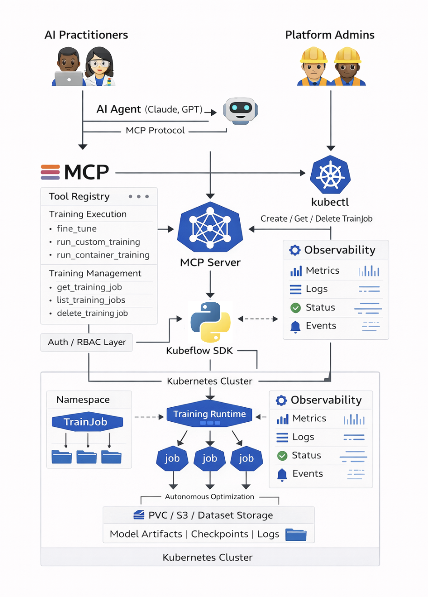
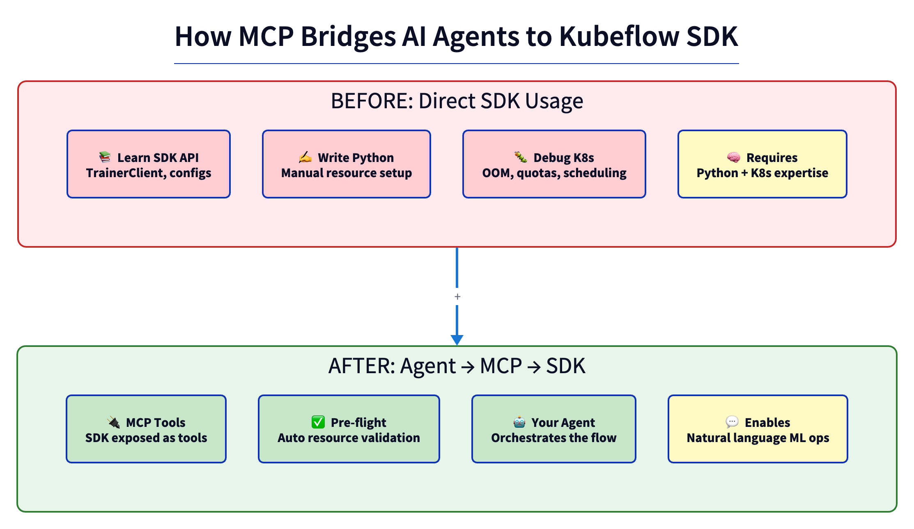
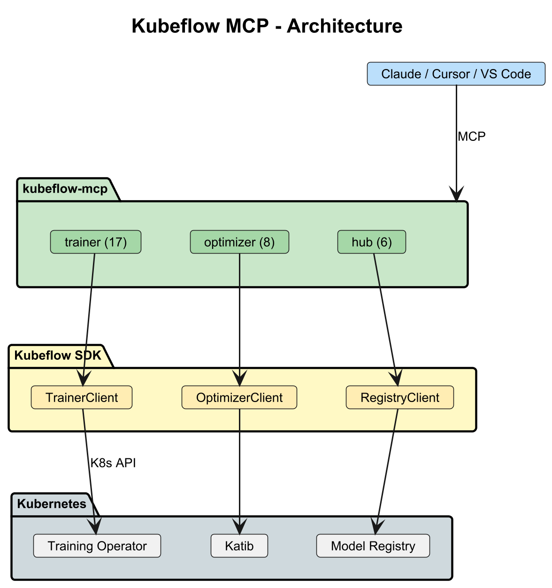
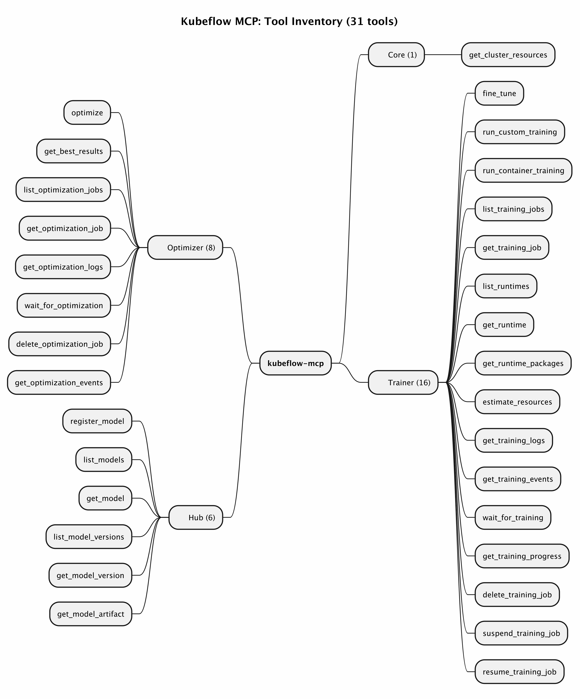
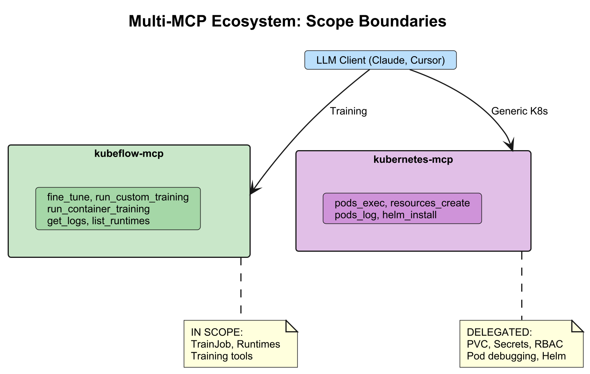
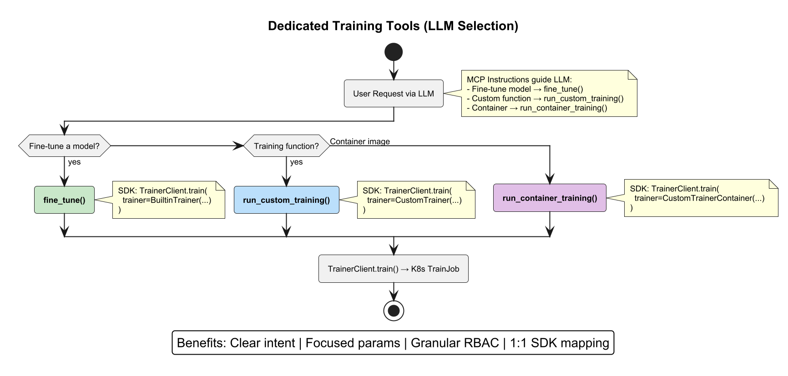
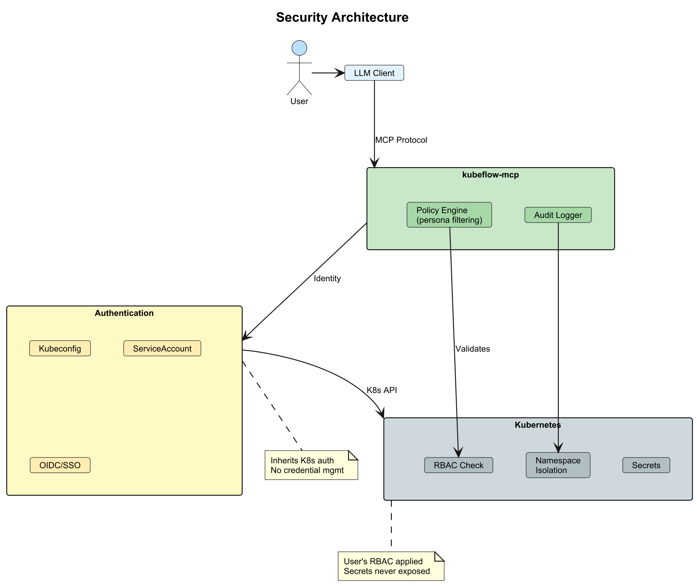
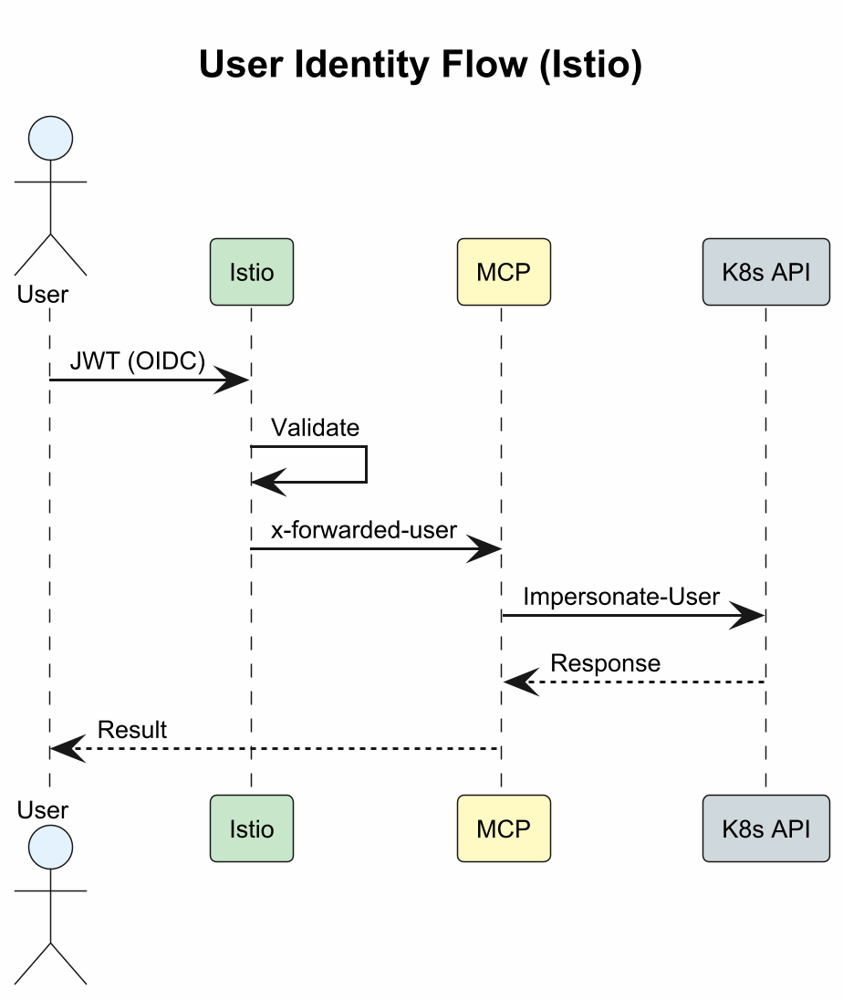

# KEP-936: Kubeflow MCP Server - AI-Powered Training Interface

**Authors:**
- Abhijeet Dhumal (Red Hat) - [@abhijeet-dhumal](https://github.com/abhijeet-dhumal)

**Tracking Issue:** [kubeflow/community#936](https://github.com/kubeflow/community/issues/936), [kubeflow/sdk#238](https://github.com/kubeflow/sdk/issues/238)

**Design Spec:** [DESIGN.md](DESIGN.md) - Detailed implementation specifications

---

## Ownership

This project will be owned by the **[WG ML Experience](https://github.com/kubeflow/community/tree/master/wg-ml-experience)** working group.

- **Working Group:** [WG ML Experience](https://github.com/kubeflow/community/tree/master/wg-ml-experience)
- **Primary Maintainer:** [@abhijeet-dhumal](https://github.com/abhijeet-dhumal) (Red Hat)
- **Repository:** `kubeflow/mcp-server` (proposed)

**Maintainer Onboarding:** Additional maintainers will be onboarded over time as they contribute improvements to the project. Contributors demonstrating sustained engagement and domain expertise will be nominated for maintainer roles following standard Kubeflow governance processes.

**Experimental Status:** This project will initially be marked as **experimental** and not intended for production usage until graduation criteria are met and further stability statements are made by the WG ML Experience leads.

---

## Table of Contents

- [Ownership](#ownership)
- [Summary](#summary)
- [Motivation](#motivation)
  - [Goals](#goals)
  - [Non-Goals](#non-goals)
- [Proposal](#proposal)
  - [Alignment with Unified Kubeflow SDK](#alignment-with-unified-kubeflow-sdk)
  - [Architecture Overview](#architecture-overview)
  - [User Stories](#user-stories)
- [Design Details](#design-details)
  - [MCP Tool Inventory](#mcp-tool-inventory)
  - [Multi-MCP Ecosystem](#multi-mcp-ecosystem)
  - [Tool Scalability](#tool-scalability)
  - [Persona-Based Tool Visibility](#persona-based-tool-visibility)
  - [Trainer Selection Logic](#trainer-selection-logic)
  - [Extensibility: Dynamic LLM Trainer Framework](#extensibility-dynamic-llm-trainer-framework)
  - [Pre-flight Validation](#pre-flight-validation)
  - [Policy-Based Access Control](#policy-based-access-control)
  - [CLI Usage](#cli-usage)
  - [Workflow](#workflow)
- [Security Considerations](#security-considerations)
  - [Authentication](#authentication)
  - [Authorization](#authorization)
  - [Multi-Tenancy](#multi-tenancy)
- [Risks and Mitigations](#risks-and-mitigations)
- [Design Decisions](#design-decisions)
- [Test Plan](#test-plan)
- [Graduation Criteria](#graduation-criteria)
- [Implementation Plan](#implementation-plan)
- [Drawbacks](#drawbacks)
- [Alternatives](#alternatives)
- [References](#references)

---

## Summary

This KEP proposes a **Model Context Protocol (MCP) Server** for the Kubeflow SDK that enables AI agents to interact with Kubeflow resources through natural language. **Phase 1 focuses on `TrainerClient` for distributed training and LLM fine-tuning; the long-term goal is AI-powered end-to-end LLMOps** covering training, hyperparameter optimization, model registry, and pipelines. The MCP server wraps the existing Kubeflow SDK without duplicating code.



**Core Principle:** The MCP server is a *complementary interface*, not a replacement. It wraps the SDK, enabling natural language workflows while preserving full programmatic access.

### Before vs After



## Motivation

Kubeflow Trainer provides powerful distributed training capabilities, but requires Python SDK knowledge, Kubernetes expertise, and manual validation. The [Model Context Protocol (MCP)](https://modelcontextprotocol.io/) provides a standard way for AI agents to interact with external systems, supported by modern AI-powered IDEs (Claude Code, Cursor, VS Code with Copilot).

### Goals

1. **Natural Language Training Interface**: Fine-tune models, run custom training, and monitor jobs through conversation
2. **SDK Integration Without Duplication**: Import and wrap existing SDK types directly
3. **Pre-flight Validation**: Automatic checks for GPU availability, memory estimation, and storage
4. **Multi-Client Support**: Work with Claude, Cursor IDE, Ollama, Open WebUI, and any MCP-compatible client
5. **Support Both Trainer Types**: `BuiltinTrainer` (zero-code fine-tuning) and `CustomTrainer` (user-provided functions)
6. **Policy-Based Access Control**: Support personas for enterprise environments

### Non-Goals

1. **Replace Kubeflow SDK**: MCP wraps the SDK, it doesn't replace it
2. **Duplicate SDK Code**: Import SDK types directly, no re-implementation
3. **Real-time Training Streaming**: Focus on polling-based monitoring
4. **Hyperparameter Optimization**: Katib integration deferred to Phase 5
5. **Replace kubectl/K8s tools**: Use `kubernetes-mcp-server` for generic K8s operations

## Proposal

### Alignment with Unified Kubeflow SDK

The MCP server evolves alongside the unified Kubeflow SDK (`kubeflow/sdk`):

| SDK Client | Component | MCP Integration |
|------------|-----------|-----------------|
| `TrainerClient` | Kubeflow Trainer | Phase 1 (this proposal) |
| `OptimizerClient` | Kubeflow Katib | Phase 5 |
| `ModelRegistryClient` | Model Registry | Phase 5 |
| `SparkClient` | Kubeflow Spark Operator | Future |
| `PipelinesClient` | Kubeflow Pipelines | Future |


### Architecture Overview



**Deployment Modes:**

| Mode | Location | Auth | Transport |
|------|----------|------|-----------|
| **Local** | User's laptop | Kubeconfig | stdio |
| **In-cluster** | K8s cluster | ServiceAccount + Impersonation | StreamableHTTP |
| **Gateway** | Behind MCP gateway | OAuth/OIDC | StreamableHTTP |

**Request Flow:**
```
1. User -> AI Agent: Natural language request
2. AI Agent -> MCP Server: JSON-RPC tool call
3. MCP Server -> Kubeflow SDK: Python method call
4. Kubeflow SDK -> K8s API: CRD operations
```
*Only the SDK communicates with the K8s API server. The MCP server is a translation layer.*

The MCP server will import Kubeflow SDK types directly—no code duplication:

```python
from kubeflow.trainer import (
    TrainerClient, BuiltinTrainer, CustomTrainer, CustomTrainerContainer,
    TorchTuneConfig, LoraConfig, Initializer,
    HuggingFaceModelInitializer, HuggingFaceDatasetInitializer,
)
```

### User Stories

**Story 1: Data Scientist Fine-Tuning**

```
User: "Fine-tune Qwen/Qwen2.5-7B-Instruct on tatsu-lab/alpaca using LoRA"

AI Agent (using MCP tools):
1. get_cluster_resources() - "4x A100 80GB available"
2. estimate_resources("Qwen/Qwen2.5-7B-Instruct", "lora") - "24GB needed"
3. fine_tune(model="...", dataset="...", peft_method="lora", confirmed=True)

Response: "Started training job 'ft-qwen-abc123'. ~24GB GPU memory needed."
```

**Story 2: ML Engineer Running Custom Training**

```
User: "Run my distributed training function on 2 nodes with 4 GPUs each"

AI Agent: run_custom_training(func_code="def train(**kwargs): ...", 
                              num_nodes=2, resources_per_node={"nvidia.com/gpu": 4}, 
                              confirmed=True)
```

**Story 3: DevOps Running Container-Based Training**

```
User: "Run my custom trainer image ghcr.io/myorg/trainer:v1 with 4 GPUs"

AI Agent: run_container_training(image="ghcr.io/myorg/trainer:v1", 
                                  resources_per_node={"nvidia.com/gpu": 4}, 
                                  confirmed=True)
```

**Story 4: Agent-Generated Training Code**

```
User: "Write a PyTorch script to fine-tune Llama on my data and run it distributed"

AI Agent:
1. Generates training code using its knowledge
2. run_custom_training(func_code="def train(**kwargs): ...", 
                       packages_to_install=["transformers", "peft"],
                       num_nodes=2, confirmed=True)
```

## Design Details

### MCP Tool Inventory



Tools are organized in layers aligned with SDK structure (16 tools in Phase 1):

| Layer | Tools | Description |
|-------|-------|-------------|
| **Core** | `get_cluster_resources()` | GPU/node availability |
| **Planning** | `estimate_resources()` | Memory estimation |
| **Training** | `fine_tune()`, `run_custom_training()`, `run_container_training()` | Job submission |
| **Discovery** | `list_training_jobs()`, `get_training_job()`, `list_runtimes()`, `get_runtime()`, `get_runtime_packages()` | Resource lookup |
| **Monitoring** | `get_training_logs()`, `get_training_events()`, `wait_for_training()` | Job monitoring |
| **Lifecycle** | `delete_training_job()`, `suspend_training_job()`, `resume_training_job()` | Job management |

**Dedicated Training Tools:**
- `fine_tune()` maps to `BuiltinTrainer` (zero-code LLM fine-tuning with TorchTune)
- `run_custom_training()` maps to `CustomTrainer` (user-provided Python code)
- `run_container_training()` maps to `CustomTrainerContainer` (pre-built container)

**MCP-to-SDK Bridge:** The SDK's `CustomTrainer` expects `func: Callable`, but MCP only transports JSON. The MCP server bridges this by accepting `func_code: str` (Python source code) and converting to a Callable via `importlib`. See [DESIGN.md](DESIGN.md#mcp-to-sdk-bridge) for implementation details.

### Multi-MCP Ecosystem



| Domain | kubeflow-mcp | kubernetes-mcp-server | hf-mcp |
|--------|--------------|----------------------|--------|
| **Kubeflow CRDs** (TrainJob, etc.) | Owns | Delegates | - |
| **Generic PVC/ConfigMaps/Secrets** | Delegates | Owns | - |
| **Model/dataset metadata** | Delegates | - | Owns |
| **Pod debugging (exec, logs)** | Delegates | Owns | - |

**Coordination with Related Projects:**

- **[HuggingFace MCP Server](https://github.com/huggingface/hf-mcp-server)** - Model/dataset discovery and metadata retrieval. For `estimate_resources()`, agents can use hf-mcp to get model metadata (param_count, hidden_size), then pass to kubeflow-mcp. Each server owns its domain: hf-mcp for discovery, kubeflow-mcp for training execution.

- **[Feast MCP](https://github.com/feast-dev/feast/issues/5404)** - Exposes feature server as MCP (`get_online_features`). Complementary: Feast serves features for training data, kubeflow-mcp executes training.

- **[Model Registry MCP Catalog](https://github.com/kubeflow/model-registry/pull/2029)** - A UI gallery for *discovering* MCP servers, not an MCP server itself. kubeflow-mcp would be *listed in* this catalog. No tool conflicts - they're cataloging servers, we're providing tools.

- **Phase 5 Hub Module** - Our `register_model()`, `list_models()` tools wrap the unified SDK's `ModelRegistryClient`. If Model Registry team later builds their own MCP tools for model operations, we'll coordinate naming via `@kubeflow/kubeflow-hub-team`.

### Tool Scalability

Research shows LLM accuracy degrades beyond 20-25 tools ([ToolScope](https://arxiv.org/abs/2510.20036)). The modular architecture addresses this:

| Strategy | Mechanism |
|----------|-----------|
| **Modular Client Loading** | `--clients trainer` loads only trainer tools |
| **Persona Filtering** | `--persona data-scientist` hides admin tools |

| Clients | Persona | Tools |
|---------|---------|-------|
| `trainer` | `readonly` | 7 |
| `trainer` | `data-scientist` | 12 |
| `trainer` | `ml-engineer` | 16 |

**Phase 5+ Scaling (33+ tools):** When tool counts exceed the optimal 20-25 range, external middleware like [mcp-optimizer](https://github.com/StacklokLabs/mcp-optimizer) can dynamically prune tools based on query context—keeping the server complete while optimizing at inference time.

### Persona-Based Tool Visibility

| Persona | Tools | Use Case |
|---------|-------|----------|
| `readonly` | 7 | Monitoring, auditing |
| `data-scientist` | 12 | Fine-tuning, custom training |
| `ml-engineer` | 16 | Full access including containers |
| `platform-admin` | 16+ | All tools, all namespaces |

### Trainer Selection Logic



### Extensibility: Dynamic LLM Trainer Framework

The MCP server will support the upcoming **Dynamic LLM Trainer Framework** ([KEP-2839](https://github.com/kubeflow/trainer/issues/2839)):

| Backend | Status |
|---------|--------|
| **TorchTune** | Phase 1 |
| **TRL** | When available |
| **Unsloth** | When available |

### Pre-flight Validation


Before training, MCP tools validate GPU availability, memory requirements, and storage.

### Policy-Based Access Control


| Persona | Discovery | Training | Lifecycle | Runtimes |
|---------|-----------|----------|-----------|----------|
| `readonly` | Yes | No | No | No |
| `data-scientist` | Yes | Yes | Yes (own jobs) | No |
| `ml-engineer` | Yes | Yes | Yes | Yes |

### CLI Usage

```bash
kubeflow-mcp serve --clients trainer --persona data-scientist
kubeflow-mcp clients list
```

**Transport:** stdio (Claude Desktop, Cursor) and StreamableHTTP (VS Code, LlamaStack, remote deployments).

### Workflow


## Security Considerations



### Authentication

| Method | Use Case |
|--------|----------|
| **Kubeconfig** | Local development, CI/CD |
| **ServiceAccount Token** | Single-user in-cluster |
| **ServiceAccount + Impersonation** | Multi-user in-cluster |
| **OIDC** | Enterprise SSO |

**Multi-User In-Cluster:** Uses Kubernetes impersonation with Istio-injected headers (`x-user-email`, `x-user-groups`).



### Authorization

MCP tools operate under the user's Kubernetes RBAC permissions.

### Multi-Tenancy


1. **Namespace Isolation**: Users access only permitted namespaces
2. **Policy Enforcement**: Persona-based tool restrictions
3. **Resource Quotas**: Validation against K8s ResourceQuotas

## Risks and Mitigations

| Risk | Mitigation |
|------|------------|
| **SDK Breaking Changes** | Pin SDK version, adapter pattern |
| **LLM Hallucination** | Pre-flight validation, structured errors |
| **Resource Exhaustion** | Two-phase confirmation pattern |
| **Unauthorized Access** | Policy layer with RBAC |

### Two-Phase Confirmation Pattern

Training tools use a confirmation pattern to prevent accidental resource consumption:

```
Phase 1: fine_tune(..., confirmed=False) - Returns preview
Phase 2: fine_tune(..., confirmed=True)  - Submits job (after user approval)
```

## Design Decisions

### Why granular tools instead of one monolithic `train()` tool?

We went with granular tools after thinking through a few scenarios:

- We do take the point about tool count. 16 tools (Phase 1) is fine, but Phase 5 could hit 33. We handle this in two ways: First, modular client loading (`--clients trainer`) means you only load tools for components you need - if you're just training, you don't get optimizer or registry tools. Second, persona filtering (`--persona data-scientist`) hides admin tools from users who don't need them. Combined, these give 70-85% reduction. For Phase 5+ with 33+ tools, we're also looking at what [Speakeasy documented](https://www.speakeasy.com/blog/100x-token-reduction-dynamic-toolsets) - instead of registering all schemas upfront, you expose three meta-tools: "search for tools", "describe this tool", "execute this tool." The LLM discovers what it needs dynamically. Same granularity, way fewer tokens in context.

- The other thing we noticed while prototyping: LLMs are surprisingly good at adapting when you give them feedback between steps. Say `estimate_resources()` comes back with "needs 80GB, cluster has 40GB." A monolithic tool would just fail. But with separate tools, Claude or Cursor will look at that mismatch and go "oh, let me try with quantization" - without us writing any conditional logic. There's some research on this too ([ToolBeHonest](https://arxiv.org/abs/2406.20015)) showing LLMs hallucinate less when they get intermediate feedback to anchor on.

- The main thing is - training jobs eat GPUs. When you're about to spin up 4x A100s, you want to see "this will need 24GB" before it runs, not discover halfway through that something was misconfigured. There's actually a paper on this ([research on HITL patterns](https://arxiv.org/abs/2510.05307)) that looked at when humans want confirmation prompts vs when they find them annoying. The finding? For cheap/reversible actions, confirmations are friction. For expensive/irreversible ones like training jobs, people actually want the pause point. That's why each tool is separate - so the agent can show intermediate results and the user can say "wait, that's too much memory, try QLoRA instead."

- And honestly, debugging is way easier. "Training failed" tells you nothing. "`estimate_resources` succeeded, `fine_tune` failed with quota exceeded" - now you know where to look.

- For users who just want the simple path - yeah, Phase 2 could add something like `auto_validate=True` that runs the whole chain internally. Power users get individual tools, casual users get the one-liner.

- Self-correction with Mellea. Phase 2 explores [Mellea's](https://github.com/generative-computing/mellea) "Instruct-Validate-Repair" pattern. If LLM passes invalid args (e.g., `model="llama"` instead of full HuggingFace path), we validate, return a helpful error, and let the LLM fix it - instead of just failing. Granular tools make this repair loop cleaner.

- Audit trails with AGNTCY. Phase 3 explores [AGNTCY Identity](https://github.com/agntcy/identity) for enterprise - cryptographic signatures on tool calls so you can prove *who* triggered *what*. Granular tools = granular audit trail. A monolithic tool would just log "training happened" without the decision chain.

### Why SDK-wrapping instead of direct K8s API?

The SDK is the stable interface; CRDs are implementation details:

- SDK handles CRD versioning - if TrainJob schema changes, we don't need to update MCP.
- We get `TorchTuneConfig`, `LoraConfig` Python types instead of constructing raw YAML.
- SDK already provides log streaming, wait-with-backoff, and [local execution](https://github.com/kubeflow/sdk/tree/main/docs/proposals/2-trainer-local-execution) - we'd have to reimplement all of this with direct API.
- [kube-authkit](https://github.com/kubeflow/sdk/issues/281) provides consistent auth across all Kubeflow APIs.

### Why standalone repo instead of inside kubeflow/sdk?

We recommend kubeflow-mcp as a **standalone project** (`kubeflow/mcp-server`) with one-way dependency on SDK. Key reasons:

| Concern | Standalone Advantage |
|---------|---------------------|
| **Dependencies** | MCP brings FastMCP, uvicorn, pydantic (~15MB+). SDK users shouldn't pay this cost if they just want `TrainerClient` |
| **Release cadence** | MCP spec evolves fast (Streamable HTTP, tool annotations). MCP can ship hotfixes without waiting for SDK release cycles |
| **Maintainer expertise** | SDK team knows K8s/training; MCP needs agent/LLM context optimization skills. Different contributors, different domain expertise |
| **Ecosystem consistency** | Every major MCP server is standalone (see precedents below). Users expect `pip install kubeflow-mcp` |
| **Testing isolation** | MCP tests need LLM mocks and mcp-tef validation; SDK tests need K8s mocks. Separate repos = focused CI, clear failure attribution |
| **Clean boundaries** | Standalone forces MCP to only import public SDK APIs. If SDK changes break MCP, that signals a breaking change |
| **Security blast radius** | MCP vulnerability doesn't affect SDK users; patches are scoped to MCP releases only |
| **Contribution barrier** | Agent/LLM contributors shouldn't need to clone full SDK repo or understand TrainJob internals to fix an MCP tool |
| **Issue triage** | "Is this an MCP bug or SDK bug?" is immediately clear with separate repos and issue trackers |
| **Language flexibility** | Future MCP features (e.g., Go components for performance, TypeScript for browser agents) aren't locked to SDK's Python-only structure |

**Industry precedent—every major MCP server is standalone:**

| Project | Repository | Notes |
|---------|------------|-------|
| GitHub MCP | [`github/github-mcp-server`](https://github.com/github/github-mcp-server) | Standalone, not inside Octokit SDK |
| Kubernetes MCP | [`containers/kubernetes-mcp-server`](https://github.com/containers/kubernetes-mcp-server) | Go-based, 1.2k+ stars, migrated to containers org for community governance |
| Feast MCP | Inside `feast-dev/feast` but separate package | Published as standalone PyPI package |
| HuggingFace MCP | [`huggingface/hf-mcp-server`](https://github.com/huggingface/hf-mcp-server) | Standalone, not inside `transformers` or `huggingface_hub` |

**Dependency direction:** `kubeflow-mcp` depends on `kubeflow-sdk`, never the reverse. Version compatibility documented in README (e.g., `kubeflow-sdk>=0.5,<2.0`).

**Discoverability:** Solved via PyPI cross-links, Kubeflow Hub catalog ([PR #2029](https://github.com/kubeflow/model-registry/pull/2029)), and documentation—not architectural coupling.

### Why not HuggingFace Skills?

Different problem space. [HF Skills](https://huggingface.co/blog/hf-skills-training) are instruction-based prompts that guide LLMs to *generate* Python code - but the user still runs that code locally. kubeflow-mcp provides *execution* on Kubernetes with RBAC, namespace isolation, and audit logging. They're complementary: [HF MCP Server](https://github.com/huggingface/hf-mcp-server) for model/dataset discovery, kubeflow-mcp for training execution.

### Comparative analysis with Feast MCP and Model Registry Catalog

We investigated existing MCP efforts in the Kubeflow/ML ecosystem:

- **Feast MCP** ([issue #5404](https://github.com/feast-dev/feast/issues/5404)) - Exposes `get_online_features` for feature retrieval. Different domain: Feast serves features for training data preparation, kubeflow-mcp executes training. Complementary, no overlap.

- **Model Registry MCP Catalog** ([PR #2029](https://github.com/kubeflow/model-registry/pull/2029)) - This is a *catalog/gallery* for discovering MCP servers, not an MCP server with model tools. It defines `McpServer`, `McpTool` entities for the UI. kubeflow-mcp would be *listed in* this catalog as a discoverable server. No tool conflicts.

- **Future Model Registry MCP tools** - If the Model Registry team builds their own MCP server with model registration/versioning tools, we'll coordinate naming (e.g., they own `register_model()`, we expose `list_registered_models()`). Our Phase 5 Hub module tools currently wrap `ModelRegistryClient`, so we're prepared to adjust scope as the ecosystem evolves.

## Test Plan

- [ ] I/we understand the owners of the involved components may require updates to existing tests.

### Unit Tests
- Tool logic with mocked SDK
- Policy enforcement

### Integration Tests
- Real TrainerClient with mock K8s
- Persona filtering

### Tool Description Validation
- Use [mcp-tef](https://github.com/StacklokLabs/mcp-tef) for quality analysis, similarity detection, LLM evaluation

### E2E Tests
- Claude Desktop / Cursor IDE integration
- Real Kubeflow cluster

## Graduation Criteria

| Stage | Requirements |
|-------|-------------|
| **Alpha** | Core MCP server with training tools, unit tests |
| **Beta** | Pre-flight validation, policy support, integration tests |
| **Stable** | E2E tests, multi-client validation, documentation |

## Implementation Plan

### Phase 1: Core MCP Server (TrainerClient)
- Modular package architecture
- 15 trainer tools + 1 core tool: `fine_tune()`, `run_custom_training()`, `run_container_training()`, discovery, monitoring, lifecycle
- CLI with `--clients` flag
- Tool validation with mcp-tef

### Phase 2: Pre-flight Validation
- Enhanced `estimate_resources()` with batch_size, sequence_length, quantization parameters
- Support `user_provided_params` (param_count, hidden_size, num_layers) for private/custom models not on HuggingFace Hub
- `check_prerequisites()` tool
- Add "Edit" support to confirmation pattern (modify params without re-specifying)
- Explore [Mellea](https://github.com/generative-computing/mellea) for argument validation
- [Claude Plugin](https://code.claude.com/docs/en/plugins) packaging with manifest.json

### Phase 3: Policy & Multi-MCP
- Policy enforcement layer
- Built-in persona policies
- Custom persona definitions via config (org-specific tool sets, namespace restrictions, deny patterns)
- Namespace restrictions
- OpenTelemetry integration via [FastMCP native instrumentation](https://gofastmcp.com/servers/telemetry)
- Explore [AGNTCY Identity](https://github.com/agntcy/identity) for enterprise deployments

### Phase 4: Advanced Features
- Checkpoint management (`list_checkpoints()`, `restore_checkpoint()`)
- GPU visibility integration
- *Future:* `get_training_progress()` (requires [KEP-2779](https://github.com/kubeflow/trainer/tree/master/docs/proposals/2779-trainjob-progress))

### Phase 5: Additional Client Modules

| Module | Tools | SDK Dependency |
|--------|-------|----------------|
| **optimizer** | 8 | `OptimizerClient` |
| **hub** | 6 | `ModelRegistryClient` |

- Optional `--mode dynamic` for 33+ tools ([100x token reduction](https://www.speakeasy.com/blog/100x-token-reduction-dynamic-toolsets) via semantic search)
- Document [mcp-optimizer](https://github.com/StacklokLabs/mcp-optimizer) as recommended middleware for external tool optimization

### Phase 6: Future Modules
- `pipelines/` - `PipelinesClient`
- `spark/` - `SparkClient`
- `feast/` - `FeastClient` ([#239](https://github.com/kubeflow/sdk/issues/239))

## Drawbacks

1. **Additional Dependency**: Users must install both SDK and MCP server
2. **Maintenance Overhead**: MCP layer must track SDK changes
3. **Abstraction Layer**: Natural language may hide complexity users need to understand

## Alternatives

| Alternative | Why Rejected |
|-------------|--------------|
| **Embed MCP in SDK** | MCP is an integration concern, not core SDK |
| **Build Reasoning into Tools** | Tools provide DATA + ACTIONS; LLMs provide REASONING |
| **Custom Protocol** | MCP is an open standard with multi-vendor support |
| **HuggingFace Skills** | Instruction-based; lacks execution, RBAC, namespace isolation |

## References

### Core
- [Model Context Protocol Specification](https://modelcontextprotocol.io/)
- [Kubeflow SDK Repository](https://github.com/kubeflow/sdk)
- [Kubeflow Trainer](https://github.com/kubeflow/trainer)

### Related Issues
- [#936: KEP Tracking Issue](https://github.com/kubeflow/community/issues/936)
- [#238: MCP Server for Kubeflow SDK](https://github.com/kubeflow/sdk/issues/238)
- [#221: Control Plane Availability Checks](https://github.com/kubeflow/sdk/issues/221)

### Related KEPs
- [KEP-2839: Dynamic LLM Trainer Framework](https://github.com/kubeflow/trainer/issues/2839)
- [KEP-2779: TrainJob Progress Tracking](https://github.com/kubeflow/trainer/tree/master/docs/proposals/2779-trainjob-progress)
- [model-registry#2029: MCP Catalog API](https://github.com/kubeflow/model-registry/pull/2029)
- [Feast MCP Server](https://docs.feast.dev/master/reference/feature-servers/mcp-feature-server) - Feature serving integration
- [HuggingFace MCP Server](https://github.com/huggingface/hf-mcp-server) - Model/dataset discovery

### Research
- [ToolScope: Tool Merging and Context-Aware Filtering](https://arxiv.org/abs/2510.20036)
- [ToolBeHonest: Multi-level Hallucination Diagnostic](https://arxiv.org/abs/2406.20015)
- [HITL Confirmation Frequency Research](https://arxiv.org/abs/2510.05307)
- [MCP Best Practices](https://mcp-best-practice.github.io/mcp-best-practice/best-practice/)
- [mcp-tef: Tool Evaluation Framework](https://github.com/StacklokLabs/mcp-tef)
- [Mellea: Generative Programming Library](https://github.com/generative-computing/mellea)
- [AGNTCY Identity](https://github.com/agntcy/identity)
- [Memory-Efficient Fine-Tuning](https://arxiv.org/abs/2501.18824) - Activation memory analysis
- [OpenTelemetry MCP Semantic Conventions](https://opentelemetry.io/docs/specs/semconv/gen-ai/mcp/)
- [FastMCP OpenTelemetry Integration](https://gofastmcp.com/servers/telemetry) - Native instrumentation for MCP servers
- [Speakeasy Dynamic Toolsets](https://www.speakeasy.com/blog/100x-token-reduction-dynamic-toolsets) - Token reduction patterns
