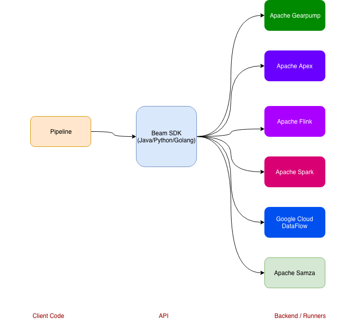

# Motivation

Kubeflow currently doesn't have support for running streaming/batch workloads. There are efforts of bringing spark operator but
I think it would be good to be able to experiment with other streaming backends like flink and others. In AI/ML systems there 
may be some data cleaning or data preparation involved before running through deep learning frameworks like tensorflow. 

# What is Apache Beam?

Apache Beam is an opensource, multiple backend system that allows for batch and streaming workloads.
It is parallel processing and portable so developers have the choice of using runners. The backends/runners supported are
apache spark, apache flink, apache gearpump, apache apex, google cloud dataflow and apache samza. The beam api also allows
you to write your pipelines in multiple programming languages such as java, golang, python, etc. 

# Goals

* Provide a common Custom Resource Definition (CRD) for defining a streaming or batch pipeline
* Implement a custom controller to manage the CRD, create dependent resources, and reconcile the desired states.
* Have the necessary crd's and operators to deploy spark, flink or any other system to run the streaming pipeline

# Non-goals

In theory, this operator can be used to run various batch or streaming pipelines in many streaming backends. Apache Spark or Apache Flink 
are leading stream processing systems which we may consider.

# UI or API

WIP

# Design

THe beam operator will run the pipeline for preprocessing and will connect to spark  cluster to run on the backend. 

# Alternatives Considered

## Future Work
We may have to consider how will this integrate with the jupyterhub integration

# Related Issues

- [Use Flink to provide an alternative runner for TFX](https://github.com/kubeflow/kubeflow/issues/1583) 
- [Explore usage of the spark-operator within kubeflow](https://github.com/kubeflow/kubeflow/issues/155) 
- [Pachyderm and Kubeflow integration](https://github.com/kubeflow/kubeflow/issues/151)

# Author

- Zak Hassan <zak.hassan@redhat.com> 

