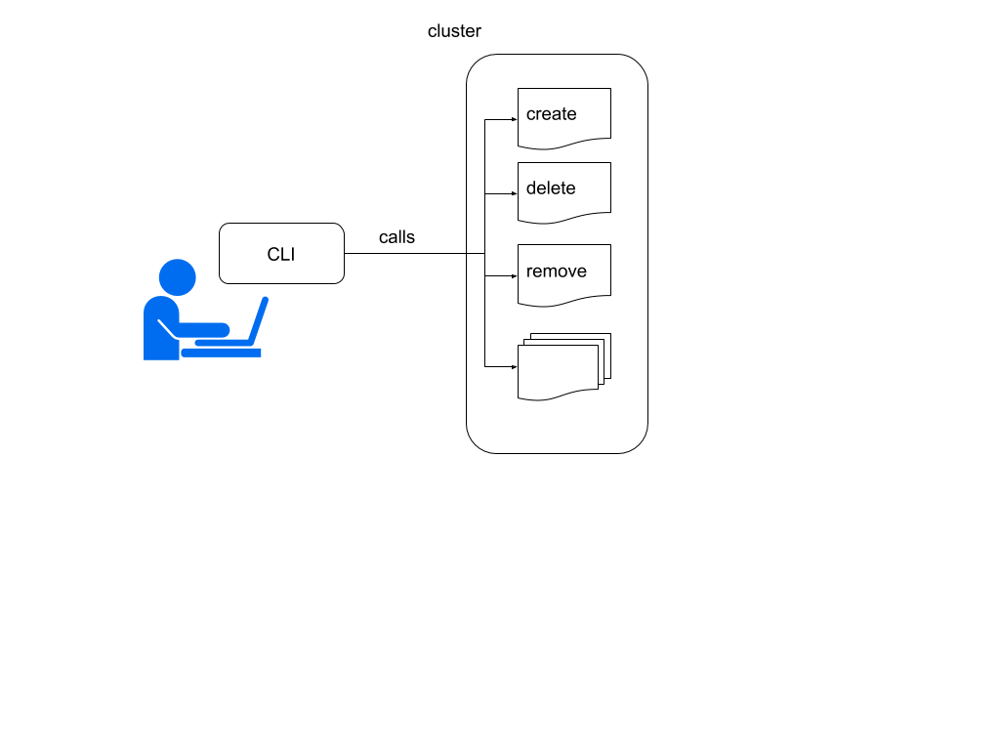

## Motivation
Kubeflow provides a DL environment for data scientists by deploying kubernetes manifests in a number of "phases". Each phase involves parameterizing and deploying different ksonnet packages. This can be shown in the following table:

| phase     | ksonnet packages     | commands | privileges |
| :------------- | :------------- | :---- | :----- |
| setup       | iap,<br/>cert-manager|  ks, kubectl, gcloud | cluster-admin |
| core       | ambassador,<br/>centraldashboard,<br/>nfs,<br/>spartascus |  ks, kubectl, gcloud | cluster-admin |
| notebook | jupyterhub | ks | data scientist |
| serving | tf-serving | ks | data scientist |
| training | tf-job | ks | data scientist |

From the table it's clear that some of the phases need to be deployed by someone with elevated cluster privileges and other phases are intended to be run by data scientists. It's somewhat less clear that a data scientist may have particular ways of configuring training, notebooks or serving that may not be easily satisfied by existing ksonnet libraries. Exposing all of the above to the data scientist muddles the possibility of a clean and concise CLI by exposing:
  1. Lengthy setup instructions to create a DL project
  1. Configurations and other setup requiring devops support
  1. Exposure of the underlying cloud platform
  1. An ad-hoc set of commands that do not compose well, may overlap or provide redundant or non-standard arguments.
  1. Supporting commands that need to be installed on a data scientist's client machine (often with upgrade constraints).
  1. Lack of command completion (ks) that does not integrate well with other commands or within a pipeline of commands.
  1. Lack of an ability to integrate a data scientist customizations or integrate new CLI subcommands required by new kubeflow components.  

## Goals
- Provide a data scientist's CLI that:
  1. Allows the data scientist to easily create a project or switch between projects.
  1. Is able to discover available services such as dashboards, jobs, job histories, notebooks.
  1. Is easily installed on the client machine.
  1. Provides common kubeflow operations as customizable subcommands (train, serve, notebook)
  1. Allows a data scientist or contributor to add or override subcommands using python
  1. Allows subcommands to be added to only those granted particular privileges
  1. Enables a subcommand registry   

## Non-Goals
The CLI subcommands suggested do not proscribe against defining additional subcommands in other proposals.

## UI or API
1. A CLI with an initial base set of subcommands:    
   1. General    
      1. `kf create [-h] [-d] [-r repo] [-b branch] [-i] <namespace>`
      1. `kf delete [-h] <namespace>`
      1. `kf remove [-h] <component>`
      1. `kf run [-h] <component> [container] -- [command]`
      1. `kf status [-h] [list|health|info][<component>]`
      1. `kf use [-h] <namespace>`
      1. `kf whoami [-h]`
   1. Specific to Kubeflow components but not addressed per se within this proposal    
      1. `kf notebook [-h] [ls|start|stop] <name>`
      1. `kf serve [-h] <name> <yaml>`
      1. `kf shell [-h] <component> [<container>]`
      1. `kf tensorboard [-h] <name> <yaml>`
      1. `kf train [-h] <name> <yaml>`
1. A CLI that is extensible via a subcommand called `command`    
  1. `kf command [-h] [add|remove|replace|upgrade|list|describe] <subcommand>`
1. Subcommands call a Kubeless Function (written in python|bash|golang) which:    
   1. Runs in a container that includes requisite tooling and dependencies like ks, kubeclt, kubeless, python2.7|python3.6


## Design
A data scientist's CLI is a flexible set of commands that are executed against a cluster of DL components. Within kubeflow, this set of components will vary and will use `ks` environments that are parameterized. A CLI with a fixed set of subcommands can not accommodate a configurable set of runtime components provided by kubeflow, of which many may be provided by open source contributors. The kubeflow flexible component design mandates a matching CLI design where subcommands can be provided by component authors or other contributors that provide one or more subcommands for a component. For example different contributors may provide a pytorch CLI that can be used with the pytorch component. The author of the pytorch component may provide their own CLI. Different CLI bindings are possible for any component. Each CLI subcommand invocation will delegate its execution to a serverless Function. This design enables a CLI ecosystem where different functionalities not possible within a fixed CLI deliverable are possible.  

### Implementation
1. Create a base container that includes needed tools `ks, kubectl, python2.7, python3.6`
1. Add a new library kubeflow/core/kubeless.libsonnet to kubeflow/core that is included in kubeflow/core/all.libsonnet
1. Define a set of kubeless Functions that match the `kf` subcommands EG:
```yaml
apiVersion: kubeless.io/v1beta1
kind: Function
metadata:
  name: create
spec:
  handler: subcommand.create
  runtime: python3.6
  function: |
  import json
  import yaml
  from kubernetes import client, config
  config.load_incluster_config()
  api=client.ExtensionsV1beta1Api()
  ...
```
   1. Kubeless Functions should use the kubernetes python API for kubectl operations and the `ks` executable for ksonnet operations or possibly the new ksonnet-lib. The preference would be to utilize an ksonnet API.
   1. Insure Kubeless core Functions are installed in containers to optimize execution times (see kubeless [documentation](http://kubeless.io/docs/building-functions/))
1. Each kubeless Function will require a client subcommand plugin that can be dynamically loaded using golang plugin as a module. This plugin (.so) would be downloaded to a `kf` plugins directory as part of `kf command add ...`. It should also be autogenerated based on the Function Spec shown.

```go
// Function object
type Function struct {
	metav1.TypeMeta
	metav1.ObjectMeta
	Spec FunctionSpec
}

// FunctionSpec contains func specification
type FunctionSpec struct {
	Handler                 string                          
	Function                string                          
	FunctionContentType     string                          
	Checksum                string                          
	Runtime                 string                          
	Timeout                 string                          
	Deps                    string                          
	Deployment              v1beta1.Deployment              
	ServiceSpec             v1.ServiceSpec
	HorizontalPodAutoscaler v2beta1.HorizontalPodAutoscaler
}
```


## Alternatives Considered
1. A static set of subcommands that prescribes all available actions a data scientist would do.
1. Using a different client framework other than spf13/cobra. Given that kubectl, kubeless and ks also use this framework there is an opportunity to leverage their subcommands.
