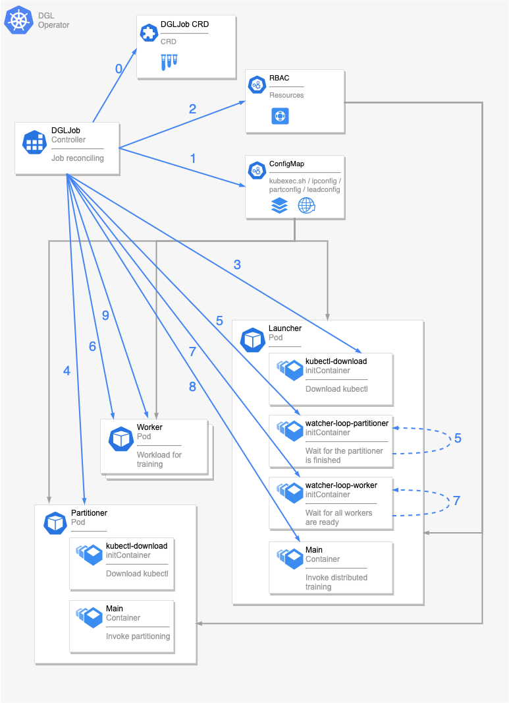
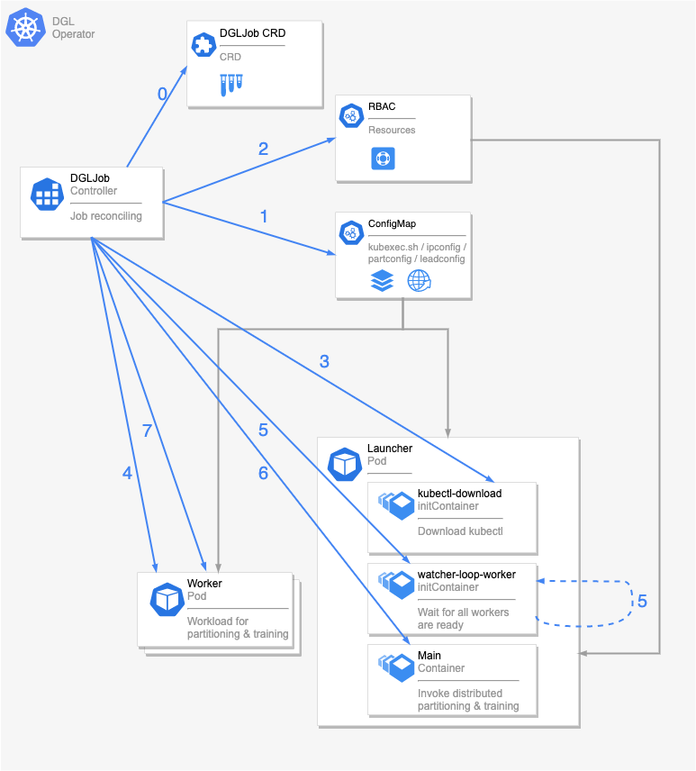

Updated on 2021/07/23

## Motivation

> Deep Graph Library ([DGL](https://github.com/dmlc/dgl)) is a Python package built for easy implementation of graph neural network model family, on top of existing DL frameworks (currently supporting PyTorch, MXNet and TensorFlow). It offers a versatile control of message passing, speed optimization via auto-batching and highly tuned sparse matrix kernels, and multi-GPU/CPU training to scale to graphs of hundreds of millions of nodes and edges. —— DGL team @ [dgl.ai](https://www.dgl.ai/)

More recently, there are a lot of new deep learning researches based on graph-structured data. And DGL has become one of the best GNN frameworks that researcher used to fulfill their works. The researchers leverage DGL to solve some conventional graph related problems, like social networks, chemical molecules and recommender systems. The DGL eco-system also has many high-leveled packages, which are developed for domain applications, such as [DGL-KE](https://github.com/awslabs/dgl-ke), [DGL-LifeSci](https://github.com/awslabs/dgl-lifesci) and DGL-RecSys. In Qihoo 360, some ML/DL teams would like to do experiments with DGL and DGL-KE framework, so we just kicked off the project on distributed DGL training.

[Native DGL distributed training](https://docs.dgl.ai/guide/distributed.html) is based on data parallelism, and we (360 AI Infra team) applied this fully distributed approach on operator/controller philosophy for Kubernetes. This proposal is aimed at defining what the DGL Operator should behave, and add it to Kubeflow.

## Explanation of Terms

1. Partition: A phase in DGL workflow, used to do partitioning on a large graph and then generate sub-graphs. DGL has 2 approaches to partition, one is single-thread (DGL built-in API), the other one is multi-process (ParMETIS, not in DGL). In the K8s & Operator context, DGL Operator wants to apply these and support 3 partition modes
    1. Single-Pod, single-thread partitioning, _will call SSP or `DGL-API` later_
    2. Single-Pod, multi-process partitioning (native ParMETIS version), _will call SMP or `ParMETIS` later_
    3. Multi-Pod, single-thread partitioning (may need some adoptions in ParMETIS), _will call MSP or `DistParMETIS` later_
2. Working Pod definitions:
    1. Launcher: A very light weight Pod traces the whole DGL workflow on the Pod level.
    2. Partitioner: A Pod does the graph partitioning.
    3. Worker: One of the Pods does the DGL training.
3. `dglrun`: A DGL workflow script file, used to take the control of graph partitioning, distributed training and some utils on the container level.
4. `watcher-loop`: A variant of [`kubectl-delivery`](https://github.com/kubeflow/mpi-operator/tree/master/cmd/kubectl-delivery), which can track not only the readiness of all workloads and also the completion of all workloads. Moreover, `kubectl` part is removed.
5. `kubectl-download`: A tiny image that only does `kubectl` part of [`kubectl-delivery`](https://github.com/kubeflow/mpi-operator/tree/master/cmd/kubectl-delivery), downloading the `kubectl` binary file.
6. `ipconfig`: A text file lists the worker pods' name, ip, port (used in training phase of dgl server) and the available slots (GPUs) in each pod.
7. `kubexec.sh`: A helper shell script that can invoke `kubectl exec` for remote execution

## Goals

A Kubeflow user should be able to run training using DGL as easily as then can using Tensorflow or PyTorch. This proposal is centered around a Kubernetes operator for DGL. A user should be able to run single worker job with DGL (1 launcher, 1 partitioner and 1 worker), distributed training jobs with DGL and `DGL-API` partitioning mode (1 launcher, 1 partitioner and multiple workers), distributed training jobs with DGL and `ParMETIS` partitioning mode (1 launcher, 1 partitioner and multiple workers), and distributed training jobs with DGL and `DistParMETIS` partitioning mode (1 launcher and multiple workers).

This proposal defines the following:

- A DGL operator
- A way to deploy the DGL Operator
- A single worker DGL example
- A distributed DGL example with `DGL-API` partitioning mode
- A distributed DGL example with `ParMETIS` partitioning mode
- A distributed DGL example with `DistParMETIS` partitioning mode

## Non-Goals

Currently, for the scope of this proposal, we won't be addressing the method for serving the model.

## API

### Container Image

- A requirement on user's container image is that it includes DGL, related libraries, and our workflow scripts (`dglrun` and utils).
- SSH is not needed (or used).
### Custom Resource Definition

The CRD yaml example is as following:

```yaml
apiVersion: qihoo.net/v1alpha1
kind: DGLJob
metadata:
  name: dgl-graphsage
  namespace: dgl-operator
spec:
  cleanPodPolicy: Running
  partitionMode: DGL-API
  dglReplicaSpecs:
    Launcher:
      replicas: 1
      template:
        spec:
          containers:
          - image: dgloperator/graphsage:v0.1.0
            name: dgl-graphsage
            command:
            - dglrun
            args:
            - --graph-name
            - graphsage
            # partition arguments
            - --partition-entry-point
            - code/load_and_partition_graph.py
            - --num-partitions
            - "2"
            # training arguments
            - --train-entry-point
            - code/train_dist.py
            - --num-epochs
            - "1"
            - --batch-size
            - "1000"
    Worker:
      replicas: 2
      template:
        spec:
          containers:
          - image: dgloperator/graphsage:v0.1.0
            name: dgl-graphsage
```

- The `cleanPodPolicy` can be optionally configured as `Running` / `None` / `All`, indicating whether to delete the pod when the task is terminated.

- The content of `Launcher` and `Worker` are followed the `PodTemplateSpec`. Users can be free to add more native key-values according to the spec.

- The `partitionMode` can be configured as `DGL-API` / `ParMETIS` / `DistParMETIS`, indicating how to partition the graph. `DGL-API` is default, because of the better precision.
    1. `DGL-API` uses DGL API `dgl.distributed.partition_graph`
    2. `ParMETIS` uses DGL recommended work-around solution [ParMETIS](https://docs.dgl.ai/guide/distributed-preprocessing.html#distributed-partitioning).
    3. `DistParMETIS` uses multi-Pod version of `ParMETIS`, still in research.

### Resulting Launcher

The resulting launcher resembles ones in MPI Operator very much. Like, `kubectl-download` downloads the `kubectl` binary file and `watcher-loop` makes sure all the working pods are ready or finished.

```yaml
kind: Pod
apiVersion: v1
metadata:
  name: dgl-graphsage-launcher
spec:
  volumes:
    - name: kube-volume
      emptyDir: {}
    - name: dataset-volume
      emptyDir: {}
    - name: config-volume
      configMap:
        name: dgl-graphsage-config
        items:
          - key: kubexec.sh
            path: kubexec.sh
            mode: 365
          - key: hostfile
            path: hostfile
            mode: 292
          - key: partfile
            path: partfile
            mode: 292
  initContainers:
    - name: kubectl-download
      image: 'dgloperator/kubectl-download:v0.1.0'
      volumeMounts:
        - name: kube-volume
          mountPath: /opt/kube
      imagePullPolicy: Always
    - name: watcher-loop-partitioner
      image: 'dgloperator/watcher-loop:v0.1.0'
      env:
        - name: WATCHERFILE
          value: /etc/dgl/partfile
        - name: WATCHERMODE
          value: finished
      volumeMounts:
        - name: config-volume
          mountPath: /etc/dgl
        - name: dataset-volume
          mountPath: /dgl_workspace/dataset
      imagePullPolicy: Always
    - name: watcher-loop-worker
      image: 'dgloperator/watcher-loop:v0.1.0'
      env:
        - name: WATCHERFILE
          value: /etc/dgl/hostfile
        - name: WATCHERMODE
          value: ready
      volumeMounts:
        - name: config-volume
          mountPath: /etc/dgl
      imagePullPolicy: Always
  containers:
    - name: dgl-graphsage
      image: 'dgloperator/graphsage:v0.1.0'
      command:
        - dglrun
      args:
        - '--graph-name'
        - graphsage
        - '--partition-entry-point'
        - code/load_and_partition_graph.py
        - '--num-partitions'
        - '2'
        - '--balance-train'
        - '--balance-edges'
        - '--train-entry-point'
        - code/train_dist.py
        - '--num-epochs'
        - '1'
        - '--batch-size'
        - '1000'
        - '--num-trainers'
        - '1'
        - '--num-samplers'
        - '4'
        - '--num-servers'
        - '1'
      volumeMounts:
        - name: kube-volume
          mountPath: /opt/kube
        - name: config-volume
          mountPath: /etc/dgl
        - name: dataset-volume
          mountPath: /dgl_workspace/dataset
      imagePullPolicy: Always
  restartPolicy: Never
```

### Resulting Partitioner

The resulting partitioner is auto-generated by DGL Operator, and users cannot modify this.

```yaml
kind: Pod
apiVersion: v1
metadata:
  name: dgl-graphsage-partitioner
spec:
  volumes:
    - name: config-volume
      configMap:
        name: dgl-graphsage-config
        items:
          - key: kubexec.sh
            path: kubexec.sh
            mode: 365
          - key: hostfile
            path: hostfile
            mode: 292
          - key: partfile
            path: partfile
            mode: 292
          - key: leadfile
            path: leadfile
            mode: 292
    - name: kube-volume
      emptyDir: {}
  initContainers:
    - name: kubectl-download
      image: 'dgloperator/kubectl-download:v0.1.0'
      volumeMounts:
        - name: kube-volume
          mountPath: /opt/kube
      imagePullPolicy: Always
  containers:
    - name: dgl-graphsage
      image: 'dgloperator/graphsage:v0.1.0'
      env:
        - name: DGL_OPERATOR_PHASE_ENV
          value: Partitioner
      volumeMounts:
        - name: config-volume
          mountPath: /etc/dgl
        - name: kube-volume
          mountPath: /opt/kube
      imagePullPolicy: Always
  restartPolicy: Never
```

### Resulting Workers

```yaml
kind: Pod
apiVersion: v1
metadata:
  name: dgl-graphsage-worker-0
spec:
  volumes:
    - name: shm-volume
      emptyDir:
        medium: Memory
        sizeLimit: 10G # sizeLimit will auto set as the half of limited memory amount
    - name: config-volume
      configMap:
        name: dgl-graphsage-config
        items:
          - key: kubexec.sh
            path: kubexec.sh
            mode: 365
          - key: hostfile
            path: hostfile
            mode: 292
          - key: partfile
            path: partfile
            mode: 292
          - key: leadfile
            path: leadfile
            mode: 292
  containers:
    - name: dgl-graphsage
      image: 'dgloperator/graphsage:v0.1.0'
      command:
        - sleep
      args:
        - 365d
      ports:
        - name: dglserver
          containerPort: 30050
          protocol: TCP
      volumeMounts:
        - name: shm-volume
          mountPath: /dev/shm
        - name: config-volume
          mountPath: /etc/dgl
      imagePullPolicy: Always
  restartPolicy: Never
```

## Design

### Operator-wise

*This part is mainly about operator-wise workflow on the Pod level*

#### `DGL-API` or `ParMETIS` partitioning and distributed training

1. Create a `ConfigMap` that contains `kubexec.sh` and `ipconfig`.
2. Create the RBAC resources (`Role`, `ServiceAccount`, `RoleBinding`) to allow remote execution (`pods/exec`).
3. Create `kubectl-download` (an `initContainer` of **Partitioner Pod**). It takes the responsibility to download `kubectl` binary, and move it to an `emptyDir` volume.
4. Create **Partitioner Pod** to do the `DGL-API` or `ParMETIS` partitioning.
5. Create `watcher-loop-partitioner` (an `initContainer` of **Partitioner Pod**). It takes the responsibility to wait for **Partitioner Pod** is finished, and continue.
6. Create **Worker Pods** that reaches the desired replicas. The command is set to sleep forever.
7. Create `watcher-loop-worker` (an `initContainer` of **Partitioner Pod**). It takes the responsibility to wait for all **Worker Pods** are ready.
8. Take off main container of the **Launcher Pod**, and run the `dglrun` command and arguments.
9. When `DGLJob` finishes, it will clean all workers.



#### `DistParMETIS` partitioning and distributed training

1. Create a `ConfigMap` that contains `kubexec.sh` and `ipconfig`.
2. Create the RBAC resources (`Role`, `ServiceAccount`, `RoleBinding`) to allow remote execution (`pods/exec`).
3. Create `kubectl-download` (an `initContainer` of **Partitioner Pod**). It takes the responsibility to download `kubectl` binary, and move it to an `emptyDir` volume.
4. Create **Worker Pods** that reaches the desired replicas. The command is set to sleep forever.
5. Create `watcher-loop-worker` (an `initContainer` of **Partitioner Pod**). It takes the responsibility to wait for all **Worker Pods** are ready.
6. Take off main container of the **Launcher Pod**, and run the `dglrun` command and arguments. `DistParMETIS` partitioning will be executed in `dglrun` scope.
7. When `DGLJob` finishes, it will clean all workers.



### Training-wise

*This part is mainly about training-wise workflow (dglrun), which is executed in the main container of Launcher/Partitioner Pod*

**Default communication backend:** gloo

**How does DGL implement distributed training**

- data parallelism: partitioned sub-graph is like the divided data
- the allreduce way: updating dense parameters is used `DDP` in PyTorch

**How do we leverage DGL to run `DGL-API` or `ParMETIS` partitioning and distributed training on Kubernetes**

Prerequisite: the raw dataset must be included in **Partitioner Pod** image, like [OGB](https://github.com/snap-stanford/ogb).

1. In the main container of **Partitioner Pod**,
    1. `dglrun` runs user-defined partioning code or [`ParMETIS` commond](https://docs.dgl.ai/guide/distributed-preprocessing.html#distributed-partitioning), and saves the partitioned sub-graphs.
    2. `dglrun` invokes a `kubectl cp` commond to copy all sub-graphs from **Partitioner Pod** to the **Launcher Pod**.
2. And then **Partitioner Pod** will be completed.
3. In the main container of **Launcher Pod**,
    1. `dglrun` invokes a `kubectl cp` commond to copy each sub-graphs from **Launcher Pod** to the specific **Worker Pod**.
    2. After finished graph dispatching, `dglrun` invokes distributed training on every **Worker Pod**. Guide [here](https://github.com/dmlc/dgl/tree/master/examples/pytorch/graphsage/experimental#step-3-launch-distributed-jobs).
4. Finally, **Launcher Pod** will be completed and **Worker Pods** will be deleted.

**How do we leverage DGL to run `DistParMETIS` partitioning and training on Kubernetes**

Prerequisite: the dataset must be included in **Worker Pod** image, like [OGB](https://github.com/snap-stanford/ogb).

1. In the main container of **Launcher Pod**,
    1. `dglrun` invokes a partition commond to do `DistParMETIS` partitioning on every **Worker Pod**.
    2. After finished `DistParMETIS` partitioning, `dglrun` invokes distributed training on every **Worker Pod**. Guide [here](https://github.com/dmlc/dgl/tree/master/examples/pytorch/graphsage/experimental#step-3-launch-distributed-jobs).
2. Finally, **Launcher Pod** will be completed and **Worker Pods** will be deleted.

## Alternatives Considered

### DGL Operator vs MPI Operator

Currently, for distributed partitioning, DGL uses `DistParMETIS` to split big graphs up and store in parallel on each **Worker Pods**, which is empowered by MPI. For distributed training, DGL uses PyTorch's `DDP` in dense parameters updating, and self-developed methods in other scenarios.

So in this manner, a fully-informed user, who understand any details about DGL and Operator philosophy, can hack some DGL workloads using MPI Operator. But this hack approach is not a good idea, because
1. User need to revise `ipconfig` processing in DGL library to adapt MPI Operator's `hostfile`.
2. User may need involve intrusive code in partition and train script.

However, there is a way to reuse MPI Operator as much as possible, MPI Operator may need,
1. Imporve the customerization of the hostfile generating formats. DGL Operator's ipconfig format: `[ip] [dgl server port] [worker num] [host/pod name] [gpu num]`
2. Improve the customization of the path of config_volume
3. Improve the customization of the initContainers to support `DGL-API` partitioning, and this should not involve intrusive code or YAML.

In my opinion, these customizations will not only include tons of work to do, and also lower the specificity of MPI Operator things. We should have a trade-off on this.

Appreciate you guys any feedback on this topic. In general, DGL Operator will follow the community, to provide native DGL distributed training experience. There is no need for users to change any code, transferring the workload from physical machines (VMs) to Kubernetes.