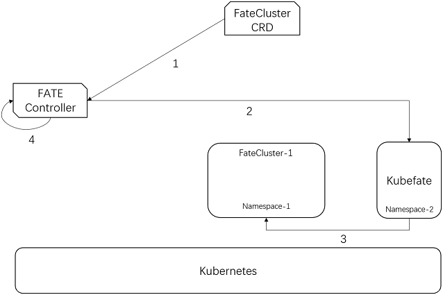

-   [Background](#background)
-   [Motivation](#motivation)
-   [Goals](#goals)
-   [Non-Goals](#non-goals)
-   [Design](#design)
    -   [Container images and deploying FATE cluster on
        Kubernetes](#container-images-and-deploying-fate-cluster-on-kubernetes)
    -   [Custom Resource Definition](#custom-resource-definition)
        -   [Kubefate](#kubefate)
        -   [FATECluster](#fatecluster)
        -   [FateJob](#fatejob)
    -   [Controller design](#controller-design)

_Status_
* 2020-5-14 – Draft v1

## Background
Federated machine learning (FML) is a machine learning setting where many clients (e.g. mobile devices or organizations) collaboratively train a model under the coordination of a central server while keeping the training data decentralized. Only the encrypted mediate parameters are exchanged between clients with MPC or homomorphic encryption.


FML has received significant interest recently, because of its effectiveness to solve data silos and data privacy preserving problems. Companies participated in federated machine learning include 4Paradigm, ANT Financial, Data Republic, Google, Huawei, Intel, JD.com, Microsoft, Nvidia, OpenMind, Pingan Technology, Sharemind, Tencent, VMware, Webank etc.

Depending on the differences in features and sample data space, federated machine learning can be classified into horizontally federated machine learning, vertically federated machine learning and federated transfer learning. Horizontally federated machine learning also is called sample-based federated machine learning, means data sets share the same feature space but different in samples. With horizontally federated machine learning, we can gather the relatively small or partial data set into a big one to in-crease the performance of trained models. Vertical federated machine learning is applicable to the cases that two data set with different feature space but share same sample ID. With vertical federated machine learning we can trained a model with attributes from different organizations for a full profile. Vertical federated machine learning is required to redesign most of machine learning algorithms. Federated transfer learning applies to scenarios that two data set with different features space but also different samples. 

[FATE (Federated AI Technology Enabler)](https://fate.fedai.org) is an open source project initialized by Webank, now hosted at the Linux Foundation. FATE is the only open source FML framework that supports both horizontal and vertical FML currently. The architecture design of FATE is focused on providing FML platform for enterprises. [KubeFATE](https://github.com/FederatedAI/KubeFATE) is an open source project to deploy FATE on Kubernetes, and is a proven effective solution for FML use cases. 

## Motivation
Kubeflow provides a toolset for end-to-end machine learning workflow on Kubernetes. Introducing the capability of federated learning to Kubeflow helps FML users and researchers leverage existing Kubeflow toolkits in their workflows and help them more efficiently build FML solutions. 

A FATE-Operator is a start of supporting FML in Kubeflow. This proposal is aimed to defining what FATE operator should look like, and how to apply to Kubeflow.

## Goals
A Kubeflow user should be able to run training using FATE as easily as they can using PyTorch, Tensorflow. This proposal is centered around a Kubernetes Operator for FATE. With the FATE-Operator, a user can:
1.	Provision and manage a FATE cluster;
2.	Submit a FML job to FATE.

This proposal defines the following:
1.	A FATE operator with three CRDs: 
   * FateJob: create a FML job;
   * FateCluster: create a FATE cluster to serve FML jobs;
   * Kubefate: the resource management component of FATE cluster.
2.	Example of full lifecycle to create KubeFATE component, deploy FATE cluster and submit a FML job to created FATE and get the result. Note that, KubeFATE and FATE cluster only needs to be deployed once, and can handle multiple jobs.

## Non-Goals
For the scope of this proposal, we won’t be addressing the method of serving the model.

## Design

### Container images and deploying FATE cluster on Kubernetes
We have built a set of Docker images for FATE cluster, and put into: https://hub.docker.com/orgs/federatedai/repositories . All the images have been already used and verified by community users. 

There is a provisioning and management component of FATE cluster, called [KubeFATE](https://github.com/FederatedAI/KubeFATE/tree/master/k8s-deploy). KubeFATE manages FATE clusters of one party in a federation.

All images work well and are proven in users’ environments.

### Custom Resource Definition
#### Kubefate
```
apiVersion: app.kubefate.net/v1beta1
kind: Kubefate
metadata:
  name: kubefate-sample
  namespace: kube-fate
spec:
  # kubefate image tag
  imageVersion: v1.0.2
  # ingress host
  ingressDomain: kubefate.net
  # kubefate config
  config:
    FATECLOUD_MONGO_USERNAME: "root"
    FATECLOUD_MONGO_PASSWORD: "root"
    FATECLOUD_MONGO_DATABASE: "KubeFate"
    FATECLOUD_REPO_NAME: "kubefate"
    FATECLOUD_REPO_URL: "https://federatedai.github.io/KubeFATE/"
    FATECLOUD_USER_USERNAME: "admin"
    FATECLOUD_USER_PASSWORD: "admin"
    FATECLOUD_LOG_LEVEL: "debug"
```
KubeFATE is a core component to manage and coordinate FATE clusters in one FML party. The above CRD defines the KubeFATE component. 
* ingressDomain defines other components how to access the service ingress of KubeFATE exposed.

#### FATECluster
```
apiVersion: app.kubefate.net/v1beta1
kind: FateCluster
metadata:
  name: fatecluster-sample
  namespace: fate-9999
spec:
  version: v1.4.0
  partyId: "9999"
  proxyPort: "30009"
  partyList:
  - partyId: "10000"
    partyIp: "192.168.1.10"
    partyPort: "30010"
  egg:
replica: 1
  # Points to KubeFATE created by CRD “Kubefate”
  kubefate:
    name: kubefate-sample
    namespace:  kube-fate
```
The FateCluster defines a deployment of FATE on Kubernetes. 
* version defines the FATE version deployed in Kubernetes;
* partyId defines the FML party’s ID;
* proxyPort defines the exposed port for exchanging models and parameters between different parties in a FML training. It will be exposed as a node port;
* partyList defines the parties in a federation which take part in collaboratively learning;
* egg is the worker nodes of FATE.

#### FateJob
```
apiVersion: app.kubefate.net/v1beta1
kind: FateJob
metadata:
  name: fatejob-sample
  namespace: fate-9999
spec:
  # fateClusterRef points to the FATE cluster resource created by FateCluster
  fateClusterRef: fatecluster-sample
  jobConf:
    pipeline: |-
      {
        "components": {
          "secure_add_example_0": {
            "module": "SecureAddExample"
          }
        }
      }
    modulesConfig: |-
      {
        "initiator": {
          "role": "guest",
          "party_id": 9999
        },
        "job_parameters": {
          "work_mode": 1
        },
        "role": {
          "guest": [
            9999
          ],
          "host": [
            9999
          ]
        },
        "role_parameters": {
          "guest": {
            "secure_add_example_0": {
              "seed": [
                123
              ]
            }
          },
          "host": {
            "secure_add_example_0": {
              "seed": [
                321
              ]
            }
          }
        },
        "algorithm_parameters": {
          "secure_add_example_0": {
            "partition": 10,
            "data_num": 1000
          }
        }
      }
```
FateJob defines the job sent to FATE cluster:
* fateClusterRef defines the cluster of FATE deployed on Kubernetes. Its value is resource name of FATE cluster created by CRD “FateCluster”;
* jobConf defines the details of a FML job. It includes:
   * pipeline: the workflow pipeline of FATE. In FATE, there are many prebuilt algorithm components (ref: https://github.com/FederatedAI/FATE/tree/master/federatedml and https://github.com/FederatedAI/FATE/tree/master/federatedrec), which can be used to train models. The pipeline defines how data are passed through and processed in the whole training flow;
   * moduleConf: the detail configuration of each algorithm component, e.g. the optimizers, the batch size etc.

### Controller design

We created a new custom controller for FateCluster, FateJob and Kubefate resources. 

The relationship between them and processes to make everything work are shown as following diagrams.

Process 1. Creating Kubefate if it does not exist. The custom controller (1) listens for Kubefate resource, (2) creates RBAC resources (Role, Service Account, RoleBinding) to allow remote execution, (3) creates the related resource of Kubefate. (4) The controller waits the resource of Kubefate to be ready and returns the status.


Process 2. Creating FATE cluster. In one party, only one Kubefate instance needs to be provisioned. Multiple FATE clusters can be provisioned by KubeFATe for different purposes. (1) The custom FATE controller listens for FateCluster custom resource, (2) and calls Kubefate cluster of the one federated party, sends the metadata and configurations (3) to create a FATE cluster. (4) The controller waits the resource of FATE to be ready and returns the status.



Process 3. Submitting a FML job to FATE cluster. (1) The custom FATE controller listens for FateJob CRD, and sends the job to FATE cluster, which includes the pipeline and modules configuration. (3) The FATE controller waits for the job results from FATE cluster.  


The overall architecture of the federated learning can be presented as following diagram, the FATE cluster will handle the communication and return to FATE controller once the job is done.


