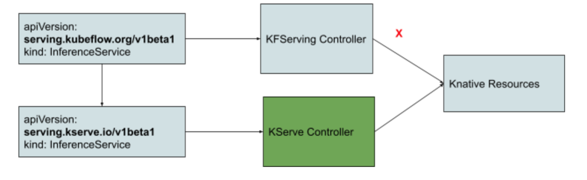

# KFServing Transition to independent Github Organization

## Background and Objective
KFServing is a project created initially by Google, Bloomberg, IBM, NVidia, Seldon under Kubeflow in 2019. It aims to provide a standard production grade model serving solution on Kubernetes.
After publishing the open source project, we have seen an explosion in demand for the software, leading to strong adoption and community growth. The scope of the project has changed since, we have also developed sub components
like ModelMesh, Model Web App which now demands its own github organization.
The KFServing WG members decide to move KFServing development code out of Kubeflow GitHub organization to its independent organization https://github.com/kserve for the project graduation under
the stewardship of [Kubeflow Serving Working Group](https://github.com/kubeflow/community/blob/master/wg-serving/README.md) leads.

## Project Rename
The project is renamed to `KServe` from `KFServing` to retain the connection and brand recognition.

## Scope of the project Rebrand

### API group change for core components
The API group is changed from `serving.kubeflow.org`  to `serving.kserve.io`.

#### InferenceService Controller
- [Issue 1826:](https://github.com/kserve/kserve/issues/1826) Go module and API group change
- Regenerate `InferenceService`, `TrainedModel` CRD with the new API group
- Regenerate OpenAPI spec and `swagger.json`

#### Python SDK
The Python SDK pypi package is renamed to [kserve](https://pypi.org/project/kserve/) from [kfserving](https://pypi.org/project/kfserving/),
see [Issue 1827](https://github.com/kserve/kserve/issues/1827).

- Regenerate python SDK from swagger.json
- Update SDK API with the new package name `kserve`
- Update model servers to import the new package `kserve`
- Update SDK docs

#### Installation Manifests
The KServe control plane is installed in `kserve` namespace instead of `kfserving-system`, see [Issue 1824](https://github.com/kserve/kserve/issues/1824).

- Update API group for the webhook configurations
- Update Standalone/Kubeflow installation manifests overlays

#### Development Scripts
- Update quick install script
- Update `Makefile` and image patch scripts

### KServe CI/CD

#### Prow Setup
Prow is designed for using plugins like `/lgtm` `/approve` and integration with github repo members makes it easy to manage all the projects in a fine-grained way,
though these can be implemented using individual github plugins. KServe has setup own Prow cluster installed with `Tide` for the github review and approval process using the
`KServe OSS Bot`.

#### E2E Tests
For now we reuse the current kubeflow AWS e2e testing infra in the kserve github organization by adding the [configuration](https://github.com/kubeflow/testing/blob/master/aws/GitOps/clusters/optional-test-infra-prow/namespaces/prow/config.yaml#L124)
to submit the presubmit job to [KServe Github Repository](https://github.com/kserve/kserve/).

- Update e2e presubmit job to use AWS e2e test Bot 
- Update e2e test scripts with new SDK package `kserve`

#### Github Actions
All the new images released from `KServe` should be published to the [kserve docker hub organization](https://hub.docker.com/u/kserve).

- Migrate all existing images from gcr.io to docker hub
- Update github workflow to use the dockerhub account `kserve`

### Ecosystem

#### Kubeflow Pipeline
- Create a new `KServe` component for `Kubeflow Pipeline`
- Add KServe component to Kubeflow conformance test

#### Models WebApp
Separate out models web-app to its own repository and setup CI/CD, see [issue 1820](https://github.com/kserve/kserve/issues/1820). 
-  Test out the models UI after the name change

### Documentation
All the existing documentation and examples are moving to [kserve/website](https://github.com/kserve/website) which is built with `mkdocs` and the website is hosted on `netlify`.

- Update main concept, architecture diagrams
- Update administration guide
- Update core inference examples
- Update storage examples
- Update explanation examples
- Update logger and monitoring examples
- Update drift detect and outlier examples
- Update notebook examples 
- Update community and contribution guidelines

### Migration
For users that are migrating from kfserving, `kserve` installs in its own namespace `kserve`.
The migration script scales down the kfserving controller in the cluster, it then converts the `InferenceService CR` from `kubeflow.org` to `kserve.io`, and reconciled in the kserve controller.
The migration should not impact the running `InferenceServices`.

