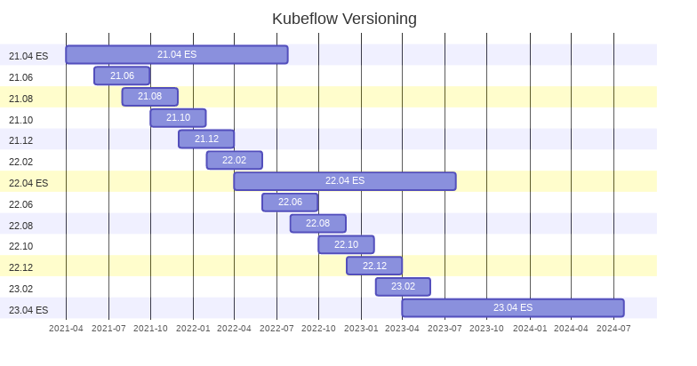

# Kubeflow Versioning

## Motivation

Regularize the Kubeflow release schedule.

## Proposal

In brief, this proposal would switch the release cycle to this:

The changes this would introduce are:

- A new version of Kubeflow would be released every 2 months
- The deadline would be strict; if something is not ready for a particular release, it will be bumped to the next one
- Each version would be supported (i.e. bugs/security issues fixed) for 4 months, except for yearly Extended Support (ES) versions that would be supported for 16 months
- Kubeflow would be versioned according to a YY.MM.N scheme, where YY and MM are the two-digit year and month of the release date, and N is the patch number. N starts at 0 for each YY.MM release, and is incremented by one for each patch release.

This proposal would not change:

- The release cycle of individual Kubeflow components

## Motivation

- Strict release schedule
  - It is not easy to plan around the current release schedule, as it does not have hard deadlines.
- Bumping components to subsequent releases
  - Kubeflow components must not block releases for this proposal to work, otherwise Kubeflow releases can't be strict.
- 2 month release cycle
  - This proposal chooses a 2 month release cycle due to the fact that if a component of Kubeflow is bumped to a subsequent release, there should not be too long of a wait until it can be included in another release. Otherwise, there will be pressure to delay a release to include a new component release, which reverts back to the current schedule.
- 4 month support cycle
  - This length of time is enough that there are always 3 supported versions of Kubeflow, assuming a 2 month release cycle. This number of supported versions matches Kubernetes, where it has seemed to work well.
- 16 month Extended Support cycle
  - This length of time is long enough that distributors and consumers of Kubeflow that are not interested in a rapid release cycle or immediate new features are not forced to continuously upgrade Kubeflow versions.
- YY.MM versioning scheme
  - This scheme is proposed instead of semantic versioning due to the fact that each individual Kubeflow component may or may not have breaking changes in its release, and that information cannot be captured accurately in a single version number. It also helps enforce a strict release schedule, as releasing say 21.04 in May or June of 2021 is not very palatable.
- Component release cycle not changing
  - Individual Kubeflow components would still maintain a release cycle outside of this versioning scheme. They would not need to have version bumps or release new images for a new Kubeflow release if there are no new changes to release.

## Component Versioning Example

Given the components A, B, and C, the release schedule might look like this:

| Kubeflow Release |  A  |  B  |  C  |
| :--------------- | :-: | :-: | :-: |
| 21.04            | 1.0 | 0.5 | 1.3 |
| 21.06            | 1.1 | 0.6 | 1.4 |
| 21.08            | 1.3 | 0.6 | 1.5 |
| 21.10            | 1.7 | 0.6 | 1.6 |
| 21.12            | 2.0 | 0.6 | 2.0 |
| 22.02            | 3.0 | 1.0 | 2.1 |

Note that component A has a more rapid release cycle than Kubeflow itself, while component B has a slower release cycle. Component B does not have to do additional release work for Kubeflow 21.08 - 21.12. Component C chooses to match the Kubeflow release cycle exactly, while maintaining semantic versioning.
