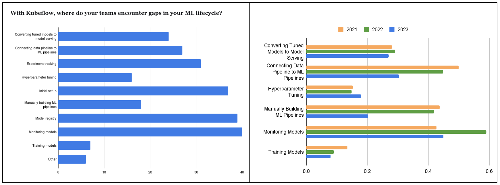

# Model Registry Platform for KubeFlow

## Authors

- Ramesh reddy (Red Hat)
- Dhiraj Bokde (Red Hat)
- Matteo Motari (Red Hat)

## Maintainers

- Ramesh Reddy (Red Hat)
- Dhiraj Bokde (Red Hat)
- Matteo Mortari (Red Hat)                                         
- Andrea Lamparelli (Red Hat)                                   
- Isabella do Amaral (Red Hat)
- Tony Davidson (Red Hat)
- Tommy Li (IBM) 
- Christian Kadner (IBM)

## Motivation

Ref GitHub issue: [https://github.com/kubeflow/kubeflow/issues/7396](https://github.com/kubeflow/kubeflow/issues/7396)

According to the [Kubeflow 2023 survey](https://blog.kubeflow.org/kubeflow-user-survey-2023/), 44% of users identified Model Registry as one of the big gaps in the user’s ML Lifecycle missing from the Kubeflow offering. 

Currently, there are no good open-source alternatives for standalone offerings of Model Registry. Most of these offerings are tightly aligned with their product counterparts or not offered as an open-source solution. We at Red Hat need a model registry that can be used in the cloud, on-prem, and in disconnected/secure environments. We would like to develop a project in the Kubeflow community adopting an open governance model with the help of the Kubeflow community.

The Kubeflow Pipelines (KFP) team uses Google’s project called [ml-metadata](https://github.com/google/ml-metadata) for storing the model training graph. Recently Google maintainers have [mentioned](https://github.com/google/ml-metadata/issues/185) that this project is going into maintenance mode putting the investment that the KFP team made into this project in jeopardy for additional feature development. 

This proposal document suggests implementing Model Registry using ml-metadata too, however, we propose to re-implement parts of the ml-metadata to keep the current investments in KFP intact. 

## Kubeflow Working Group 

Currently, Kubeflow doesn’t have a working group that will be responsible for Model Registry. We propose to establish a new **Model Registry WG**. The scope of this working group is to gather, analyze, and develop model registry requirements of Kubeflow community users.  We could also create a single WG for Spark and Model Registry as suggested in the Spark proposal.

## High-Level Architecture

The desired high-level model is depicted in the figure below.

Figure: [High-Level Architecture](https://miro.com/app/board/uXjVND99Mxk=/?share_link_id=650058432780)

**NOTE:** The Model Registry is a _passive repository_ for metadata and is not meant to be a _Control Plane_. It does not perform any orchestration or expose APIs to perform actions on underlying OpenShift AI components. The AI components use Model Registry as a state machine to which they would reconcile their internal state to.

We envision this to be more of a backing store for various stages of MLOps that can log the user flow of model development and deployment. The model registry will meet a data scientist's need to visualize a model’s lineage and trace back the training executions, parameters, metrics, etc. It will also help deployment engineers visualize model pipeline events, actions, progress through deployment stages, etc. 

The goal is to make Model Registry a first-class citizen in the Kubeflow ecosystem but this is not intended to be a limitation. The Model Registry is designed to function as a "multi-protocol" registry, offering streamlined integration not only with KubeFlow Pipelines but also with the capability to import from platforms such as HuggingFace or MLflow, among others (we've conducted preliminary experiments in this area). Additionally, there's a potential long-term goal to propose a universally adopted "Model Registry standard protocol" across all vendors

As a community initiative, we can implement the[ MLflow Registry REST API](https://mlflow.org/docs/latest/rest-api.html) to align the Model Registry as MLflow compatible, although this is not part of the initial scope.

**LLM support:** In this dynamic scenario, the model registry functions as a metadata store, ensuring the decoupling of the registry from the actual model file. This setup allows for the storage of prompt/fine-tuned models akin to any other model type without necessitating a complete duplication of the model. RAG, essentially a pattern constructed atop LLM, currently lacks a distinct requirement or gap that needs addressing on the model registry front. The integration for example with LangChain requires the development of the [provider code in LangChain](https://python.langchain.com/docs/integrations/providers) (same for Llama-Index) which can be considered.

## Goals 

* Associate metadata from training, experimentation, studies, and their metrics, with a model.
* Build a catalog of models and manage model versions for deployment
* Management of ML models in different deployment environments.
* Build an open-source solution with a vibrant community in KubeFlow with open governance
* Build a Kube Native solution
* Avoid reinvention unless it is mandatory

## Architecture

To bootstrap the project fast as well as to keep the existing investment in the KFP module intact we propose implementing the Model Registry in multiple steps. 

* Step 1: Adopt the Google community project [ML-Metadata](https://github.com/google/ml-metadata/) and build a Model Registry solution that also caters to the KFP team. This still follows the single-tenant (per namespace) deployment.
* Step 2: Re-implement parts of the ML-Metadata project in Go lang and also make this server multi-tenant capable. Implement the RBAC features on the server to control the behavior with permissions and user personas.

### Step 1:  The Incubation (Target to Deliver as Alpha in KF 1.9)

Google community project [ML-Metadata](https://github.com/google/ml-metadata/) will be used as the core component to build the Model Registry. ML-Metadata provides a very extensible schema that is generic, similar to a key-value store, but also allows for the creation of logical schemas that can be queried as if they were physical schemas. Those can be manipulated using their bindings in the Python library. 

We intend to use this model to extend and provide metadata storage services for model serving, also known as Model Registry. As part of this extension, we will develop Python/Go extensions to support the Model Registry. We will also develop an OpenAPI interface to expose the Model Registry API to the clients. 

[Diagram source](https://lucid.app/lucidchart/6a9818f2-d76e-40b7-b30c-57cb1c143d9e/edit?viewport_l[…]1528%2C0_0&invitationId=inv_a7e226fb-edc9-4c4e-b36e-dac9df95219b)

### Step 2:  The Re-Write

> [!NOTE]
> this step might be influenced by the outcomes of the current investigation on OCI/ORAS as an infrastructure layer for Model Registry (see related chapter later in this document); as such, amendments to time or scope might follow depending on the results and decisions in relation to that topic.

In this step we propose to rewrite parts of the ML-Metadata project, primarily remove the C++ server and re-implement it based on Golang and make it Kube native. As part of the rewrite, we want to make this multi-tenant such that there is only a single installation of the Model Registry and integrate with Istio/envoy to support the RBAC and mTLS on its endpoints. We have done a POC using GoLang and found using the code generation and ORM solutions we could eliminate a lot of crud code for easier maintenance. We also believe picking more mainstream language for the Kubernetes environment might also encourage more contributions from the community.

### Components

This section will briefly describe the different components of the system.

#### MLMD C++ Server

This is the metadata server from Google's ml-metadata project.  This component is hosted to communicate with a backend relational database that stores the actual metadata about the models. This server exposes a “_gRPC_” interface for its clients to communicate with. This server provides a very flexible schema model, where using this model one can define logical data models to fit the needs of different MLOps operations, for example, metadata during the training and experimentation, metadata about metrics or model versioning, etc. 

#### OpenAPI/REST Server

This component exposes a higher-level REST API of the Model Registry. In contrast, the MLMD server exposes a lower level generic API over gRPC, whereas this REST server exposes a higher level API that is much closer to the domain model of Model Registry, like

* Register a Model
* Version a Model
* Get a catalog of models
* Manage the deployment statutes of a model
* Search for registered models

The REST API server converts its requests into one or more underlying gRPC requests on the MLMD Server. This layer is mainly designed to be used with tooling. Implementation of the Model Registry UI in the Kubeflow Dashboard is an open question at this point to be discussed with the Kubeflow Dashboard project. In step 2, this will be expanded as the main server replacing the C++ server. The semantics of communication protocol can be reevaluated.

#### Model Registry Controller

Model Registry controller is also called Model Registry Operator. The main purpose of this component is to install/deploy components of the Model Registry stack on a Kubernetes cluster. Once the components are installed, the reconciler in the controller will continuously run and monitor these components to keep them healthy and alive. 

#### CLI

CLI, a command line tool for interacting with Model Registry. This tool can be used by a user to execute operations such as retrieving the registered models, getting the model’s deployment status, model’s version, etc. 

### Integration with Model Serving Components

Once a model has been registered as a _RegisteredModel_ resource, versions of the model and its _ModelArtifacts_ will be created and associated with the _RegisteredModel_. 

The model serving controller will advertise itself in the model registry by creating a _ServingEnvironment_ entity. 

The sequence diagram below shows how _RegisteredModel_ will be deployed by model serving:

Figure: [Model Serving Sequence](https://miro.com/app/board/uXjVNVwkkHw=/?share_link_id=50390168590)

The user creates _InferenceService_ entities in Model Registry for _RegisteredModels_ to deploy them. The _InferenceService_ may optionally specify which _ModelVersion_ to deploy. If it’s not specified, model serving should deploy the latest _ModelVersion_ of _RegisteredModel_. 

Model serving will reconcile _InferenceService_ metadata with Kubernetes CRs to deploy ML models. It will also reconcile Kubernetes CR status with _ServeModel_ state to log model serving state in Model Registry. 

A model registry Golang client library will provide wrapper APIs to make it easier to work with model registry entities and to perform sequences of operations such as retrieving _ModelArtifacts_ to serve. 

### Integration with Kubeflow Pipelines Components

For Step 1, we believe the Model Registry will work as is as a drop-in solution, as there are not any changes from its perspective, only the introduction of Model Registry. However, the deployed Model Registry can be used to serve both KFP components and Model Registry users.

In Step 2, when a new Model Registry is supported with multi-tenancy, the KFP components will need to be modified to support a multi-tenant model. To support this we would need to update the KFP MLMD Python bindings  

### Integration with Notebooks

We intend to extend the current MLMD Python libraries for Model Registry usage. We intend to push these as importable packages into any notebook environment.

### Security

RBAC roles will be defined as “Data Scientist”, “Data Engineer”, “Administrator” based on consultations with Red Hat’s UX teams. The permissions matrix for the roles to available permissions needs to be mapped. Initially, these will be enforced at the OpenAPI layer.

### Metrics and Observability

The Model Registry will be a system designed to be observable, poentially including capabilities to generate user-level metrics as required.

### UI/Dashboard

The team listed in the maintainers lacks expertise in UI development. While this feature is on our roadmap, we'll need to collaborate with the dashboard community team to receive the necessary support in this area. This is largely TBD right now.

### Implementation Plan

* We seek help to establish a working group dedicated to initiating the developmental plans for the incubation stage. We intend to foster collaboration within the community and engage with other community organizations to collectively work on a solution
* We are seeking approval to create two new repositories within Kubeflow’s GitHub organization. One repository will focus on the operator, while the other will serve as the designated space for the Model Registry. We intend to move the current Model Registry implementation in the Open Data Hub organization and modify it to align with the standards and requirements of the Kubeflow community.

### Additional considerations (OCI spec considerations)

We are also exploring to leverage, at least in part, the OCI distribution spec 1.1 as part of Model Registry. This could provide a kube-native and CNCF friendly way to bundle model artifacts and related artifacts. We are also exploring how much of the OCI spec can be used for additional purposes, for example:

* storing [versioned] artifacts
* signing artifacts
* RBAC
* linking with OCI 1.1
* audit logs
* some additional metadata storage

but this is still under active investigation so while some use cases might likely be supportable (eg: storing) others might not be achievable given OCI capabilities in relation to model registry requirements.

## Alternative Open Source Projects Considered

### MLFlow

MLFlow is one of the most popular ML frameworks: it provides comprehensive, out-of-the-box coverage of all the phases in a typical ML project end-to-end.  A GUI provides data-scientist-friendly ways to compare experiments run, comparing parameters and characteristics, making it easy to identify effective models, training strategies, and which models can be promoted to the next phase (staging, prod). They provide a very low barrier for entry for Data scientists to use the Model Registry by providing various deployment options.

**Pros:**

* MLFlow is the most popular e2e ML project management framework
* out-of-the-box support for many ML models

**Risks:**

* While being an OSS project, MLFlow seems to be governed by Databricks, making it challenging from an outlook and future contributions/RFEs perspective. 
* Not designed as a Kube-native solution.
* For model lineage support, it is aligned with MLFlow’s experiments and lineage. This does fit with the current Kubeflow pipeline functionality.
* Built for working with the MLFlow suite of components, not as a reusable component in an ML platform without further integrations.

## DVC (iterative.ai)

This project uses git as the underlying storage solution and the immutability is guaranteed by the use of hashes and RBAC. The project leverages the capability of git in “tracking data” in order to implement a “tracking experiment” to deliver the reproducibility of the trained model. The combination of file pointers in the git history is used to retrieve objects/artifacts, along with the ability to reproduce the actual training pipeline. 

A complementary project called GTO lets you manage tags inside of the git repo: this is an open-source project, and this is the backend used by the GUI/”studio” application. This component is used by DVC to provide a Model Registry store.

**Pros:**

* DVC uses git as the underlying storage, and leverages git concepts in its capabilities to guarantee the reproducibility of the ML training
* Stores even training data also in git.
* Geared totally for the CI/CD workflows, everything controlled by a YAML file.

**Risks:**

* While being an OSS project, seems governed by Iterative.ai, no open governance model.
* The search/query is based on git, in large workspaces this could be a performance risk.
* Not a Kube native solution.
* Model lineage support is aligned with DVC’s experiments and lineage flow which git influenced. This does fit with the current Kubeflow pipeline workflow functionality natively.

## ModelDB (verta.ai)

ModelDB is an open-source machine learning model monitoring and management system that tracks metadata throughout a model's lifecycle. It follows a client-server architecture with a web-based front end and a Java-based backend that interacts with a relational database and an artifact store. ModelDB primarily focuses on experiment tracking and management, but it also includes a Python library that is integrated with Verta's ML platform. Their Model Registry component is NOT an Open Source solution only available in their enterprise offering.

**Pros:**

* Open Source solution supports experiment tracking.
* Provides flexibility in database schema for efficient metadata management.
* Utilizes a contract-first backend implementation based on Proto schemas, enhancing data consistency and communication.
* Uses Java stack used in the backend implementation.

**Risks:**

* Community contributions may be challenging as it is primarily maintained and governed by Verta.ai.
* Fully integrated within the Verta.ai ML platform, which may limit its usability outside of its ecosystem.
* No Model Registry capabilities.
* There is no standalone Python library available for ModelDB
