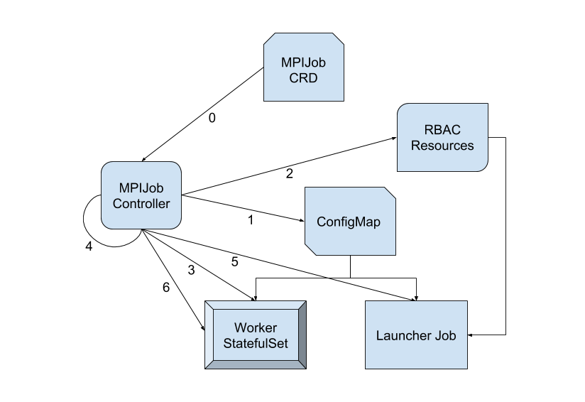

## Motivation
Kubeflow currently supports distributed training of TensorFlow models using
[tf-operator](https://github.com/kubeflow/tf-operator), which relies on
centralized parameter servers for coordination between workers. An alternative
is a decentralized approach in which workers communicate with each other
directly via the MPI
[`allreduce`](http://mpitutorial.com/tutorials/mpi-reduce-and-allreduce/)
primitive, without using parameter servers.
NVIDIA's [NCCL](https://developer.nvidia.com/nccl) library has implemented most
of the MPI primitives efficiently on GPUs, and Uber's
[Horovod](https://github.com/uber/horovod) makes it simple to do multi-gpu and
multi-node training using TensorFlow; the TensorFlow team is also working on an
`allreduce`
[implementation](https://github.com/tensorflow/tensorflow/tree/master/tensorflow/contrib/distribute).
Compared to parameter servers, this approach arguably is more
[bandwidth optimal](http://www.cs.fsu.edu/~xyuan/paper/09jpdc.pdf) and
[scales better](https://eng.uber.com/horovod/). For a detailed survey of
distributed deep learning, see
[this paper](https://arxiv.org/abs/1802.09941).

However, right now there is no easy way to launch this type of training jobs on
Kubernetes. By providing a CRD and a custom controller, we can make
allreduce-style distributed training as simple as training on a single node.

## Goals
* Provide a common Custom Resource Definition (CRD) for defining a single-gpu,
multi-gpu, or multi-node training job.
* Implement a custom controller to manage the CRD, create dependent resources,
and reconcile the desired states.
* The cross-pod communication should be secure, without granting unnecessary
permissions to any pod.
* Though the initial version focuses on TensorFlow/Horovod, the approach can be
applied to other frameworks with MPI support, such as
[ChainerMN](https://github.com/chainer/chainermn) or
[CNTK](https://docs.microsoft.com/en-us/cognitive-toolkit/multiple-gpus-and-machines).

## Non-Goals
In theory, this operator can be used to run arbitrary MPI jobs (e.g.
computational fluid dynamics), but it's not our focus.

## API

### Container Image

A requirement on user's container image is that it includes an MPI
implementation. The initial version is tested on Open MPI 3.0.0, but it can be
extended to other MPI implementations if there is a need.

It's also expected that the user would invoke `mpirun`, either through an
`entrypoint` in the Docker image, or a `command` in the `PodSpec`.

SSH is not needed (or used).

### Custom Resource Definition
The custom resource can be defined in two ways, in terms of how GPU resources
are specified.

In the simple version, user specifies the total number of GPUs and the operator
figures out how to allocate them efficiently:
```yaml
apiVersion: kubeflow.org/v1alpha1
kind: MPIJob
metadata:
  name: tensorflow-benchmarks
spec:
  gpus: 128
  template:
    spec:
      containers:
      - name: tensorflow-benchmarks
        image: rongou/tensorflow_benchmarks:latest
```

For more flexibility, user can choose to specify the resources explicitly (this
example also shows the full `mpirun` command line):
```yaml
apiVersion: kubeflow.org/v1alpha1
kind: MPIJob
metadata:
  name: tensorflow-benchmarks
spec:
  replicas: 16
  template:
    spec:
      containers:
      - name: tensorflow-benchmarks
        image: rongou/tensorflow_benchmarks:latest
        command: ["mpirun"]
        args: [
          "-bind-to", "none",
          "-map-by", "slot"",
          "python", "scripts/tf_cnn_benchmarks/tf_cnn_benchmarks.py",
          "--model", "resnet101",
          "--batch_size", "64",
          "--variable_update", "horovod",
        ]
        resources:
          limits:
            nvidia.com/gpu: 8
```

Either case would result in a worker `StatefulSet` and a launcher `Job`.

### Resulting Worker
```yaml
apiVersion: apps/v1
kind: StatefulSet
metadata:
  name: ${job-id}-worker
spec:
  podManagementPolicy: Parallel
  replicas: 15
  selector:
    matchLabels:
      app: ${job-id}-worker
  serviceName: ${job-id}-worker
  template:
    metadata:
      labels:
        app: ${job-id}-worker
    spec:
      containers:
      - name: tensorflow-benchmarks
        image: rongou/tensorflow_benchmarks:latest
        command: ["sleep"]
        args: ["365d"]
        resources:
          limits:
            nvidia.com/gpu: 8
        volumeMounts:
        - name: ml-job-config
          mountPath: /etc/mpi
      volumes:
      - name: ml-job-config
        configMap:
          name: ${job-id}-config
          items:
          - key: kubexec.sh
            path: kubexec.sh
            mode: 365
```

### Resulting Launcher
```yaml
apiVersion: batch/v1
kind: Job
metadata:
  name: ${job-id}-launcher
spec:
  template:
    spec:
      initContainers:
      - name: kubectl-delivery
        image: rongou/kubectl-delivery:latest
        volumeMounts:
        - name: ml-job-kubectl
          mountPath: /opt/kube
        env:
        - name: TARGET_DIR
          value: /opt/kube
      containers:
      - name: tensorflow-benchmarks
        image: rongou/tensorflow_benchmarks:latest
        resources:
          limits:
            nvidia.com/gpu: 8
        volumeMounts:
        - name: ml-job-kubectl
          mountPath: /opt/kube
        - name: ml-job-config
          mountPath: /etc/mpi
        env:
        - name: OMPI_MCA_plm_rsh_agent
          value: /etc/mpi/kubexec.sh
        - name: OMPI_MCA_orte_default_hostfile
          value: /etc/mpi/hostfile
      restartPolicy: OnFailure
      serviceAccountName: ${job-id}-launcher
      volumes:
      - name: ml-job-kubectl
        emptyDir: {}
      - name: ml-job-config
        configMap:
          name: ${job-id}-config
          items:
          - key: kubexec.sh
            path: kubexec.sh
            mode: 365
          - key: hostfile
            path: hostfile
            mode: 292
```

The launcher pod invokes `mpirun` and communicates with worker pods through MPI.
The initial handshake is done through `kubectl exec` instead of SSH. Logs can
be accessed through the launcher pod.

## Design
We create a new custom controller that listens for `MPIJob` resources. When a
new `MPIJob` is created, the controller goes through the following *logical*
steps:
1.  Create a `ConfigMap` that contains:
    *   A helper shell script that can be used by `mpirun` in place of ssh. It
        invokes `kubectl exec` for remote execution.
    *   A `hostfile` that lists the pods in the worker `StatefulSet` (in the
        form of `${job-id}-worker-0`, `${job-id}-worker-1`, ...), and the
        available slots (GPUs) in each pod.
1.  Create the RBAC resources (`Role`, `ServiceAccount`, `RoleBinding`) to allow
    remote execution (`pods/exec`).
1.  Create the worker `StatefulSet` that contains the desired replicas minus 1,
    as the launcher also does work. The command is set to sleep indefinitely.
1.  Wait for the worker pods to be ready.
1.  Create the launcher Job. It’s run under the `ServiceAccount` created in
    step 2. Environment variables are set to tell `mpirun` to use our helper
    script for remote execution, and the `hostfile` to use. The `kubectl` binary
    is delivered to an `emptyDir` volume through an init container.
1.  After the launcher job finishes, set the `replicas` to 0 in the worker
    `StatefulSet`.



It may be desirable to schedule all the GPUs in a single Kubernetes resource
(for example, for gang scheduling). We can add an option to the operator so that
the worker `StatefulSet` does all the work, thus acquiring all the GPUs needed.
The launcher job then becomes very light weight and no longer requires any GPUs.

## Alternatives Considered
One option is to add `allreduce` support to the existing tf-operator, but the
modes of operation are quite different. Combining them may make the user
experience unnecessarily complicated. A user would typically pick one approach
or the other and stick with it, so there is probably not a lot of overlap.
Depending on user feedback, we may consider merging the two operators down the
road.

Kubeflow recently added Open MPI support through `ksonnet` template expansion.
Right now it’s a fairly manual process. It also requires that user's container
image have ssh installed, which may present a security risk if not properly
configured. By encapsulating most of the logic in an MPI operator, and
leveraging Kubernetes' remote execution API directly, the user interface can be
greatly simplified, at the same time providing better security.
