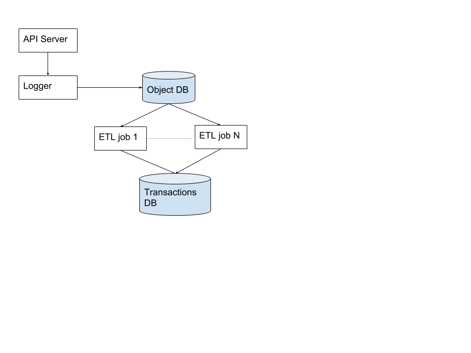

## Motivation
Reproducible ML is a [big problem](https://petewarden.com/2018/03/19/the-machine-learning-reproducibility-crisis/). 
Kubeflow could add a lot of values to users by making it easy for users to track how datasets and models were produced.
A lot of valuable information is available in K8s resource specifications. Resources like K8s Jobs, TFJobs, ConfigMaps, and Argo workflows
often contain information (e.g. via command line arguments) about inputs and outputs and the code (docker image) used. There are
two major problems to using this information to track provenance of models and data today:

1. The information is not durable

	* I should not rely on the K8s APIServer as a persistent, historical data store for resources.

1. The schema is not convenient

	* People use a variety of conventions/patterns to pass inputs/outputs to their programs
	* Lack of uniformity is a barrier to building tools that can surface information in useful ways.

The purpose of this proposal is to solve these problems to facilitate tools to track and surface provenance.

## Goals

1. Build an agent to persist resource specs to durable storage

1. Allow user defined ETL pipelines to transform raw data into useful tables.

## Non-Goals

1. Building a comprehensive set of tools to surface provenance information.


## Design

As illustrated by the diagram below the system will consist of

1. A cluster agent that watches the APIServer and records K8s objects to a persistent datastore
1. A row database (e.g. HBASE/BigTable) to store the raw K8s objects
1. One or more ETL pipelines to turn the raw data into transaction records
1. A database to store the transaction records



Similar to how logging works in [Kubernetes](https://kubernetes.io/docs/concepts/cluster-administration/logging/) we will have
a simple cluster level agent that will watch a configurable subset of K8s resources (e.g. TFJobs, Jobs, Workflows, ConfigMaps).
The agent will then write the complete K8s object (e.g spec and status) to the database.

The schema for the objects DB will be

| UUID | kind | apiVersion | object |
| -----|------|------------|--------|
| | | | | |

 * UUID can be used as a row key
 * kind & apiVersion allow filterting so i can have different ETL pipelines handling different types of objects 
 * object wil be a string containing the full json representation of the object

Rows will be versioned with an integer (as in HBASE/BigTable). This will facilitate incremental processing using a streaming ETL framework like spark or Apache beam. The K8s resource version can be used as the version but this isn't required.

The objects database is eventually consistent; the only requirement is that the database eventually stores the last version(prior to its deletion) of an object. No guarantees are provided about intermediate versions; implementations can choose to store intermediate versions or not.

We store the full raw object to avoid discarding information which may become important in the future. This schema is future proof. The fields UUID, kind and apiVersion are present in all Kubernetes objects and are unlikely to be removed in future releases.

We rely on ETL pipelines to extract useful information and store it in a database representing transactions.

A proposed schema for the transactions table is

| id | inputs | outputs | transform |
| --- | --- | --- | --- |
| | | | |

 * id string serving as the unique row id
 * inputs json object describing the inputs
 * outputs json object describing the outputs
 * transform json object describing the transform

 As an example a TFJob might be stored as

 ```
 inputs:
   train_data: gs://bucket/train-data-set*
   eval_data: gs://bucket/eval-data-set*

 outputs:
   model: gs://bucket/model.pb

 transform:
   image: gcr.io/project/trainer:1.0
   num_steps: 10
 ```

The schema is intentionally quite flexible to give users the flexibility to store pertinent information. For example, it is quite common
to train a model starting with an existing checkpoint and this information would be pertinent to provenance.

The design allows users to easily adapt the system to their conventions by writing their own ETL pipelines (or extending existing ones) as opposed
to forcing them to adopt specific conventions. For example, some users might choose to decorate their K8s objects with annotations that store
relevant metadata using a particular schema suitable for their system. Other users might rely on particular command line arguments. 

Another advantage of storing the raw data is that metadata can be backfilled after the fact provided the relevant data is available in the resource.
For example, during early experimentation if a user is running jobs in an adhoc fashion they don't need to think about what data and schema
to use. Later on when they want to obtain provenance information they can write an ETL pipeline to parse the raw data. 

### ETL

We are intentionally not prescriptive about how ETL pipelines should be written. The expectation is that users will choose
a variety of tools (e.g. Spark and Beam) to write their pipelines.

### Conventions

The hope is common conventions will emerge with associated tooling so that users don't have to implement it themselves.

For example, one convention might be to use a particular annotation on K8s objects to encode relevant data. This could be supported
with an ETL pipeline that could be deployed as a cron job via Kubeflow. In addition, this annotation could be well supported in
Kubeflow ksonnet components e.g. for TFJob.

## Alternatives Considered

### Store only transactions

An alternative design would be to not store the raw data and only have the transaction database. The advantages are

- Requires less storage
- Don't need to maintain ETL pipelines

The disadvantage of this approach is that you have to know ahead of time what information is worth preserving. 

### Use logging

We could treat the objects as text and log them using existing logging support in Kubernetes.

I think