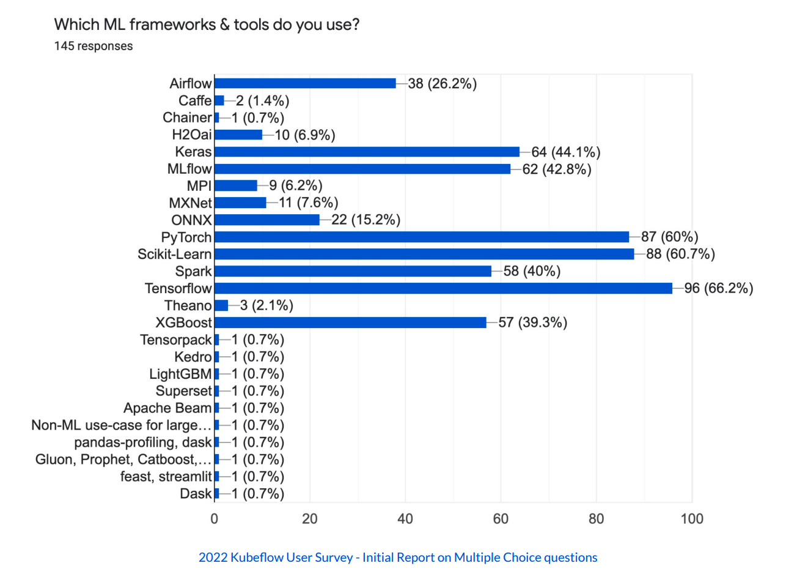
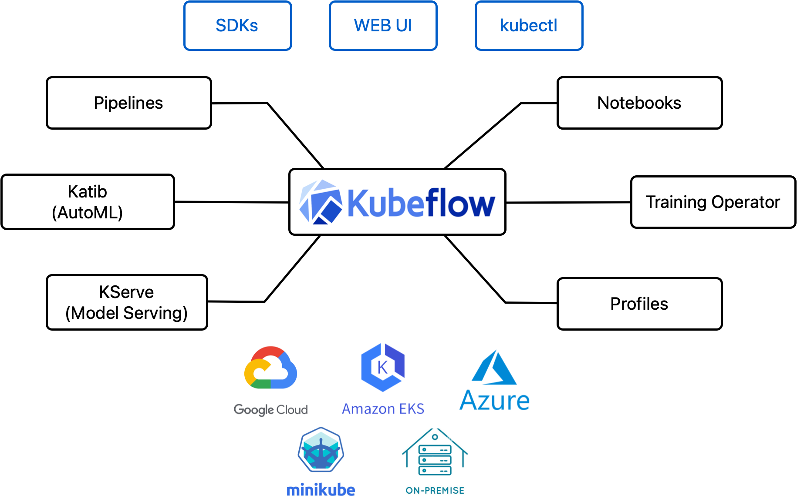
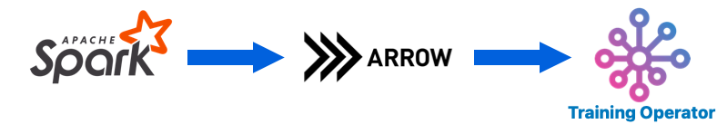

# Adoption of Spark Kubernetes Operator in Kubeflow

Original doc: https://docs.google.com/document/d/1rCPEBQZPKnk0m7kcA5aHPf0fISl0MTAzsa4Wg3dfs5M/edit

## Authors

- Andrey Velichkevich (Apple)
- Chaoran Yu (Apple)
- Marcin Wielgus (Google)
- Rus Pandey (Apple)
- Vara Bonthu (AWS)

## Motivation

Ref GitHub issue: https://github.com/kubeflow/community/issues/648

[Spark on Kubernetes Operator](https://github.com/GoogleCloudPlatform/spark-on-k8s-operator) is the
project to simplify the capability of running Apache Spark on Kubernetes. It automates deployment
and simplifies lifecycle management of Spark Jobs on Kubernetes.

This project boasts a substantial user base with 167 contributors, 2.5k likes, and is endorsed by 45
organizations as documented in
[the "Who is using" document](https://github.com/GoogleCloudPlatform/spark-on-k8s-operator/blob/master/docs/who-is-using.md).
There are many more organizations using it than the originally reported 45. The primary issue at
hand is that this project currently resides under the GoogleCloudPlatform GitHub organization, and
it is solely moderated by a Google employee. Numerous users and customers have voiced concerns and
raised issues regarding the maintenance of the repository. The existing Google maintainers
are constrained by limitations in terms of time and support, adversely affecting both the project
and its user community.

At Kubecon Chicago 2023, AWS open source architects and the Apple infrastructure team initiated
discussions with the Google team, specifically Marcin Wielgus. They conveyed their interest in
contributing the project to either the Kubeflow or Apache Spark community.
Marcin from Google confirmed their willingness to donate the project to either of these communities.

Spark already has a lot of AI/ML use-cases and the Kubeflow ecosystem can help to address those.
According to the recent Kubeflow survey, Spark is one of the most popular frameworks for Kubeflow users:

## Benefits for Kubeflow

The following diagram shows the main components of Kubeflow. Notebooks for interactive ML development,
Training Operator for distributed ML Training, Katib for HyperParameter Tuning, KServe for
Model Serving, Pipelines for ML pipelines, and Profiles to create Kubeflow user profiles.

Today, Kubeflow doesn’t have any component for Data Preparation which is an essential step for
MLOps lifecycle. Spark is one of the best and most-used frameworks for Data Preparation,
Data Analysis, Feature Engineering for Data Scientists. Thus, adopting Spark Operator to Kubeflow
components will significantly improve Kubeflow user experience.

### Kubeflow Working Group Data

Currently, Kubeflow doesn’t have a working group (WG) which is responsible for Data Preparation.
By adopting Spark Operator to Kubeflow we can establish a new Data WG. The scope of this
WG is to provide guidelines for AI/ML users to run data preparation tools such as
[Spark](https://spark.apache.org/), [Dask](https://www.dask.org/), or [Ray](https://docs.ray.io/en/latest/)
on Kubernetes. Also,
[a new proposal for Model Registry](https://docs.google.com/document/d/1T3KfOqIfJohp0s1koQ2XrJJQQhj7TECO-m2xPsW59_c/edit#heading=h.t7b42oqmiz2y)
in Kubeflow can be part of Data WG scope.

Initially, Spark Operator is the ideal candidate to start this WG.

### Spark Operator & Kubeflow Training Operator

When users want to do distributed training with Kubeflow Training Operator currently they have to
manually download data for every Training Job worker from the external storage (e.g. S3, GCS, etc.).
For the Large Language Models usually datasets grow significantly and downloading data is a time and
cost consuming process.

If users use Spark for data preparation, they want to feed the training data directly to
the Training Workers from Spark. We can leverage [Apache Arrow Flight](https://arrow.apache.org/docs/format/Flight.html)
to store data in-memory and use it in the job workers. We can propose API and controller changes
in Spark Operator and Training Operator to support it.

### Spark Operator & Kubeflow Distributions

Kubeflow Profile Controller can be integrated with Spark jobs to define appropriate roles and
policies for users to interact with Spark from the Kubeflow Central Dashboard. Kubeflow user roles
will have the appropriate permission to create/consume Spark jobs in their Kubeflow namespaces.
For example, they can use Kubeflow Notebooks to create Spark jobs. That will give users a better
end-to-end ML experience in Kubeflow distributions.

### Spark Operator & Kubeflow Pipelines

Today, Kubeflow Pipelines doesn’t have
[the Spark Operator component](https://github.com/kubeflow/pipelines/tree/master/components/kubeflow)
that is supported by the Kubeflow community. Kubeflow Pipelines has several Spark components which
are vendor specific. For example, Spark component for
[Azure](https://github.com/kubeflow/pipelines/tree/e976d6d4696262e319ae971ffa645297cf258d80/components/azure/azuresynapse/runsparkjob),
Spark component for [IBM Cloud](https://github.com/kubeflow/pipelines/tree/e976d6d4696262e319ae971ffa645297cf258d80/components/ibm-components/spark),
Spark component for [GCP](https://github.com/kubeflow/pipelines/tree/e976d6d4696262e319ae971ffa645297cf258d80/components/gcp/dataproc/submit_pyspark_job).
We can create a new Kubeflow Pipelines component which allows users to integrate Spark jobs in
their AI/ML pipelines.

## Maintainers

The following maintainers are committed to maintain Spark Operator under Kubeflow GitHub org to
track issues, do releases, merge PRs.

- Vara Bonthu ([@vara-bonthu](https://github.com/vara-bonthu) - AWS)
- Chaoran Yu ([@yuchaoran2011](https://github.com/yuchaoran2011) - Apple)
- Marcin Wielgus ([@mwielgus](https://github.com/mwielgus) - Google)

## Migration Plan

### GitHub Repository

Spark repository is going to migrate to a new repository under Kubeflow GitHub org.
That will allow us to save GitHub history (Issues, PRs, Commits).

Current Repository: https://github.com/GoogleCloudPlatform/spark-on-k8s-operator
New Repository: https://github.com/kubeflow/spark-operator

Initially, we are going to [transfer Spark Operator GitHub repository](https://docs.github.com/en/repositories/creating-and-managing-repositories/transferring-a-repository#about-repository-transfers) with the same name: `spark-on-k8s-operator`.
After the transfer, we need to work on renaming repository
from `spark-on-k8s-operator` to `spark-operator` to keep it consistent with other Kubeflow components
(e.g. `mpi-operator`, `training-operator`).

### API Changes

Currently, Spark has its own APIs group for `SparkJob` custom resource:
[`sparkoperator.k8s.io`](https://github.com/GoogleCloudPlatform/spark-on-k8s-operator/blob/86d71c828bd05fb0486f4190efacf839771eba16/pkg/apis/sparkoperator.k8s.io/register.go#L20).

Maintainers are going to decide if APIs should be renamed to `kubeflow.org` to keep it consistent
with other Kubeflow APIs.

### Documentation

Documentation is currently located in the [spark-on-k8s-operator/docs](https://github.com/GoogleCloudPlatform/spark-on-k8s-operator/tree/master/docs)
section. In the future we can migrate these docs to the Kubeflow Website.

## Existing Solutions to run Spark on Kubernetes

- Proposal to create a new Java-based Spark Operator:
  [SPIP: Spark Kubernetes Operator](https://docs.google.com/document/d/1f5mm9VpSKeWC72Y9IiKN2jbBn32rHxjWKUfLRaGEcLE/edit#heading=h.h3pualbnwuc2)

  We are going to track the Apache Community final decision on the official Apache Spark Operator in
  [this issue](https://issues.apache.org/jira/browse/SPARK-46054)

- Stackable Spark Operator: https://github.com/stackabletech/spark-k8s-operator

- OpenShift Spark Operator: https://github.com/opendatahub-io-contrib/spark-on-openshift

- Using Spark Submit to create Spark Application on Kubernetes:
  https://spark.apache.org/docs/latest/submitting-applications.html

Despite on existing Spark Operator solution, we still need to support customers who are using
Spark Operator from the GCP GitHub org because APIs are not compatible and it is not trivial to
migrate all customers to a new operator. In the future, we can discuss with the Apache Spark
community to find the best way of running Spark on Kubernetes and guide our users on how to use it
for their ML workloads on Kubernetes.
