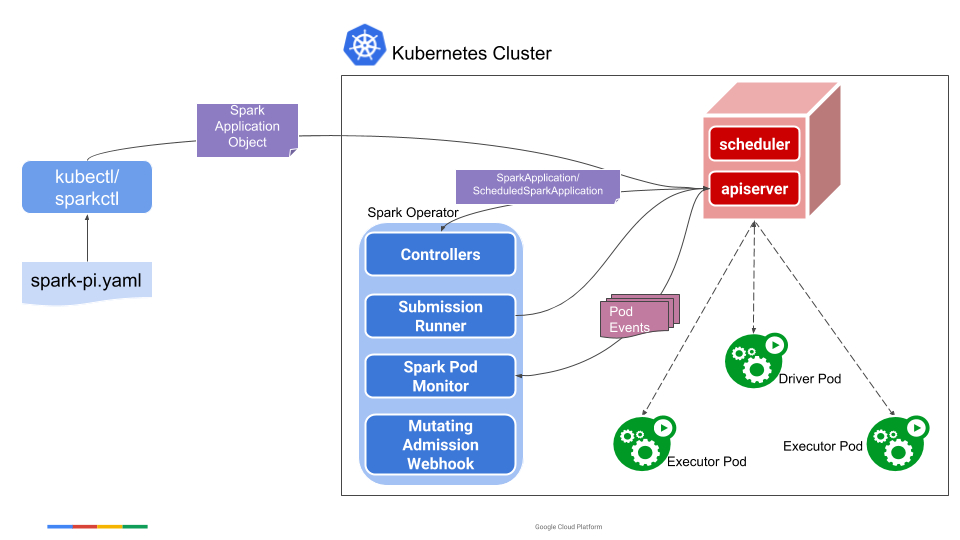
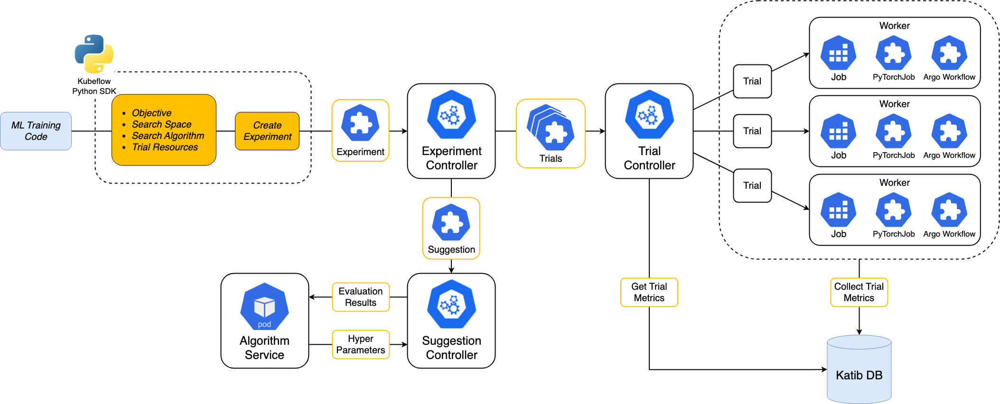
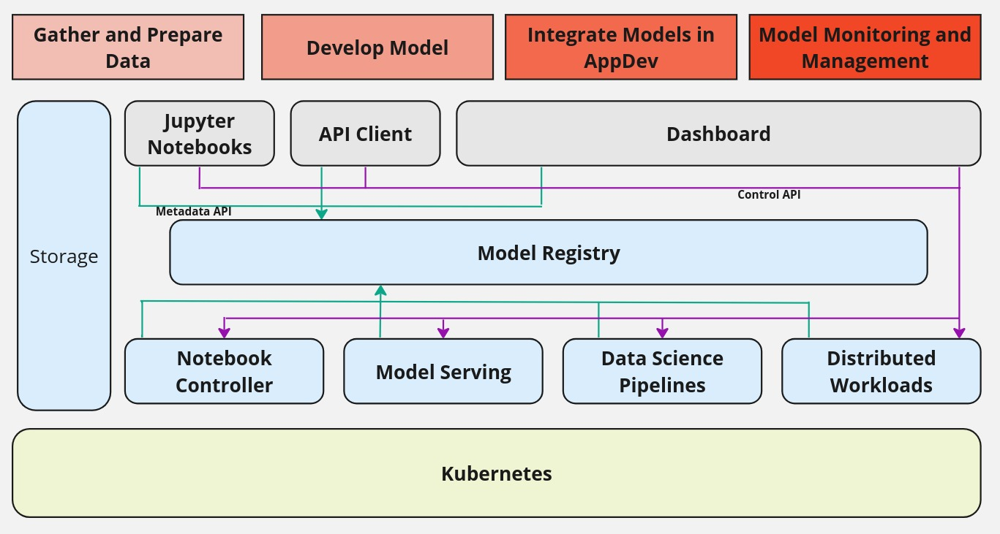
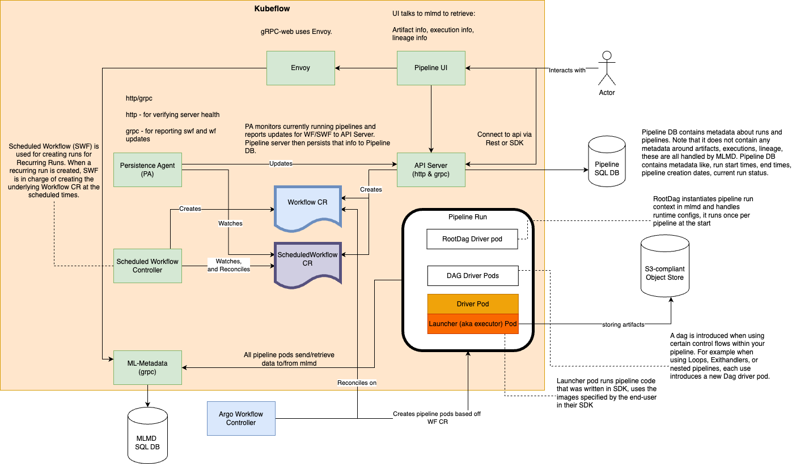

# Kubeflow Security Self-Assessment

This document is a Kubeflow security self-assessment.

Authors:

- Kubeflow Community

# Table of Contents

- [Metadata](#metadata)
- [Security links](#security-links)
- [Software Bill of Materials](#software-bill-of-materials)
- [Overview](#overview)
  - [Background](#background)
  - [Actors](#actors)
  - [Actions](#actions)
  - [Goals](#goals)
  - [Non-Goals](#non-goals)
- [Self-assessment Use](#self-assessment-use)
- [Security functions and features](#security-functions-and-features)
- [Project Compliance](#project-compliance)
- [Secure Development Practices](#secure-development-practices)
  - [Development pipeline](#development-pipeline)
  - [Communication Channels](#communication-channels)
  - [Ecosystem](#ecosystem)
- [Security issue resolution](#security-issue-resolution)
  - [Responsible disclosure practice](#responsible-disclosure-practice)
  - [Incident response](#incident-response)
- [Appendix](#appendix)

# Metadata

<table>
  <thead>
    <tr>
      <th>Name</th>
      <th>Information</th>
    </tr>
  </thead>
  <tbody>
    <tr>
      <td>Assessment Stage</td>
      <td>Incomplete</td>
    </tr>
    <tr>
      <td>Software</td>
      <td>
        <a href="https://github.com/kubeflow/spark-operator">Kubeflow Spark Operator</a>, 
        <a href="https://github.com/kubeflow/notebooks">Kubeflow Notebooks</a>, 
        <a href="https://github.com/kubeflow/trainer">Kubeflow Trainer</a>, 
        <a href="https://github.com/kubeflow/katib">Kubeflow Katib</a>, 
        <a href="https://github.com/kubeflow/model-registry">Kubeflow Model Registry</a>, 
        <a href="https://github.com/kubeflow/pipelines">Kubeflow Pipelines</a>
      </td>
    </tr>
    <tr>
      <td>Security Provider?</td>
      <td>No. Kubeflow projects are not security providers</td>
    </tr>
    <tr>
      <td>Languages</td>
      <td>Python, Go, TypeScript</td>
    </tr>
  </tbody>
</table>

# Security links

- Kubeflow Spark Operator security policy: https://github.com/kubeflow/spark-operator/blob/master/SECURITY.md
- Kubeflow Notebooks security policy: https://github.com/kubeflow/notebooks/blob/master/SECURITY.md
- Kubeflow Trainer security policy: https://github.com/kubeflow/trainer/blob/master/SECURITY.md
- Kubeflow Katib security policy: https://github.com/kubeflow/katib/blob/master/SECURITY.md
- Kubeflow Model Registry security policy: https://github.com/kubeflow/model-registry/blob/main/SECURITY.md
- Kubeflow Pipelines security policy: https://github.com/kubeflow/pipelines/blob/master/SECURITY.md

# Software Bill of Materials

The go.mod file for each component can be found in the appropriate Kubeflow projects:

- https://github.com/kubeflow/spark-operator/blob/master/go.mod
- https://github.com/kubeflow/notebooks/blob/notebooks-v2/workspaces/controller/go.mod
- https://github.com/kubeflow/trainer/blob/master/go.mod
- https://github.com/kubeflow/katib/blob/master/go.mod
- https://github.com/kubeflow/model-registry/blob/main/go.mod, https://github.com/kubeflow/model-registry/blob/main/clients/python/pyproject.toml
- https://github.com/kubeflow/pipelines/blob/master/go.mod

All Kubeflow container images can be found here: https://github.com/orgs/kubeflow/packages

The SBOMs for any released Kubeflow container image can be accessed using the following command:

```
docker sbom ghcr.io/kubeflow/trainer/trainer-controller-manager:v2.0.0-rc.0
```

# Overview

[Kubeflow](https://www.kubeflow.org/) is the foundation of tools for AI Platforms on Kubernetes.

AI platform teams can build on top of Kubeflow by using each project independently or deploying the
entire AI reference platform to meet their specific needs. The Kubeflow AI reference platform is
composable, modular, portable, and scalable, backed by an ecosystem of Kubernetes-native
projects that cover every stage of the [AI lifecycle](https://www.kubeflow.org/docs/started/architecture/#kubeflow-projects-in-the-ai-lifecycle).

Whether you’re an AI practitioner, a platform administrator, or a team of developers, Kubeflow
offers modular, scalable, and extensible tools to support your AI use cases.

Please refer to [the official documentation](https://www.kubeflow.org/docs/) for more information.

## Background

Building AI platforms in cloud native environments poses many challenges given the uniqueness of
AI workloads. While Kubernetes provides a robust foundation for container orchestration, it was not
originally designed to support AI workloads. Some of the gaps including gang-scheduling, accelerator
management, monitoring, autoscaling, managing stateful workloads, often resulting in operational
complexity and inefficiencies.

Kubeflow projects address these challenges by creating Custom Resource Definitions (CRDs)
on top of Kubernetes to orchestrate AI workloads for Data Processing, AI Development, Model Training,
Model Optimization, ML Pipelines and MLOps governance. Additionally, Kubeflow offers a variety of interfaces including a
Python SDK and web UIs which allow users to focus on their models rather than the underlying
complexities.

Kubeflow is designed to be portable, extensible, and framework-agnostic. It offers pluggable
architecture that allows platform engineers integrate their internal systems with Kubeflow tools.

Every Kubeflow project is designed to address specific parts of the AI lifecycle. For example, Kubeflow
Trainer manages model training and Kubeflow Spark Operator manages data processing workloads.

## Actors

Kubeflow consists of **six** individual projects which allow organizations to build end-to-end
AI platforms. The following diagram shows the AI lifecycle and role of Kubeflow projects:


The actors for each Kubeflow project are explained in the following sections:

### Kubeflow Spark Operator



- Spark Operator controller: A controller that watches for events of SparkApplication CRDs and acts on the watch events. It includes a submission runner that runs Spark submit for submissions received from the controller, and a Spark pod monitor that watches for Spark pods and sends pod status updates to the controller.

- Spark Mutating Webhook: a Mutating Admission Webhook that handles customizations for Spark driver
  and executor Pods based on the annotations on the Pods added by the controller.

Detailed information can be found here in the official
[Kubeflow Spark Operator docs](https://www.kubeflow.org/docs/components/spark-operator/overview/#architecture).

### Kubeflow Notebooks

- Notebook controller: controller that watches events of Notebook CRDs. Kubeflow Notebooks supports
  three type of IDEs: JupyterLab, RStudio, and VSCode. Supported images are explained in
  [this guide](https://www.kubeflow.org/docs/components/notebooks/container-images/#official-images).

- Culling controller: controller that watches for Notebooks activity and cull resources in case of
  idleness.

- Notebook web UI: web interface that allow users to manage their Notebooks. User can leverage this
  UI to create IDE and start model development. The web UI is integrated with Kubeflow Dashboard
  which gives users ability to see all created Notebooks.

### Kubeflow Katib



- Experiment controller: controller that watches events of Experiment CRDs which manage single
  hyperparameter tuning job. User can specify several parameters in Experiment such as objective
  to define metric that user wants to achieve, search space to define set of all hyperparameter
  values, and search algorithm to use for optimization job (e.g. bayesian optimization )

- Suggestion controller: controller that watches events of Suggestion CRDs which manage set of
  hyperparameter values that the hyperparameter tuning process has proposed. Suggestion is
  responsible to manage algorithm service.

- Trail controller: controller that watches events of Trial CRDs which manage one iteration of
  hyperparameter tuning process. A Trial corresponds to one worker job instance with a list of
  parameter assignments. The list of parameter assignments corresponds to a Suggestion.

- Katib webhooks: Validates and mutates CRD resources to ensure they conform to Katib standards
  and best practices. Katib also manages admission webhook to mutate metrics collector sidecar
  container into Trial workers.

- Katib SDK: Python SDK which allows ML engineers manage their Experiments without learning YAML
  configurations and Kubernetes APIs.

- Katib web UI: web interface that allow users to manage their Experiments. User can leverage this
  UI to create Experiment and compare results.

### Kubeflow Trainer


- TrainingRuntime controller: controller that watches events of TrainingRuntime and
  ClusterTrainingRuntime CRDs. It is responsible to check whether runtime is unused and can be
  deleted or updated by users.

- TrainJob controller: controller that watches events of TrainJob CRDs. It is
  responsible to orchestrate distributed training job based on TrainJob and TrainingRuntime
  configurations. It creates additional resources like ConfigMap for MPI hostfile to ensure
  appropriate orchestration of jobs.

- Trainer webhook: Validates and mutate CRD resources to ensure they conform to Kubeflow Trainer
  standards and best practices.

- External Integrations: JobSet controller to manage orchestration of multiple jobs within single
  workload.

- Kubeflow Trainer SDK: Python SDK which allows ML engineers manage their TrainJobs without
  learning YAML configurations and Kubernetes APIs.

### Kubeflow Model Registry



- OpenAPI/REST Server: This component exposes a high-level REST API of the Model Registry.
  The REST API offers end-user capabilities focused on the domain model of Model Registry, like
  register a model, version a model, get a catalog of models, manage the deployment statutes of a model

- Python SDK: Python SDK to interact with Model Registry. This tool can be used by a user to execute
  operations such as retrieving the registered models, get model’s deployment status, model’s version etc.

Detailed information can be found here in the official
[Kubeflow Model Registry docs](https://www.kubeflow.org/docs/components/model-registry/reference/architecture/).

### Kubeflow Pipelines (KFP)



- KFP API Server: A gRPC and HTTP API server that accepts user requests to manage their ML pipelines.
  Users connect to the API server via REST or KFP SDK.

- Pipelines SQL DB: database that contains metadata about runs and pipelines. KFP API Server writes
  data to this DB.

- Persistent Agent: controller that watches for events of Workflow and ScheduledWorkflow CRDs.
  It reports status to the KFP API Server.

- Scheduler Workflow controller: controller that watches for events of ScheduledWorkflow CRDs.
  It creates runs for recurring runs. When a recurring run is created, the controller is in charge of
  creating the underlying Workflow CR at the scheduled times.

- ML Metadata gRPC server: gRPC server that manage data in MLMD SQL database.

- External Integrations:

  - Argo Workflow controller to manage orchestration of Workflow CRDs.
  - S3-complaint object store: object store that contains artifacts that launcher pods read and
    write to.
  - MLMD SQL DB: database that contains metadata around artifacts, executions, and lineage. All
    pipeline pods send and receive data from MLMD. KFP UI also communicates with this database.

- Envoy Gateway: Support KFP UI -> MLMD reads via HTTP/1.0 using gRPC-web protocol.

- Launcher Pod: Runs user's code that was written in KFP SDK. It uses the images specified
  by the user and it downloads Python packages from an external pip repository (e.g. PyPI).

## Actions

### Kubeflow Spark Operator

- Spark Application submission: Users create SparkApplication CRDs, specifying configuration for the
  Spark Job.

- Spark Operator controller automatically performs appropriate actions to orchestrate Spark jobs on
  Kubernetes

- Security and Access Control: Spark Operator leverages Kubernetes RBAC for Spark drivers and
  executors. This allows administrators to define who can create, modify, or delete SparkApplications
  and associated pods within the specific namespaces, enabling proper multi-tenant isolation.

### Kubeflow Notebooks

- Notebook creation: User access Kubeflow Notebook UI to create Notebook. Kubeflow Dashboard manages
  authentication and authorization for user via Istio gateway.

- Security and Access Control: Kubeflow Notebooks leverages Kubernetes RBAC to ensure that user can
  manage Notebooks.

### Kubeflow Katib

- Experiment creation: User creates Experiment CRDs, specifying configuration for the hyperparameter
  tuning job. User can create Experiment using: Python SDK, Kubeflow Dashboard, or `kubectl`. In
  case of Python SDK and `kubectl`, Katib relies on Kubernetes RBAC, in case of Kubeflow Dashboard
  user access it via Istio gateway.

- Security and Access Control: Katib leverages Kubernetes RBAC to ensure that user can
  manage Experiments.

### Kubeflow Trainer

- TrainJob creation: User creates TrainJob CRDs, specifying configuration for the training job.
  User should create TrainJob using Python SDK. Python SDK relies on Kubernetes RBAC to access
  Kubernetes cluster.

- TrainingRuntime creation: User creates TrainingRuntime or ClusterTrainingRuntime CRDs, specifying
  template configuration for the training job. User should create CRDs via `kubectl`.

- Security and Access Control: Kubeflow Trainer leverages Kubernetes RBAC to ensure that user can
  manage TrainJobs and TrainingRuntimes.

### Kubeflow Model Registry

- Save models: User utilizes Python client to interact with Model Registry. Also, user can use
  Kubeflow Dashboard to manage models. In that case, user access it via Istio gateway

### Kubeflow Pipelines

- Create pipelines: User utilized Python client to manage ML pipelines. Also,
  can use Kubeflow Dashboard to access KFP UI. In that case, user access it via Istio gateway

- Security and Access Control: Kubeflow Pipelines leverages Kubernetes RBAC to ensure that user can
  manage Pipelines.

## Goals

- **Foundation for AI Platforms on Kubernetes**: Kubeflow projects provide a standard, cloud native
  solution to build end-to-end AI platforms on Kubernetes. The Kubeflow tools are scalable and
  composable which gives organizations flexibility to adopt them.

- **Simplify Complexity**: Abstract the Kubernetes complexity for ML users to manage and scale AI
  workloads. Define Python-first experience for users, so they can focus on their models rather
  than the underlying infrastructure.

- **Large Scale Model Development**: Provide capability to develop, train, optimize, and deploy
  LLMs at scale.

- **Out of the Box ML Framework Support**: Support a wide range of ML frameworks like PyTorch,
  JAX, HuggingFace, DeepSpeed, XGboost, and others to run AI workloads.

- **Advanced Orchestration Patterns**: Support advanced orchestration patterns such as gang-scheduling,
  High-Performance Computing jobs, and GPU cost optimization to run AI workloads.

- **End-to-End GenAI on Kubernetes**: Provides simple APIs and interfaces for users to perform
  end-to-end GenAI use-cases including LLM fine-tuning, RAG, LLM optimizations, LLM inference,
  AI agent orchestration.

- **Interactive AI development**: Provide interactive development environment for ML users to
  develop and deploy AI models.

## Non-Goals

- Kubeflow doesn't re-invent ML frameworks and packages (e.g. PyTorch, JAX).
- Kubeflow is not a replacement for GitOps systems like ArgoCD.
- Kubeflow doesn't enforce a deployment method or distribution for Kubeflow projects.
- Kubeflow does not manage the security of external dependencies or third-party plugins beyond
  standard Kubernetes best practices.

# Self-assessment Use

This self-assessment is created by the Kubeflow team to perform an internal analysis of the
project’s security. It is not intended to provide a security audit of Kubeflow, or function as an
independent assessment or attestation of Kubeflow’s security health.

This document serves to provide Kubeflow users with an initial understanding of Kubeflow’s security,
where to find existing security documentation, Kubeflow plans for security, and general overview of
Kubeflow security practices, both for development of Kubeflow projects as well as security of
Kubeflow projects.

This document provides the CNCF TAG-Security with an initial understanding of Kubeflow to assist in
a joint-assessment, necessary for projects under incubation. Taken together, this document and the
joint-assessment serve as a cornerstone for if and when Kubeflow seeks graduation and is preparing
for a security audit.

# Security functions and features

| Component                          | Applicability | Description of Importance                                                                               |
| ---------------------------------- | ------------- | ------------------------------------------------------------------------------------------------------- |
| Kubernetes RBAC & Network Policies | Critical      | Leverages Kubernetes RBAC and network policies to restrict access to resources and isolate workloads.   |
| Kubeflow Web UI                    | Critical      | Leverages Istio Gateway and OAuth2 Proxy to authenticate and authorize users for Kubeflow UIs           |
| Secure Defaults                    | Relevant      | Default configurations are designed to minimize exposure and follow Kubernetes security best practices. |
| Monitoring & Logging               | Relevant      | Integrates with Prometheus, Grafana, and logging systems for observability and incident response.       |

# Project Compliance

Kubeflow projects do not currently claim compliance with specific security standards
(e.g., PCI-DSS, ISO, GDPR). The Kubeflow projects follow open source and Kubernetes security best
practices and is following the OpenSSF Best Practices. Kubeflow projects achieve the OpenSSF badges:

- Kubeflow Spark Operator: https://www.bestpractices.dev/en/projects/10524
- Kubeflow Notebooks: https://www.bestpractices.dev/en/projects/9942
- Kubeflow Katib: https://www.bestpractices.dev/projects/9941
- Kubeflow Trainer: https://www.bestpractices.dev/projects/10435
- Kubeflow Model Registry: https://www.bestpractices.dev/en/projects/9937
- Kubeflow Pipelines: https://www.bestpractices.dev/en/projects/9938

# Secure Development Practices

## Development pipeline

- Committers are required to agree to the Developer Certificate of Origin (DCO) for each and
  every commit by simply stating you have a legal right to make the contribution.
- At least one reviewer is required for a pull request to be approved.
- Automated tests for unit, integration, and end-to-end testing.
- Automated code quality checks and linting.
- Publicly documented contribution and code review guidelines

  - https://www.kubeflow.org/docs/about/contributing/
  - https://github.com/kubeflow/spark-operator/blob/master/CONTRIBUTING.md
  - https://github.com/kubeflow/notebooks/blob/main/CONTRIBUTING.md
  - https://github.com/kubeflow/trainer/blob/master/CONTRIBUTING.md
  - https://github.com/kubeflow/katib/blob/master/CONTRIBUTING.md
  - https://github.com/kubeflow/pipelines/blob/master/CONTRIBUTING.md
  - https://github.com/kubeflow/model-registry/blob/main/CONTRIBUTING.md

- Tide is enabled to automatically merge the PRs after approvers add `/lgtm` and `/approve` labels.

- Release process for each Kubeflow project is described in their GitHub repositories:

  - https://github.com/kubeflow/spark-operator/blob/master/docs/release.md
  - https://github.com/kubeflow/trainer/blob/master/docs/release/README.md
  - https://github.com/kubeflow/katib/blob/master/docs/release/README.md
  - https://github.com/kubeflow/pipelines/blob/master/RELEASE.md
  - https://github.com/kubeflow/model-registry/blob/main/RELEASE.md

## Communication Channels

### Internal

- Kubeflow projects have a dedicated CNCF Slack channel `kubeflow-contributors` used for developer
  communication.
- Kubeflow KSC has private mailing list for maintainers and users asks: `ksc@kubeflow.org`

### Inbound

- Kubeflow Projects have dedicated CNCF Slack channels to communicate with users and maintainers:

  - `#kubeflow-spark-operator`
  - `#kubeflow-notebooks`
  - `#kubeflow-trainer`
  - `#kubeflow-katib`
  - `#kubeflow-model-registry`
  - `#kubeflow-pipelines`

- Kubeflow Working Groups host weekly community meetings: https://www.kubeflow.org/docs/about/community/#list-of-available-meetings

### Outbound

- Kubeflow users this Slack channel for announcements: `#kubeflow-announcements`

- Kubeflow has dedicated mailing: `kubeflow-discuss@googlegroups.com`

- Kubeflow also uses various social media:

  - LinkedIn: https://www.linkedin.com/company/kubeflow/
  - X: https://x.com/kubeflow
  - BlueSky: https://bsky.app/profile/kubefloworg.bsky.social
  - YouTube Channel: https://www.youtube.com/@Kubeflow and https://www.youtube.com/@KubeflowCommunity

## Ecosystem

Kubeflow projects extensively use cloud native ecosystem, including Kubernetes, Argo Workflow,
Istio, Helm, Knative, KServe, JobSet, Kueue, and other projects.

Many CNCF projects have integrations with Kubeflow tools like KubeEdge and Volcano have integrations
with Kubeflow Trainer.

# Security Issue Resolution

Kubeflow projects maintain security policy in their corresponding `SECURITY.md` files:

- https://github.com/kubeflow/spark-operator/blob/master/SECURITY.md
- https://github.com/kubeflow/notebooks/blob/master/SECURITY.md
- https://github.com/kubeflow/trainer/blob/master/SECURITY.md
- https://github.com/kubeflow/katib/blob/master/SECURITY.md
- https://github.com/kubeflow/model-registry/blob/main/SECURITY.md
- https://github.com/kubeflow/pipelines/blob/master/SECURITY.md

## Responsible Disclosure Practice

Vulnerability reports are accepted via GitHub's private vulnerability reporting tool or via a
private mailing list `ksc@kubeflow.org`. Maintainers collaborate with reporters to triage and
resolve issues, and advisories are published as needed.

## Incident Response

Upon receiving a vulnerability report, the Kubeflow maintainers triage the issue, determine impact,
and work to release a patch for supported versions. Users are notified via release notes,
documentation, and community channels. Only a limited number of maintainers have access to
the reports to avoid excessive disclosure of vulnerabilities.

# Appendix

- _Known Issues Over Time_: Issues and vulnerabilities are tracked in GitHub Issues and Security
  Advisories. No critical vulnerabilities are currently open.
- _OpenSSF Best Practices_: Kubeflow projects achieved the passing level criteria and some projects
  achieve silver and gold status. Community is currently working to achieve silver status for
  each Kubeflow project.
- _Case Studies_: Kubeflow is used by a lot of organizations including AstraZeneca, AWS, Bloomberg,
  CERN, DHL, Google, IBM, NVIDIA, Nutanix, Red Hat, Toyota, and many others. The extensive list of
  adopters for each project can be found here: https://github.com/kubeflow/community/blob/master/ADOPTERS.md
- _Related Projects / Vendors_: Related projects including KServe, Volcano, MLFlow, Airflow. Vendors including
  SageMaker, VertexAI, AzureML, OpenShift AI.
- _Competitive projects_: MLFlow, Airflow, Ray.
  Kubeflow projects differentiate by providing Kubernetes-native solution, extensible and portable.
  That gives organizations more flexibility to integrate Kubeflow tools within AI platforms.
